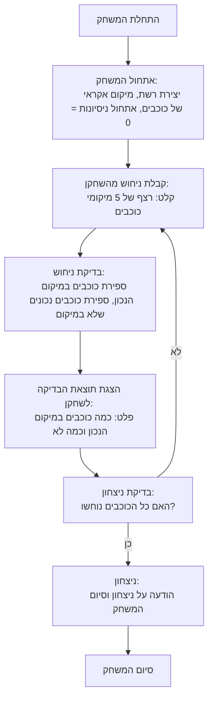

## <algorithm>

1. **התחלת המשחק**:
   - התוכנית מציגה הודעת פתיחה ומסבירה את חוקי המשחק.
     - דוגמה: "ברוכים הבאים ל-STARS! עליכם לנחש רצף של חמישה כוכבים על רשת."
   - יוצרת רשת בגודל 5x5.
   - מייצרת רצף אקראי של חמישה כוכבים על הרשת.
     - דוגמה: רצף כוכבים אקראי: (A1, B3, C5, D2, E4)
   - מאפסת את מספר הניסיונות ל-0.
2. **לולאת משחק**:
   - כל עוד השחקן לא ניחש את כל הכוכבים, התוכנית מבצעת את הפעולות הבאות:
   
     - **קלט מהמשתמש**:
       - מבקשת מהשחקן להזין את הניחוש שלו.
         - דוגמה: "הזינו את הניחוש שלכם (למשל, A1, B2, C3, D4, E5):"
       - קולטת את הניחוש מהשחקן.
         - דוגמה: השחקן מזין: "A1, B2, C3, D4, E5"
     - **בדיקת ניחוש**:
       - בודקת כמה כוכבים נמצאים במיקום הנכון.
         - דוגמה: אם הרצף הנכון הוא (A1, B3, C5, D2, E4) והשחקן ניחש (A1, B2, C3, D4, E5), אז הכוכבים הנכונים במיקום הם: A1 ו-D4. (סך הכל 2).
       - בודקת כמה כוכבים קיימים בניחוש, אך לא במיקום הנכון.
         - דוגמה: בהמשך לדוגמה הקודמת, הכוכבים הנכונים ולא במיקום הם: B2 (צריך להיות ב-B3) ו-E5 (צריך להיות ב-E4) - סך הכל 2, אבל בגלל שכבר חישבנו את הכוכבים במיקום הנכון, אז נותר רק 1 שהוא לא במקום.
       - מציגה את התוצאה לשחקן (כמה במקום וכמה לא במקום).
         - דוגמה: "מיקום נכון: 2, לא במקום: 1"
     - **בדיקת ניצחון**:
       - בודקת האם השחקן ניחש את כל הכוכבים.
         - אם כן, מודיעה על ניצחון.
         - אם לא, חוזרת ללולאת המשחק.
3. **סיום המשחק**:
    - מודיעה על ניצחון ומציגה את מספר הניסיונות הכולל.
    - שואלת אם השחקן רוצה לשחק שוב.
       - אם כן, מתחילה משחק חדש.
       - אם לא, מציגה הודעת סיום.
       
**זרימת נתונים:**
1. משתמש מזין ניחוש -> קלט
2. קלט-> בדיקת ניחוש (השוואה עם הכוכבים הנכונים)
3. בדיקת ניחוש -> תוצאה (כמה במקום וכמה לא)
4. תוצאה -> משתמש (הודעה)
5. בדיקה אם ניצחון -> אם כן, הודעת ניצחון וסיום משחק. אם לא, חזרה ללולאת המשחק.

## <mermaid>

**ניתוח התלויות:**

*   אין תלויות ישירות בספריות או מודולים חיצוניים בתרשים `mermaid` זה. זה מתאר את זרימת ההגיון ברמה הגבוהה של המשחק.
*   אם היינו מפרטים את הקוד, היינו צריכים להוסיף תלויות כמו `random` לגנרציה של הכוכבים או `input` לקבלת ניחושים מהמשתמש.

## <explanation>

**הסברים מפורטים:**

*   **ייבואים (Imports):**
    *   הקוד המתואר לא כולל ייבוא של מודולים, אך מציין שימוש עתידי במודול `random` לייצור הכוכבים ושימוש בפונקציות `input` לקליטת ניחושי השחקן.
        *   `random` - משמש לייצור אקראיות במשחק, במיוחד לייצור מיקום אקראי של הכוכבים.
        *   `input` - משמש לקליטת נתונים מהמשתמש (הניחושים).
*   **מחלקות (Classes):**
    *   לא קיימות מחלקות בקוד זה. המימוש הוא פרוצדורלי (סדרתי) ולא מונחה עצמים.
*   **פונקציות (Functions):**
    *   לפי התיאור, נדרשות פונקציות:
        *   **`init_game()`:** פונקציה שתתחיל את המשחק, תייצר רשת 5x5, תמקם באופן אקראי את הכוכבים על הרשת, ותאפס את מספר הניסיונות.
        *   **`get_player_guess()`:** פונקציה שתקלוט ניחוש מהמשתמש.
        *   **`check_guess(player_guess, stars)`:** פונקציה שתקבל את הניחוש של השחקן ואת מיקומי הכוכבים, ותחזיר את מספר הכוכבים במיקום הנכון ואת מספר הכוכבים הנכונים אבל לא במיקום.
            *   פרמטרים: `player_guess` (רשימה של מיקומי כוכבים שהמשתמש ניחש), `stars` (רשימה של מיקומי כוכבים הנכונים).
            *   ערך מוחזר: tuple של (מספר כוכבים במיקום נכון, מספר כוכבים נכונים אבל לא במיקום).
        *   **`check_win(player_guess, stars)`:** פונקציה שתבדוק האם הניחוש של השחקן זהה למיקומי הכוכבים הנכונים.
            *   פרמטרים: `player_guess`, `stars`.
            *   ערך מוחזר: `True` אם ניצח, `False` אם לא.
        *   **`play_again()`:** פונקציה שתשאל את השחקן אם הוא רוצה לשחק שוב.
            *   ערך מוחזר: `True` אם כן, `False` אם לא.
*   **משתנים (Variables):**
    *   `grid`: רשימה דו-ממדית (5x5) המייצגת את לוח המשחק (לרוב יהיה כאן שימוש ברשימה של רשימות).
    *   `stars`: רשימה המכילה את המיקומים הנכונים של הכוכבים (לדוגמה: `['A1', 'B3', 'C5', 'D2', 'E4']`).
    *   `player_guess`: רשימה המכילה את מיקומי הכוכבים שהשחקן ניחש.
    *   `correct_place`: משתנה המכיל את מספר הכוכבים הנמצאים במיקום הנכון.
    *   `correct_not_place`: משתנה המכיל את מספר הכוכבים הנכונים אך לא במיקום הנכון.
    *   `moves`: משתנה המכיל את מספר הניסיונות של השחקן.

**שרשרת קשרים עם חלקים אחרים בפרויקט:**

*   בשלב זה אין שרשרת קשרים עם חלקים אחרים בפרויקט, אלא אם חלקים אלו ימומשו בתוך הפונקציות המפורטות (לדוגמה:  `gs.get_settings()` אם נשתמש בהגדרות גלובליות).
*   אם נחבר את הקוד למערכת ניהול משחקים גדולה יותר, אז חלקים אלו יטפלו בניהול התור, שמירת נתונים (מספר ניסיונות, מידע על המשחק) ועוד.

**בעיות אפשריות ושיפורים:**

*   **טיפול בשגיאות קלט:** אין טיפול בשגיאות קלט כגון ניחושים לא תקינים (לא בפורמט הנכון, כפילויות).
*   **ממשק משתמש:** הממשק הטקסטואלי מאוד בסיסי. ניתן לשפר אותו עם ממשק גרפי.
*   **קוד מודולרי:** כרגע הקוד הוא תיאור פרוצדורלי. עדיף לממש אותו בצורה מודולרית באמצעות פונקציות (כמו שציינו), כך שקל יותר לבדוק, לתחזק ולהרחיב אותו.
*   **אפשרויות משחק:** להוסיף אפשרות לבחור מספר כוכבים, גודל רשת ורמות קושי שונות.