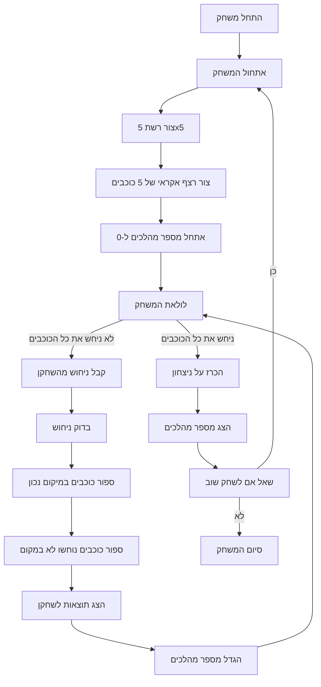

## <algorithm>

1. **התחלת המשחק:**
   - הצג הודעת פתיחה והסבר על חוקי המשחק.
   - צור רשת משחק בגודל 5x5.
   - צור באופן אקראי רצף של 5 כוכבים על הרשת. לדוגמה, כוכבים במיקומים A1, B2, C3, D4, E5.
   - אתחל את מספר המהלכים ל-0.

2. **לולאת המשחק:**
   - כל עוד השחקן לא ניחש את כל הכוכבים, חזור על השלבים הבאים:
      - קבל את ניחוש השחקן (לדוגמה: "A1, B2, C3, D4, E5").
      - בדוק את הניחוש מול מיקומי הכוכבים האמיתיים:
          - ספר כמה כוכבים נמצאים במיקום הנכון.
          - ספר כמה כוכבים נוחשו, אבל לא במיקום הנכון.
      - הצג לשחקן את תוצאות הניחוש (לדוגמה: "נכון במקום: 2, ניחוש נכון לא במקום: 1").
      - הגדל את מספר המהלכים ב-1.

3. **סיום המשחק:**
    - אם השחקן ניחש את כל הכוכבים:
        - הצג הודעת ניצחון.
        - הצג את מספר המהלכים שנדרשו כדי לנצח.
        - שאל את השחקן האם הוא רוצה לשחק שוב.
        - אם התשובה חיובית, התחל משחק חדש (חזור לשלב 1).
        - אחרת, סיים את התוכנית.

## <mermaid>

## <explanation>

**ייבואים (Imports):**
- לא מוצגים ייבואים ספציפיים בקוד התיאורי הזה, אך צוין שייעשה שימוש ב `random` כדי ליצור את מיקומי הכוכבים באופן אקראי.

**מחלקות (Classes):**
- אין שימוש במחלקות בקוד התיאורי. ניתן היה להוסיף מחלקה לניהול רשת המשחק והכוכבים, אך זה לא חלק מהתיאור הנוכחי.

**פונקציות (Functions):**
- לא מוצגות פונקציות ספציפיות בקוד התיאורי, אך ניתן להניח שהקוד יכיל:
    - פונקציה ליצירת רשת המשחק.
    - פונקציה ליצירת מיקומי כוכבים אקראיים.
    - פונקציה לקבלת ניחוש השחקן וניתוחו.
    - פונקציה להשוואת ניחוש השחקן למיקומי הכוכבים האמיתיים.
    - פונקציה להצגת תוצאות הניחוש.

**משתנים (Variables):**
- מספר המהלכים (סוג: int): עוקב אחרי מספר הניסיונות של השחקן.
- רשת המשחק (סוג: רשימה או מערך דו-ממדי): מייצגת את רשת המשחק ואת מיקומי הכוכבים.
- רצף הכוכבים (סוג: רשימה או מערך): מכיל את המיקומים האמיתיים של הכוכבים.
- ניחוש השחקן (סוג: מחרוזת): קלט מהשחקן עם מיקומי הכוכבים שהוא מנחש.
- מספר כוכבים נכונים במקום (סוג: int): מספר הכוכבים בניחוש שנמצאים במיקום הנכון.
- מספר כוכבים נכונים לא במקום (סוג: int): מספר הכוכבים בניחוש שנמצאים ברשימת הכוכבים, אבל במיקום שגוי.

**בעיות אפשריות ותחומים לשיפור:**
- **טיפול בקלט שגוי:** לא מצוין טיפול מפורש בקלט שגוי מהשחקן. יש להוסיף בדיקות לווידוא שהקלט בפורמט הנכון ולטפל במקרים חריגים.
- **אימות מיקום הכוכבים:** יש לוודא שהכוכבים לא ממוקמים על אותה משבצת.
- **ממשק משתמש:** ניתן לשפר את ממשק המשתמש כדי שיהיה נוח וידידותי יותר, לדוגמה, להשתמש בממשק גרפי ולא רק טקסט.
- **הוספת רמות קושי:** ניתן להוסיף רמות קושי על ידי שינוי מספר הכוכבים או גודל הרשת.
- **שימוש במחלקות:**  הוספת מחלקות תאפשר ארגון טוב יותר של הקוד ושימוש חוזר בקוד.

**שרשרת קשרים עם חלקים אחרים בפרויקט:**
- משחק זה יכול להשתמש במודולים קיימים של ממשק משתמש שפותחו בפרויקט.
- יכול להיכלל במערכת ניהול משחקים רחבה יותר.
- המשתנים של משחק זה (כגון ספירת צעדים) יכולים להיות מושפעים ממודולים אחרים המנהלים את המצב הכללי של המשחק.