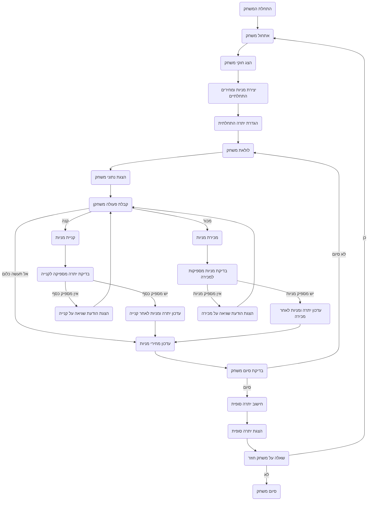

## <algorithm>

1. **התחלת המשחק (Initialization):**
   - הצגת הודעת פתיחה והסבר על כללי המשחק.
     *דוגמה:*
     ```
     ברוכים הבאים ל-STOCK!
     המטרה שלך היא לנהל תיק מניות, לקנות ולמכור מניות על בסיס תחזיות שוק.
     המטרה של המשחק היא למקסם את הרווח שלך על ידי קניית מניות במחיר נמוך ומכירתן במחיר גבוה.
     המשחק נמשך 10 ימים.
     בהצלחה!
     ```
   - יצירת רשימה של מניות עם מחירי התחלה.
   *דוגמה:*
     ```
        מניות = {
            "A": {"מחיר": 50, "כמות": 0},
            "B": {"מחיר": 30, "כמות": 0},
            "C": {"מחיר": 70, "כמות": 0}
         }
     ```
   - הגדרת סכום כסף התחלתי לשחקן (לדוגמה, 1000$).
     *דוגמה:*
     `balance = 1000`
   - מעבר ללולאת משחק שבה השחקן מבצע את הפעולות שלו (קנייה, מכירה, או כלום).

2. **מהלך המשחק (Game Loop):**
   - הצגת מידע על המניות:
     - הצגת היום הנוכחי.
     - הצגת מחירי המניות הנוכחיים.
       *דוגמה:*
       ```
         יום 1:
         מניה A: 50$
         מניה B: 30$
         מניה C: 70$
       ```
     - הצגת היתרה הנוכחית של השחקן.
        *דוגמה:*
        ```
        יתרה: 1000$
        ```
     - הצגת כמות המניות של השחקן.
       *דוגמה:*
       ```
       מניה A: 0
       מניה B: 0
       מניה C: 0
       ```
   - בקשת פעולה מהשחקן (קנייה, מכירה, או לא לעשות כלום).
   - קליטת בחירת הפעולה והקלט מהשחקן (אם רלוונטי).
     *דוגמה:*
     ```
      בחר פעולה:
      1. לקנות מניות
      2. למכור מניות
      3. לא לעשות כלום
     ```
   - ביצוע פעולת השחקן:
     - **קנייה:**
       - קבלת כמות המניות ומניית הקנייה.
       - בדיקה אם יש מספיק כסף לביצוע הקנייה.
       - אם כן, עדכון יתרת השחקן וכמות המניות.
         *דוגמה:*
          ` balance -= price * quantity `
          ` stocks[stock]["quantity"] += quantity `
       - אם לא, הצגת הודעת שגיאה.
       *דוגמה:*
          `אין מספיק כסף לקנייה. נסה שוב`
     - **מכירה:**
       - קבלת כמות המניות ומניית המכירה.
       - בדיקה אם יש מספיק מניות למכירה.
       - אם כן, עדכון יתרת השחקן וכמות המניות.
         *דוגמה:*
          ` balance += price * quantity `
          ` stocks[stock]["quantity"] -= quantity `
       - אם לא, הצגת הודעת שגיאה.
        *דוגמה:*
           `אין מספיק מניות למכירה. נסה שוב`
     - **ללא פעולה:** המשך ליום הבא.
   - עדכון מחירי המניות באקראי.
     *דוגמה:*
      ```
       new_price = old_price * (1 + random.uniform(-0.1, 0.1))
       ```
   - בדיקה האם המשחק הסתיים (האם עברו 10 ימים).
   - אם לא הסתיים, חזור לתחילת לולאת המשחק.

3. **סיום המשחק (Game End):**
   - חישוב יתרת הסיום של השחקן (כולל ערך המניות).
     *דוגמה:*
      `total_balance = balance + sum(stocks[stock]["price"] * stocks[stock]["quantity"] for stock in stocks)`
   - הצגת יתרת הסיום של השחקן.
     *דוגמה:*
      `המשחק הסתיים! היתרה הסופית שלך היא: 1200$`
   - שאילת השחקן האם הוא רוצה לשחק שוב.
   - אם כן, אתחל את המשחק מחדש.

## <mermaid>


## <explanation>

**ייבואים (Imports):**

- המודול `random` משמש ליצירת מספרים אקראיים לצורך עדכון מחירי המניות בצורה דינמית. אין תלות מפורשת בחבילות `src.` אחרות, אך הוא חלק מהמערכת הכללית של הפרויקט.

**מחלקות (Classes):**

- אין מחלקות בקוד זה. הקוד מבוסס על פונקציות ומשתנים גלובליים כדי לשמור על מצב המשחק.

**פונקציות (Functions):**

- אין פונקציות מוגדרות בקוד הזה. הלוגיקה מבוצעת באופן ישיר בתוך רצף ההוראות.

**משתנים (Variables):**

- `stocks`: מילון המכיל מידע על כל מניה (מחיר וכמות בבעלות השחקן). המילון משמש לניהול המניות במשחק.
- `balance`: מספר המייצג את כמות הכסף שיש לשחקן.
- `day`: מספר המייצג את מספר היום הנוכחי במשחק.
- `action`: משתנה המקבל את בחירת השחקן (קנייה, מכירה, או כלום).
- `quantity`: משתנה המייצג את כמות המניות שהשחקן רוצה לקנות או למכור.
- `stock`: משתנה המייצג את סוג המניה שהשחקן רוצה לקנות או למכור.

**הסברים נוספים:**

- הקוד מספק הדגמה של משחק שוק מניות פשוט, שבו השחקן יכול לקנות או למכור מניות, ולנסות להרוויח מהתנודות בשוק.
- הקוד משתמש בגישה איטרטיבית (לולאת משחק) כדי לשמור על משך המשחק ולהציע לשחקן פעולות אפשריות בכל שלב.
- שינוי מחירי המניות באקראיות מוסיף אלמנט של אי ודאות למשחק ומדמה את תנודות השוק.
- הקוד אינו כולל בדיקת תקינות קלט מעבר לבדיקה האם יש מספיק כסף או מניות.
- קוד זה יכול להוות בסיס למשחק מורכב יותר שיכלול גם תכונות נוספות, כמו ממשק משתמש גרפי, מניות נוספות, ואפשרויות משחק מורכבות יותר.
- הקוד אינו כולל טיפול בשגיאות מעבר לבדיקה של מספיק כסף או מניות.
- הקוד אינו מודולרי, והלוגיקה שלו מרוכזת בתוך קובץ אחד.

**בעיות אפשריות או תחומים לשיפור:**

1. **קלט משתמש:** אין טיפול בטעויות קלט שאינן מספריות, למשל, אם השחקן יכניס מחרוזת במקום מספר.
2. **אבסטרקציה:** הקוד אינו מודולרי ואינו משתמש בפונקציות או מחלקות, דבר שמקשה על תחזוקה והרחבה.
3. **טיפול בשגיאות:** הקוד לא מטפל בשגיאות אפשריות, כגון ניסיון לרכוש או למכור מניה שאינה קיימת, או קלט לא תקין.
4. **ממשק משתמש:** אין ממשק משתמש גרפי, מה שעלול להקשות על חוויית המשחק.
5. **הצגת נתונים:** הצגת הנתונים לשחקן היא בסיסית מאוד וניתן לשפר אותה על ידי הוספת תרשימים או גרפים.
6. **פונקציונליות נוספת:** חסרות פונקציות נוספות שניתן להוסיף, כמו אפשרות לבחור אסטרטגיה, מידע היסטורי על מחירי מניות, וכדומה.
7. **קוד מלוכלך:** הקוד אינו כתוב בצורה מסודרת וקריאה.
8. **בדיקות:** חסרות בדיקות אוטומטיות ללוגיקה של המשחק.
9. **רמת קושי:** מנגנון השינוי האקראי במחירי המניות פשוט מאוד, וניתן להוסיף רמות קושי נוספות.
10. **שמירת התקדמות:** חסרה אפשרות לשמור את התקדמות המשחק ולטעון אותה.