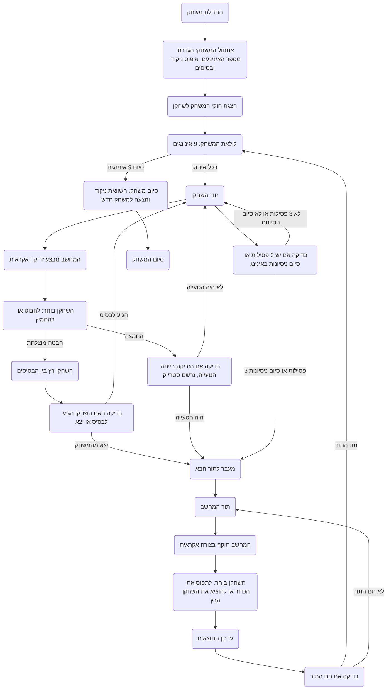
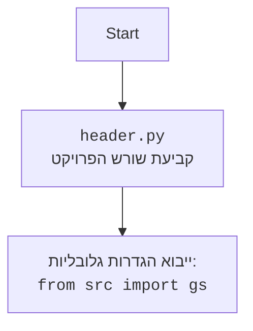

## <algorithm>

1.  **התחלת המשחק:**
    *   הגדרת מספר האינינגים ל-9.
    *   איפוס הניקוד של השחקן והמחשב.
    *   איפוס מיקומי השחקנים על הבסיסים (בסיסים ריקים).
    *   הצגת חוקי המשחק לשחקן.
        *   דוגמה: "המשחק מורכב מ-9 אינינגים. מטרתך לצבור יותר נקודות מהיריב. בכל תור בחר בין חבטה לבין החמצה."

2.  **לולאת המשחק הראשית:**
    *   הלולאה רצה במשך 9 אינינגים.
    *   בכל אינינג, יש שני תורים:
        *   תור השחקן (התקפה, המחשב מתגונן).
        *   תור המחשב (התקפה, השחקן מתגונן).
    *   **תור השחקן:**
        *   המחשב מבצע זריקה אקראית (כדור פשוט, זריקה או הטעייה).
        *   השחקן בוחר:
            *   לחבוט.
            *   להחמיץ.
        *   תוצאה:
            *   חבטה מוצלחת:
                *   השחקן רץ בין הבסיסים (החלטת שחקן).
                *   בדיקה אם השחקן הגיע לבסיס הבא או יצא מהמשחק.
                    *   דוגמה: אם השחקן בוחר לרוץ, הוא מגיע לבסיס הבא. אם השחקן לא מצליח לרוץ, הוא יוצא מהמשחק.
            *   החמצה:
                *   אם הזריקה הייתה הטעייה, נרשם סטרייק.
                    *   דוגמה: אם השחקן החמיץ כדור הטעייה, סטרייק נספר.
        *   התור נמשך עד 3 פסילות או סיום כל הניסיונות באינינג.
    *   **תור המחשב:**
        *   השחקן משחק בתפקיד המגן.
        *   המחשב תוקף בצורה אקראית:
            *   זריקה.
            *   חבטה וריצה בין הבסיסים.
        *   השחקן בוחר:
            *   לתפוס את הכדור.
            *   להוציא את השחקן הרץ מהמשחק.
                *   דוגמה: אם השחקן בוחר לנסות לתפוס את הכדור, נבדק אם הצליח או לא.
        *   עדכון התוצאות.

3.  **חישוב ניקוד:**
    *   נקודה ניתנת על כל שחקן שהגיע בהצלחה לבסיס הבית.
    *   עדכון טבלת התוצאות בסוף כל אינינג.

4.  **סיום המשחק:**
    *   בסיום 9 אינינגים, משווים את הנקודות בין השחקן למחשב.
        *   דוגמה: "המשחק הסתיים! התוצאה הסופית: שחקן: 5, מחשב: 3, ניצחת!"
    *   הצעה להתחיל משחק חדש או לצאת.

## <mermaid>

   

## <explanation>

**ייבואים (Imports):**

*   אין ייבוא מפורש בקוד. התרשים מראה כי הקוד יצטרך לייבא את הגדרות הגלובליות מהחבילה `src`, אם קיימות, באמצעות `from src import gs`.

**מחלקות (Classes):**

*   אין מחלקות מוגדרות בקוד. מדובר בתיאור תהליכי של משחק בייסבול.

**פונקציות (Functions):**

*   בקוד אין פונקציות מוגדרות, אך אפשר להגדיר פונקציות שיעזרו במימוש המשחק. הפונקציות יהיו:
    *   `initialize_game()`: מאתחלת את המשחק, מגדירה את מספר האינינגים, מאפסת את הניקוד ומיקומי השחקנים על הבסיסים.
    *   `play_inning()`: משחקת אינינג אחד, ומורכבת משני תורים - תור השחקן ותור המחשב.
    *   `player_turn()`: מנהלת את תור השחקן, מקבלת את בחירות השחקן (חבטה או החמצה), מחשבת את התוצאות ועדכון מיקומי הבסיס.
    *   `computer_turn()`: מנהלת את תור המחשב, בו המחשב תוקף והשחקן מגן.
    *   `update_score()`: מעדכנת את הניקוד לאחר כל אינינג, ומחשבת נקודות על כל שחקן שהגיע לבסיס הבית.
    *   `end_game()`: מציגה את התוצאה הסופית ומציעה לשחק משחק נוסף.
   
**משתנים (Variables):**

*   `innings_count`: מספר האינינגים במשחק (9).
*   `player_score`: ניקוד השחקן.
*   `computer_score`: ניקוד המחשב.
*   `bases`: מציין איזה בסיסים תפוסים על ידי שחקנים.

**הערות:**

*   הקוד המוצג הוא תיאור מילולי של המשחק, לא קוד ממשי.
*   יש צורך לכתוב פונקציות ספציפיות כדי ליישם את לוגיקת המשחק.
*   המשחק משתמש בבחירות אקראיות כדי לדמות את פעולות המחשב, אך ניתן להוסיף מנגנונים מורכבים יותר.
*   אין תלות מפורשת בחלקים אחרים בפרויקט, אך ייתכן שיהיה צורך בחלקים נוספים בעת מימוש המשחק (למשל, פונקציות קלט/פלט, מחוללי אקראיות).

**שרשרת קשרים עם חלקים אחרים בפרויקט:**
אם קיימת חבילה `src`, הקוד ייצטרך לייבא את ההגדרות הגלובליות שלה. בנוסף, יהיה צורך בחבילה נוספת לקליטת נתוני משתמש ופלט.