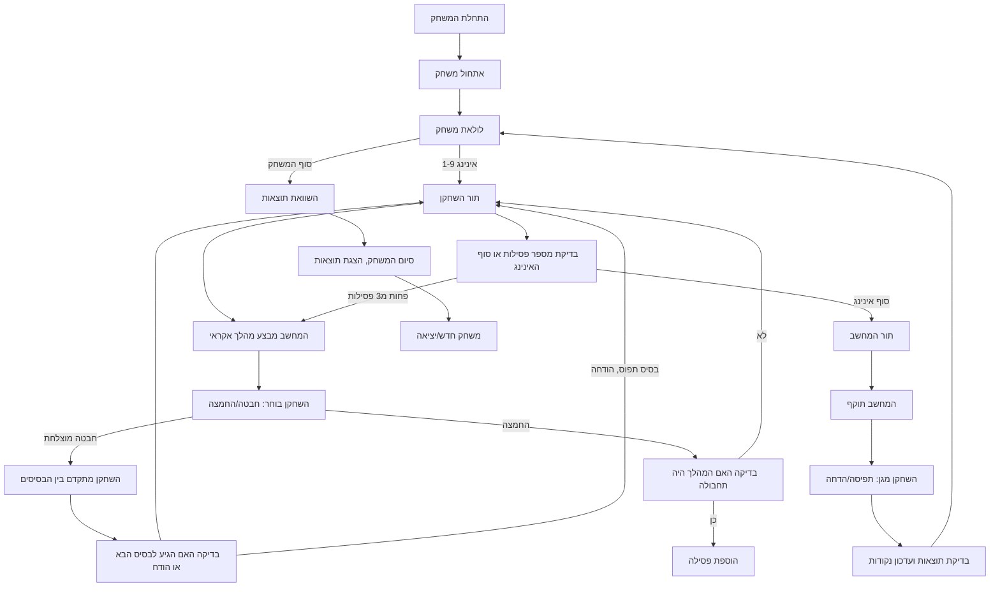

## ניתוח קוד: משחק בייסבול

### <algorithm>

1.  **אתחול משחק:**
    *   הגדרת מספר האינינגים ל-9.
    *   איפוס לוח התוצאות של השחקן והמחשב ל-0.
    *   איפוס בסיסים (כל הבסיסים ריקים).
    *   הצגת חוקי המשחק לשחקן.
    *   דוגמה: `innings = 9, playerScore = 0, computerScore = 0, bases = [False, False, False]`

2.  **לולאת משחק ראשית:**
    *   לולאה על פני האינינגים (1 עד 9).
    *   בתוך כל אינינג:
        *   **תור השחקן (התקפה):**
            1.  המחשב מבצע מהלך אקראי: "זריקה רגילה", "הגשה", "תחבולה".
                *   דוגמה: `computerMove = "זריקה רגילה"`
            2.  השחקן בוחר: "חבטה" או "החמצה".
                *   דוגמה: `playerChoice = "חבטה"`
            3.  תוצאה:
                *   **חבטה מוצלחת:**
                    *   השחקן מתקדם בין הבסיסים (החלטה של השחקן).
                        *   דוגמה: `playerBaseAdvance = "כן"`
                    *   בדיקה האם הגיע לבסיס הבא או הודח.
                        *   דוגמה: אם `playerBaseAdvance == "כן"` והבסיס תפוס אז השחקן הבא ינסה לעבור
                *   **החמצה:**
                    *   אם המהלך היה "תחבולה" יירשם פסילה.
                        *   דוגמה: אם `computerMove =="תחבולה"` והשחקן החמיץ אז מתווספת פסילה.
            4.  המשך עד 3 פסילות או סוף האינינג.
        *   **תור המחשב (התקפה):**
            1.  המחשב מבצע מהלכים אקראיים: "הגשה", "חבטה ותנועה".
            2.  השחקן בוחר: "לתפוס כדור", "להדיח רץ".
            3.  בדיקת תוצאות ועדכון הניקוד.

3.  **ספירת נקודות:**
    *   נקודה מוענקת על כל שחקן שהגיע לבית בהצלחה.
    *   עדכון טבלת התוצאות לאחר כל אינינג.

4.  **סיום משחק:**
    *   לאחר 9 אינינגים, השוואת נקודות שחקן ומחשב.
    *   הכרזת המנצח והצגת התוצאה הסופית.
    *   אפשרות להתחלה משחק חדש או יציאה.

### <mermaid>

### <explanation>

*   **ייבואים (Imports):** אין ייבואות מפורשים בקוד הזה, אבל באופן כללי, בייבואים משמשים כדי להשתמש בפונקציות ומחלקות מקבצים חיצוניים, לדוגמה: `import random` לייבוא פונקציות רנדומליות.
*   **מחלקות (Classes):** אין מחלקות בקוד זה, אך ביישום אמיתי של המשחק ניתן להשתמש במחלקות כמו `Player`, `Computer`, `Game` וכו'. כל מחלקה תכיל מידע על המשתתפים, המשחק והיחסים בינהם.
*   **פונקציות (Functions):** אין פונקציות מפורשות בקוד זה, אך בדוגמת יישום:
    *   `initialize_game()`: לאתחל את המשחק.
    *   `player_turn()`: לטפל בתור השחקן.
    *   `computer_turn()`: לטפל בתור המחשב.
    *   `calculate_score()`: לחשב את הניקוד.
    *   `end_game()`: לסיים את המשחק.
*   **משתנים (Variables):**
    *   `innings`: מספר האינינגים (9).
    *   `playerScore`: ניקוד השחקן.
    *   `computerScore`: ניקוד המחשב.
    *   `bases`: רשימה בוליאנית המייצגת האם הבסיסים תפוסים או לא.
    *   `computerMove`: מהלך אקראי של המחשב.
    *   `playerChoice`: בחירת השחקן (חבטה או החמצה).
    *   `playerBaseAdvance`: בחירת השחקן להתקדם בין הבסיסים.
    *   `outs`: מספר פסילות.
*   **בעיות אפשריות ותחומים לשיפור:**
    *   המשחק מבוסס על טקסט בלבד, מה שמגביל את חוויית המשתמש.
    *   מכניקת המשחק פשוטה, וניתן להוסיף אלמנטים נוספים כמו בחירת כוח חבטה.
    *   נדרש אינטרפייס משתמש טוב יותר, במקום קלט טקסטואלי בלבד.
*   **קשר עם חלקים אחרים בפרויקט:**
    *   קובץ זה הוא תיאור חוקי המשחק. בפרויקט מלא, הוא יתקשר עם מודולים אחרים כמו מודול ממשק המשתמש, מודול לוגיקה של המשחק, וכו'.
    *   מודול גרפי יוכל לתת ייצוג ויזואלי למשחק.

בקיצור, הניתוח מספק הבנה מפורטת של לוגיקת המשחק, אך יש צורך ביישום בפועל על מנת ליצור משחק שלם.