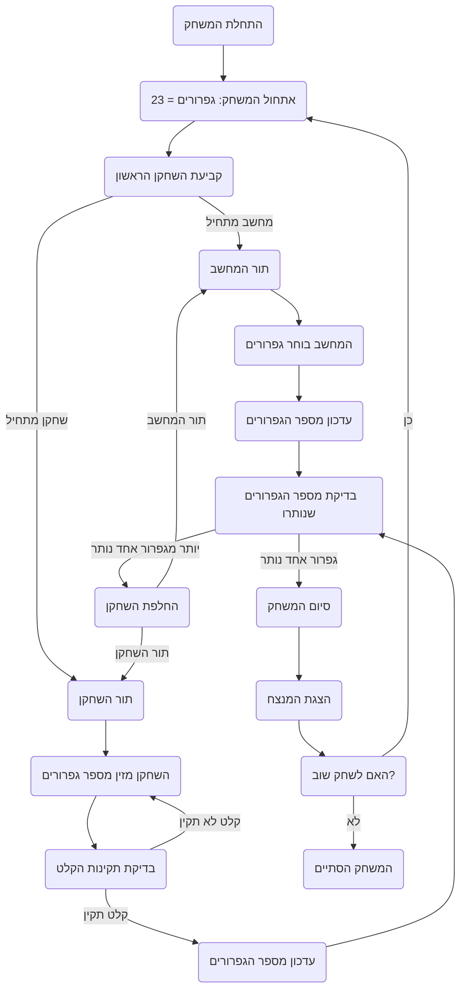

## ניתוח קוד משחק 23 גפרורים

### <algorithm>
1. **התחלת המשחק**:
   - המשחק מתחיל עם 23 גפרורים.
   - נקבע מי מתחיל - המחשב או השחקן. לדוגמה, המחשב מתחיל.
   - `matches = 23`, `currentPlayer = "computer"`.
2. **לולאת משחק**:
   - **תור השחקן**:
      - אם `currentPlayer` הוא "player":
          - השחקן מתבקש להזין כמה גפרורים הוא רוצה לקחת (1, 2 או 3).
          - לדוגמה, השחקן מזין 2.
          - מספר הגפרורים שנותרו מופחת ב-2. `matches = 21`
      - בצע בדיקות:
         - שהקלט של השחקן הוא מספר בין 1 ל-3.
         - שהשחקן לא מנסה לקחת יותר גפרורים ממה שנותר.
   - **תור המחשב**:
      - אם `currentPlayer` הוא "computer":
        - המחשב בוחר לקחת מספר גפרורים (1, 2 או 3) על פי אסטרטגיה.
        - אסטרטגיה:
           - המחשב מנסה להשאיר לשחקן מספר גפרורים ששווה למספר כפולות של 4 ועוד 1 (למשל 5, 9, 13, 17, 21).
           - אם נשארו 21 גפרורים, המחשב ייקח 3 גפרורים, כך שישארו 18 גפרורים (המספר הקרוב ביותר לכפולה של 4 ועוד 1).
        - מספר הגפרורים שנותרו מופחת בהתאם. לדוגמה `matches=18`.
   - החלף את השחקן בין "player" ל "computer"
   - המשחק ממשיך עד שיש גפרור אחד שנותר.
3. **סיום המשחק**:
   - אם נשאר גפרור אחד:
      - השחקן שלקח את הגפרור האחרון מפסיד.
      - מוצגת הודעה מתאימה.
      - המשחק שואל האם השחקן רוצה לשחק שוב.
       - אם השחקן בוחר "כן", המשחק מתחיל מהתחלה.
       - אם השחקן בוחר "לא", המשחק מסתיים.
### <mermaid>

### <explanation>

**ייבוא (Imports):**
אין ייבוא בסעיף קוד זה.

**מחלקות (Classes):**
אין מחלקות בסעיף קוד זה.

**פונקציות (Functions):**
אין פונקציות בסעיף קוד זה. הקוד מתאר זרימת עבודה של המשחק, ולא קוד ממשי.

**משתנים (Variables):**
- `matches`: מספר הגפרורים שנותרו על השולחן. הוא מתחיל ב-23. סוג: מספר שלם (integer).
- `currentPlayer`: השחקן שתורו לשחק. יכול להיות "computer" או "player". סוג: מחרוזת (string).

**הסברים מפורטים:**
- הקוד שסופק אינו קוד ממשי, אלא תיאור מפורט של חוקי המשחק "23 גפרורים" ואלגוריתם בסיסי למשחק, כולל אסטרטגיית ניצחון בסיסית.
- הקוד מתאר את שלבי המשחק, החל מאיניציאליזציה (איתחול) של מספר הגפרורים, המשך בתורות של השחקן והמחשב, ועד לקביעת המנצח והסיום.
-  האסטרטגיה של המחשב: אסטרטגיית הניצחון המתוארת היא להשאיר מספר גפרורים שהוא כפולה של 4 ועוד 1. זהו הרעיון המרכזי באלגוריתם הניצחון.
- אין קוד ממשי, לכן אין בעיות קוד ספציפיות או תחומים לשיפור.

**שרשרת קשרים עם חלקים אחרים בפרויקט:**
- לא ניתן ליצור שרשרת קשרים עם חלקים אחרים בפרויקט כי הקוד הוא תיאור של המשחק ולא קוד ממשי.
- אם היה מדובר בקוד פייתון, אפשר היה ליצור קשרים עם מודולים אחרים של המשחק.