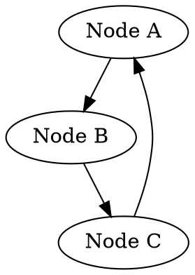

# Usage Guide for `dot2png.py`

This script converts DOT files to PNG images using the Graphviz library.  It's designed to be run from the command line.


## Prerequisites

- **Graphviz:** Ensure Graphviz is installed on your system.  You'll need the `graphviz` library in your Python environment.  If you don't have it, install it using pip:

```bash
pip install graphviz
```

- **Python:**  A Python 3.x interpreter.


## How to Use

1. **Prepare your DOT file:** Create a `.dot` file containing the graph description using the DOT language.  A simple example is provided in the docstring.

2. **Run the script from the command line:**

```bash
python dot2png.py <input_dot_file> <output_png_file>
```

   - Replace `<input_dot_file>` with the path to your `.dot` file.
   - Replace `<output_png_file>` with the desired name and path for the output PNG file.  The file extension should be `.png`.

   For example:

```bash
python dot2png.py my_graph.dot output_graph.png
```

3. **Error Handling:** The script includes error handling.  If the input `.dot` file is not found, a `FileNotFoundError` will be raised, and the error message will be printed to the console. Other errors during conversion will also be reported.


## Example `.dot` File (`my_graph.dot`):



This will create a PNG image file named `output_graph.png` containing the graph.


## Script Structure

- **`dot2png(dot_file, png_file)` function:** This function handles the conversion process:
    - Reads the `.dot` file.
    - Creates a `graphviz.Source` object from the DOT file content.
    - Sets the output format to 'png'.
    - Calls `source.render` to generate the PNG file, with `cleanup=True` to remove temporary files.
    - Includes error handling to catch `FileNotFoundError` and other exceptions during conversion.


- **`if __name__ == "__main__":` block:** This block is crucial for running the script from the command line.
    - Checks if the correct number of command-line arguments is provided (input DOT file and output PNG file).
    - Extracts the file paths from command-line arguments.
    - Calls the `dot2png` function with the provided file paths.


## Troubleshooting

- **Graphviz not found:** If you get an error related to Graphviz not being found, make sure Graphviz is installed and accessible to your Python environment.
- **Invalid DOT file:** Check your `.dot` file for any syntax errors.  Errors in the DOT file will likely cause conversion errors.


This guide provides a clear understanding of how to use `dot2png.py` to convert DOT files to PNG images. Remember to replace placeholders with your actual file names and paths.