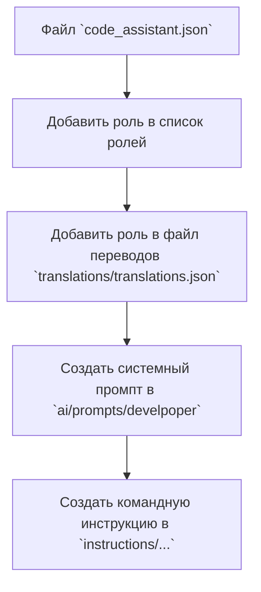

# Роль помощника по коду

## Обзор

Данный документ описывает порядок действий для создания новой роли помощника по коду. Он предоставляет пошаговую инструкцию и визуализацию процесса в виде графа.

## Порядок действий

### Шаг 1: Файл `code_assistant.json`

**Описание**: На данном шаге происходит добавление новой роли в конфигурационный файл `code_assistant.json`. Этот файл содержит список доступных ролей и их соответствующие параметры.

**Действия**: Добавить запись о новой роли с необходимыми атрибутами в `code_assistant.json`.

### Шаг 2: Добавление роли в файл переводов `translations/translations.json`

**Описание**: На данном шаге необходимо добавить переводы для новой роли в файл переводов `translations/translations.json`. Это обеспечивает локализованный интерфейс для пользователей.

**Действия**: Добавить переводы для всех элементов интерфейса, связанных с новой ролью.

### Шаг 3: Создание системного промпта в `ai/prompts/develpoper`

**Описание**: Создание системного промпта для новой роли. Системный промпт определяет поведение модели при взаимодействии с ролью.

**Действия**: Создать новый файл в директории `ai/prompts/develpoper` с описанием и настройка параметров для новой роли.

### Шаг 4: Создание командной инструкции в `instructions/...`

**Описание**: Разработка командной инструкции, объясняющей, как использовать новую роль.

**Действия**: Создать файл в директории `instructions/...` с подробной инструкцией по использованию роли. Этот файл должен быть доступным для пользователей.

## Граф зависимости



## Настройка стилей блоков

```
style A width: 300px
style B width: 300px
style C width: 300px
style D width: 300px
style E width: 300px
```