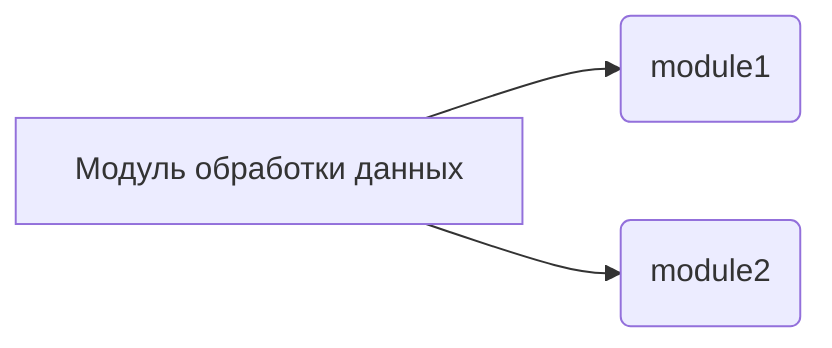

# Инструкция по объяснению кода

## Обзор

Данная инструкция описывает формат документации для Python кода, предназначенной для последующего использования.  Документация должна быть написана в формате Markdown (.md) и содержать подробное Разбор кода, включая алгоритм работы, диаграмму зависимостей (Mermaid), объяснение импортов, классов, функций, переменных, а также возможных ошибок и областей для улучшения.

## Формат документации

### Структура файла

Каждый файл должен содержать следующие разделы:

1. **Заголовок:** Краткое описание модуля.
2. **Описание:** Краткое описание цели и функциональности модуля.
3. **Импорты:** Подробное описание импортируемых библиотек и их роли.
4. **Классы:** Описание каждого класса, включая его атрибуты, методы, назначение и взаимосвязи с другими классами.
5. **Функции:** Описание каждой функции, включая ее аргументы, возвращаемые значения, назначение и примеры использования.
6. **Переменные:** Описание глобальных переменных, их тип и назначение.
7. **Алгоритм (блок-схема):**  Пошаговое описание алгоритма работы кода с примерами.
8. **Диаграмма зависимостей (Mermaid):** Диаграмма, визуализирующая взаимосвязи между модулями и классами.
9. **Подробное объяснение:** Подробное разъяснение кода, включая пояснение импортов, классов, функций, переменных, возможных ошибок и областей для улучшения.
10. **Связи с другими частями проекта (применимо):** Пояснение взаимосвязи с другими модулями или компонентами проекта.


### Примеры

#### Пример описания класса:

```markdown
### Класс `ClassName`

**Описание:** Класс для выполнения определенной задачи.

**Атрибуты:**

- `attribute1`: Описание атрибута `attribute1`.
- `attribute2`: Описание атрибута `attribute2`.

**Методы:**

- `method1(param1, param2)`: Описание метода `method1`.
- `method2()`: Описание метода `method2`.
```


#### Пример описания функции:

```markdown
### Функция `function_name`

**Описание:** Функция для выполнения вычислений.

**Аргументы:**

- `param1`: Описание аргумента `param1`.
- `param2`: Описание аргумента `param2`.

**Возвращаемое значение:**

- `result`: Описание возвращаемого значения.

**Пример использования:**

```python
result = function_name(param1, param2)
```
```

##  Образец структуры документации Python кода:


```markdown
# Модуль обработки данных

## Обзор

Этот модуль предназначен для обработки входных данных и выполнения определенных вычислений.


## Импорты

- `module1`:  Описание импорта `module1` и его связи с другими модулями.
- `module2`: Описание импорта `module2` и его роли в модуле.

## Классы

### Класс `MyClass`


**Описание**:  Класс для обработки данных.

**Атрибуты**:
- `data`: Список чисел для обработки.

**Методы**:
- `process_data()`: Метод обрабатывает данные и возвращает результат.

## Функции

### Функция `calculate_sum`

**Описание**:  Вычисляет сумму элементов в списке.

**Аргументы**:
- `data_list`: Список чисел для суммирования.

**Возвращаемое значение**:
- `sum`: Сумма элементов в списке.


## Алгоритм

(Блок-схема алгоритма здесь)

## Диаграмма зависимостей (Mermaid)



## Подробное объяснение

(Здесь объяснение импортов, классов, функций, переменных, ошибок и областей для улучшения)

## Взаимосвязь с другими частями проекта


(Если применимо)


```
```


## Заключение

Этот шаблон документации поможет создать подробную и понятную документацию для вашего Python кода.  Пожалуйста, заполните соответствующие разделы для каждого модуля.