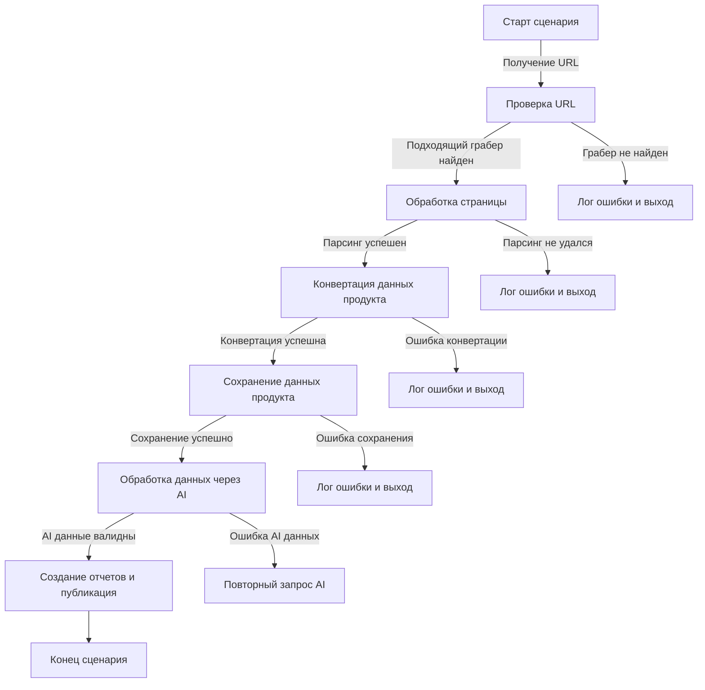

# Сценарий обработки прайс-листа

## Обзор

Этот сценарий описывает процесс получения, обработки и сохранения данных прайс-листа.  Он включает в себя этапы проверки URL, парсинга, конвертации данных, сохранения в базу данных, обработки данных с помощью AI и генерации отчетов.

## Таблица Содержания

* [Старт сценария](#старт-сценария)
* [Получение URL](#получение-url)
* [Проверка URL](#проверка-url)
* [Обработка страницы](#обработка-страницы)
* [Парсинг](#парсинг)
* [Конвертация данных продукта](#конвертация-данных-продукта)
* [Сохранение данных продукта](#сохранение-данных-продукта)
* [Обработка данных через AI](#обработка-данных-через-ai)
* [Создание отчетов и публикация](#создание-отчетов-и-публикация)
* [Ошибка URL](#ошибка-url)
* [Ошибка парсинга](#ошибка-парсинга)
* [Ошибка конвертации](#ошибка-конвертации)
* [Ошибка сохранения](#ошибка-сохранения)
* [Ошибка AI данных](#ошибка-ai-данных)

## Диаграмма потока

## Этапы сценария

### Старт сценария

Начальная точка выполнения сценария.

### Получение URL

Получение URL адреса прайс-листа.  Источник URL может быть различным (например, из файла конфигурации, базы данных).

### Проверка URL

Проверка корректности и доступности URL. Проверка наличия доступного грабера для конкретного формата страницы.

### Обработка страницы

Загрузка страницы по полученному URL с помощью выбранного грабера. Обработка ошибок при загрузке страницы.

### Парсинг

Извлечение данных из HTML-страницы с помощью парсера (например, Beautiful Soup, lxml).

### Конвертация данных продукта

Преобразование полученных данных в стандартный формат, пригодный для сохранения в базе данных.  Проверка корректности конвертации.

### Сохранение данных продукта

Сохранение данных в базу данных (например, в формате JSON или CSV). Проверка успешности сохранения.

### Обработка данных через AI

Обработка данных с помощью AI (например, для анализа цен, категорий, или других параметров).

### Создание отчетов и публикация

Генерация отчетов на основе обработанных данных и публикация их в системе.

### Ошибка URL

Если URL недоступен или некорректен, сценарий должен залогировать ошибку и завершиться.

### Ошибка парсинга

Если парсинг страницы не удался, сценарий должен залогировать ошибку и завершиться.

### Ошибка конвертации

Если конвертация данных в нужный формат не удалась, сценарий должен залогировать ошибку и завершиться.

### Ошибка сохранения

Если сохранение данных в базе данных не удалось, сценарий должен залогировать ошибку и завершиться.

### Ошибка AI данных

Если AI обработал данные с ошибкой, сценарий должен залогировать ошибку и попытаться выполнить повторный запрос к AI или перейти к следующему варианту решения.

### Конец сценария

Завершение сценария после успешной обработки всех этапов.