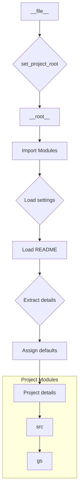

# Code Explanation for hypotez/src/ai/dialogflow/header.py

## <input code>

```python
## \file hypotez/src/ai/dialogflow/header.py
# -*- coding: utf-8 -*-\
#! venv/Scripts/python.exe
#! venv/bin/python/python3.12

"""
.. module: src.ai.dialogflow 
	:platform: Windows, Unix
	:synopsis:

"""


"""
	:platform: Windows, Unix
	:synopsis:

"""


"""
	:platform: Windows, Unix
	:synopsis: Модуль определяющий корневой путь к проекту. Все импорты строятся относительно этого пути.
    :TODO: В дальнейшем перенести в системную переменную

"""

import sys
import json
from packaging.version import Version

from pathlib import Path
def set_project_root(marker_files=('__root__')) -> Path:
    """
    Finds the root directory of the project starting from the current file's directory,
    searching upwards and stopping at the first directory containing any of the marker files.

    Args:
        marker_files (tuple): Filenames or directory names to identify the project root.
    
    Returns:
        Path: Path to the root directory if found, otherwise the directory where the script is located.
    """
    __root__:Path
    current_path:Path = Path(__file__).resolve().parent
    __root__ = current_path
    for parent in [current_path] + list(current_path.parents):
        if any((parent / marker).exists() for marker in marker_files):
            __root__ = parent
            break
    if __root__ not in sys.path:
        sys.path.insert(0, str(__root__))
    return __root__


# Get the root directory of the project
__root__ = set_project_root()
"""__root__ (Path): Path to the root directory of the project"""

from src import gs

settings:dict = None
try:
    with open(gs.path.root / 'src' / 'settings.json', 'r') as settings_file:
        settings = json.load(settings_file)
except (FileNotFoundError, json.JSONDecodeError):
    ...

doc_str:str = None
try:
    with open(gs.path.root / 'src' / 'README.MD', 'r') as settings_file:
        doc_str = settings_file.read()
except (FileNotFoundError, json.JSONDecodeError):
    ...


__project_name__ = settings.get("project_name", 'hypotez') if settings  else 'hypotez'
__version__: str = settings.get("version", '')  if settings  else ''
__doc__: str = doc_str if doc_str else ''
__details__: str = ''
__author__: str = settings.get("author", '')  if settings  else ''
__copyright__: str = settings.get("copyrihgnt", '')  if settings  else ''
__cofee__: str = settings.get("cofee", "Treat the developer to a cup of coffee for boosting enthusiasm in development: https://boosty.to/hypo69")  if settings else "Treat the developer to a cup of coffee for boosting enthusiasm in development: https://boosty.to/hypo69"
```

## <algorithm>

**Step 1**: The script initializes a variable `MODE` with the value 'dev'.

**Step 2**: `set_project_root` function is defined.  This function aims to locate the project's root directory.
  - It takes an optional argument `marker_files` to specify files/directories that indicate the project root.
  - It starts from the directory containing the current file.
  - It iterates through the parent directories until it finds a directory containing at least one of the specified files (`pyproject.toml`, `requirements.txt`, `.git`).
  - If a root directory is found, it's added to the `sys.path` for import resolution.


**Step 3**: The script calls `set_project_root` to determine the project root and stores it in `__root__`.

**Step 4**: The script imports necessary modules: `sys`, `json`, `packaging.version`, and `pathlib`.


**Step 5**: The script attempts to load project settings from `gs.path.root / 'src' / 'settings.json'` into the variable `settings`. It uses a `try...except` block to handle potential errors such as `FileNotFoundError` and `json.JSONDecodeError`.


**Step 6**: The script attempts to load the project documentation from `gs.path.root / 'src' / 'README.MD'` into the variable `doc_str`. It also uses a `try...except` block to handle potential errors.


**Step 7**: It extracts project name, version, documentation, details, author, copyright, and a "coffee" link from the loaded settings.


**Step 8**: The script assigns default values if the corresponding settings are not found or if any error occurs during loading.


**Step 9**: The script returns the calculated project root, settings, documentation, and other project details.

## <mermaid>



**Dependencies Analysis**:

- `sys`: Used for manipulating the Python path.
- `json`: Used for parsing the JSON configuration file (`settings.json`).
- `packaging.version`: Likely used for handling project versioning.
- `pathlib`: Provides an object-oriented way to work with file paths.
- `src`: (Implied) A package containing other modules; `gs` seems to be a part of it (based on the code). `gs.path.root` suggests a way of accessing the project's root directory.


## <explanation>

**Imports**:

- `sys`: Used to modify the Python path, crucial for locating and importing modules from the project's root directory.
- `json`: Used for reading and parsing the JSON configuration file ('settings.json') that likely contains project metadata.
- `packaging.version`: Used to work with project versions (likely for version compatibility checks or similar).
- `pathlib`: Used for working with file paths in a more object-oriented way than the traditional `os` module, improving readability and preventing errors from incorrect string manipulations.
- `src`: This import is crucial, as it allows the code to access modules and functionalities defined within the `src` package, including `gs`, which helps determine the project root directory.

**Classes**:

- No classes are directly defined.

**Functions**:

- `set_project_root(marker_files=...)`:  This is a crucial function. It locates the project root directory by traversing upwards from the current file's directory until it finds a directory containing any of the specified marker files (`pyproject.toml`, `requirements.txt`, `.git`). It's important to ensure that these files exist at the project root, or the function will return an unexpected result.  This function also modifies the Python path (`sys.path`), which is important for correctly loading modules from the project root.
  - **Example Usage**: `__root__ = set_project_root()`

**Variables**:

- `MODE`: A simple string variable representing the project mode (e.g., 'dev', 'prod').
- `__root__`: Stores the path to the project root.  This is a vital variable for finding files within the project tree.
- `settings`: A dictionary containing project settings, like the project name, version, author, etc., loaded from `settings.json`.
- `doc_str`: A string containing the project documentation, loaded from `README.MD`.
-  `__project_name__`, `__version__`, `__doc__`, `__details__`, `__author__`, `__copyright__`, `__cofee__`: Calculated variables containing relevant project details.

**Potential Errors and Improvements**:

- **Error Handling**: The `try...except` blocks around file reading (`settings.json` and `README.MD`) are good practice.  However, consider logging the errors instead of using `...`.  This way, you could track the source of problems more effectively.
- **Robustness**: The logic for finding the project root (`set_project_root`) could benefit from more extensive error handling.  Consider cases where the marker files are not present or unexpected directory structures exist.
- **`gs.path.root`**:  The `gs` package is not directly defined within the code. There should be a definition or documentation explaining how `gs.path.root` is determined. If not present, you could define a function to derive the path and use it consistently throughout the project.
- **`set_project_root` parameter**: While the default is good, consider using an optional parameter (perhaps a `pathlib.Path` object) to potentially specify the starting location in cases where the current file isn't the starting point.

**Relationships with other parts of the project**:

- The code heavily relies on the `src` package, particularly the `gs` module to access the project root.


This analysis provides a comprehensive understanding of the provided Python code, its functionality, and potential areas for improvement.