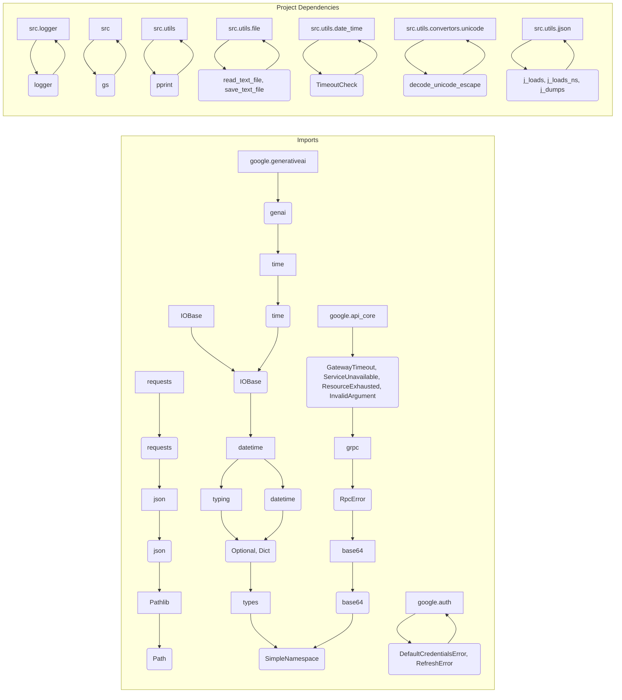

# Code Explanation for `hypotez/src/ai/gemini/generative_ai.py`

## <input code>

```python
# -*- coding: utf-8 -*-\n\n#! venv/bin/python/python3.12\n\n"""
.. module:: src.ai.gemini
   :platform: Windows, Unix
   :synopsis: Google generative AI integration
   https://github.com/google-gemini/generative-ai-python/blob/main/docs/api/google/generativeai.md
"""


import time
import json
from io import IOBase
from pathlib import Path
from datetime import datetime
from typing import Optional, Dict
from types import SimpleNamespace
import base64

import google.generativeai as genai
import requests

from grpc import RpcError
from google.api_core.exceptions import (
    GatewayTimeout,
    ServiceUnavailable,
    ResourceExhausted,
    InvalidArgument,
)
from google.auth.exceptions import DefaultCredentialsError, RefreshError
from src.logger import logger
from src import gs
from src.utils import pprint
from src.utils.file import read_text_file, save_text_file
from src.utils.date_time import TimeoutCheck
from src.utils.convertors.unicode import decode_unicode_escape
from src.utils.jjson import j_loads, j_loads_ns, j_dumps

timeout_check = TimeoutCheck()

# ... (rest of the code)
```

## <algorithm>

```mermaid
graph TD
    A[GoogleGenerativeAI.__init__] --> B{Initialize API Key, Model Name, Config};
    B --> C[Configure GoogleGenerativeAI];
    C --> D[Start Chat];
    D --> E[GoogleGenerativeAI.ask];
    E --> F{Check for Response};
    F -- Yes --> G[Save Dialogue];
    F -- No --> H[Sleep & Retry];
    G --> I[Return Response];
    H --> E;
    E -- Error --> J[Handle Errors (Network, Authentication, etc.)];
    J --> H;
    E -- Timeout --> K[Sleep & Retry];
    K --> E;
    E -- Invalid Input --> L[Handle Invalid Input];
    L --> H;

    style E fill:#f9f,stroke:#333,stroke-width:2px
    style J fill:#f9f,stroke:#333,stroke-width:2px
```

**Explanation:**

1. **Initialization (`GoogleGenerativeAI.__init__`):** Takes API key, model name, configuration, and system instructions.  Initializes Google Generative AI model and sets up dialogue and history log paths.

2. **Start Chat (`_start_chat`):**  Starts an interactive chat session with the Generative AI model.

3. **Request (`ask`):** Sends a request (`q`) to the AI model. Handles potential errors, timeouts, and rate limits.

4. **Response Handling (`ask`):** Checks if the response exists. If it does, saves the dialogue and returns the response. If not, sleeps and retries a certain number of times.

5. **Error Handling (`ask`):** Catches various exceptions (e.g., network errors, API errors, authentication issues, resource exhaustion). Implements exponential backoff for retries. Includes detailed logging and potential fallback mechanisms.

6. **Dialogue Saving (`_save_dialogue`):** Saves the dialogue to text and JSON files for logging and future use.

## <mermaid>



**Dependency Analysis:**

The mermaid code visualizes the dependencies. `google.generativeai` and `requests` are crucial external libraries for interacting with the Google AI platform and making HTTP requests.  Packages within the `src` directory are internal project components.  Crucially, the code relies on the `gs` and `utils` modules (`pprint`, file handling, date-time management, JSON handling, and Unicode decoding) to manage project-specific functions.  The diagram demonStartes the interdependence and flow of information between these modules and external libraries.

## <explanation>

**Imports:**

The code imports various modules for different functionalities:

* `google.generativeai`: Used to interact with Google's generative AI models.
* `requests`: Used for making HTTP requests.  Crucial for API calls.
* `grpc`, `google.api_core`, `google.auth`: Necessary for handling communication and authentication with the Google API.
* `time`, `json`, `pathlib`, `datetime`, `typing`, `types`, `base64`, `IOBase`: Core Python modules for time management, data serialization, paths, data types, etc.

The `src` packages (e.g., `src.logger`, `src.utils`) indicate internal project dependencies, likely for logging, utility functions, and custom data handling routines.

**Classes:**

* `GoogleGenerativeAI`: This class encapsulates the interaction with Google's Generative AI models. It manages the initialization, sending requests, error handling, and saving responses.  Attributes define the model name, configuration, API key, dialogue/history logging paths, and other settings.

**Functions:**

* `__init__`: Initializes the `GoogleGenerativeAI` object with API credentials, model selection, and configurations. Importantly, it sets up the file paths for saving chat dialogues and history.
* `ask`: Sends a question to the model and returns the response.  Includes comprehensive error handling for various API issues and network problems.  Crucially, the `attempts` parameter and exponential backoff logic handle potential service interruptions.
* `_save_dialogue`: Stores dialogue data in text and JSON formats, providing a persistent history.
* `describe_image`:  Processes image descriptions; the code handles image loading and interaction with the model to generate descriptions.
* `upload_file`: Uploads files to the Google Generative AI service. It includes sophisticated error handling (with retry logic).
* `chat`: (partially shown) Implements a chat-like interaction.
* Internal methods (`_start_chat`): Internal helper functions facilitate the communication flow.

**Variables:**

* `MODE`: A string variable to determine operation mode.
* `timeout_check`: An instance of `TimeoutCheck`.  This hints at a potentially custom class for time management.
* `api_key`, `model_name`, `generation_config`: Variables holding crucial settings for API interactions.

**Potential Errors/Improvements:**

* **Error Handling:** While the code has extensive error handling, it could include more specific error logging (e.g., logging the exact error type).
* **Rate Limiting:** Explicit rate limiting mechanisms could be added to prevent the application from exceeding API rate limits. This is especially crucial for production environments.
* **Logging:**  The use of `logger` (from `src.logger`) demonStartes good logging practices, but consider improving the structure of log messages.
* **File Handling:** The `upload_file` function includes a potentially problematic retry mechanism, which could potentially cause infinite loops if the upload fails consistently.  Consider alternative approaches like using exponential backoff.
* **`chat` function:** Only snippets of the function are presented. More explanation and details are needed to fully understand this functionality.


**Relationships with Other Project Parts:**

The code relies heavily on the `src` modules, particularly `gs` (likely for Google Cloud Storage or local storage management) and `utils` (likely for utility functions). The detailed structure of these relationships is implicitly defined in the import statements and the use of `gs.path` and `src.utils`.


This comprehensive analysis provides a detailed understanding of the code's functionality, dependencies, and potential areas for improvement.  More context regarding `gs` would improve the analysis.