# Code Explanation for hypotez/src/ai/gemini/header.py

## <input code>

```python
## \file hypotez/src/ai/gemini/header.py
# -*- coding: utf-8 -*-\
#! venv/Scripts/python.exe
#! venv/bin/python/python3.12

"""
.. module: src.ai.gemini 
	:platform: Windows, Unix
	:synopsis: Модуль интерфейса с моделью от Coogle - generativeai

"""
MODE = 'dev'


import sys
import json
from packaging.version import Version

from pathlib import Path
def set_project_root(marker_files=('pyproject.toml', 'requirements.txt', '.git')) -> Path:
    """
    Finds the root directory of the project starting from the current file's directory,
    searching upwards and stopping at the first directory containing any of the marker files.

    Args:
        marker_files (tuple): Filenames or directory names to identify the project root.
    
    Returns:
        Path: Path to the root directory if found, otherwise the directory where the script is located.
    """
    __root__:Path
    current_path:Path = Path(__file__).resolve().parent
    __root__ = current_path
    for parent in [current_path] + list(current_path.parents):
        if any((parent / marker).exists() for marker in marker_files):
            __root__ = parent
            break
    if __root__ not in sys.path:
        sys.path.insert(0, str(__root__))
    return __root__


# Get the root directory of the project
__root__ = set_project_root()
"""__root__ (Path): Path to the root directory of the project"""

from src import gs

config:dict = None
try:
    with open(gs.path.root / 'src' / 'config.json', 'r') as f:
        config = json.load(f)
except (FileNotFoundError, json.JSONDecodeError):
    ...

doc_str:str = None
try:
    with open(gs.path.root / 'src' / 'README.MD', 'r') as settings_file:
        doc_str = settings_file.read()
except (FileNotFoundError, json.JSONDecodeError):
    ...


__project_name__ = config.get("project_name", 'hypotez') if config else 'hypotez'
__version__: str = config.get("version", '')  if config else ''
__doc__: str = doc_str if doc_str else ''
__details__: str = ''
__author__: str = config.get("author", '')  if config else ''
__copyright__: str = config.get("copyrihgnt", '')  if config else ''
__cofee__: str = settings.get("cofee", "Treat the developer to a cup of coffee for boosting enthusiasm in development: https://boosty.to/hypo69")  if settings  else "Treat the developer to a cup of coffee for boosting enthusiasm in development: https://boosty.to/hypo69"
```

## <algorithm>

**Workflow:**

1. **Initialization:** Defines a constant `MODE` and imports necessary libraries (`sys`, `json`, `Version` from `packaging`, `Path` from `pathlib`).
2. **Project Root Determination:**
   - The `set_project_root` function is called to find the project's root directory by checking for `marker_files` (e.g., `pyproject.toml`, `requirements.txt`, `.git`).
   - It traverses upwards from the current file's directory.
   - If found, it adds the root directory to `sys.path` to allow importing modules from other project locations.
3. **Configuration Loading:**
   - Tries to load the project's configuration from `gs.path.root / 'src' / 'config.json'`.
   - Handles potential `FileNotFoundError` or `json.JSONDecodeError`.
4. **Documentation Loading:**
   - Attempts to read project documentation from `gs.path.root / 'src' / 'README.MD'`.
   - Handles potential errors.
5. **Project Metadata Extraction:**
   - Extracts project name, version, documentation, author, copyright, and optional "cofee" information from `config` (if loaded) and assigned to respective constants.
   - Uses default values if `config` is not loaded.
6. **Finalization:**
  - Sets the `__root__` constant to the found project root.

**Data Flow:**

- The `set_project_root` function takes a directory structure and returns the root directory of the project.
- The loaded configuration and documentation are used to assign values to project-specific metadata variables.

```mermaid
graph LR
    A[main] --> B{set_project_root};
    B --> C[Check marker files];
    C --> D{__root__ in sys.path?};
    D -- Yes --> E[Return __root__];
    D -- No --> F[Insert to sys.path];
    E --> G[__root__ = result];
    F --> G;
    G --> H[Load config.json];
    H --> I{Load successful?};
    I -- Yes --> J[Extract metadata];
    I -- No --> K[Handle error];
    J --> L[Set __project_name__ etc.];
    K --> L;
    L --> M[Load README.md];
    M --> N{Load successful?};
    N -- Yes --> O[Set __doc__];
    N -- No --> P[Handle error];
    O --> Q[Return metadata];
    P --> Q;
    subgraph "External Dependencies"
        style B fill:#f9f,stroke:#333,stroke-width:2px;
        style C fill:#ccf,stroke:#333,stroke-width:2px;
        style D fill:#ccf,stroke:#333,stroke-width:2px;
        style F fill:#ccf,stroke:#333,stroke-width:2px;
        style H fill:#ccf,stroke:#333,stroke-width:2px;
        style I fill:#ccf,stroke:#333,stroke-width:2px;
        style K fill:#ccf,stroke:#333,stroke-width:2px;
        style M fill:#ccf,stroke:#333,stroke-width:2px;
        style N fill:#ccf,stroke:#333,stroke-width:2px;
    end

```


## <mermaid>



**Dependencies Analysis:**

- `sys`: Provides access to system-specific parameters and functions.
- `json`: Used for handling JSON data (loading and saving).
- `packaging.version`: Used for version comparisons.
- `pathlib`: Used for working with file paths and directories (crucial for navigating and finding the project root).
- `gs`: A custom module (likely from the `src` package) providing path-related functionality, specifically accessing the project root directory.  `gs.path.root` is crucial for the code's functionality and demonStartes a relationship to other parts of the `src` package.

## <explanation>

**Imports:**

- `sys`: Used to manipulate the Python path (`sys.path`) to enable importing modules from the project's root directory.
- `json`: Used to load the project's configuration (`config.json`).
- `packaging.version`: Used for handling version numbers.
- `pathlib`: Crucial for creating and interacting with file paths, especially important for finding the project's root directory.
- `gs`: This is a custom module (likely part of the `src` package) providing a way to handle file system paths, specifically the project root (`gs.path.root`).  This demonStartes a clear dependency and interaction with other parts of the project.

**Classes:**

- No classes are defined.

**Functions:**

- `set_project_root(marker_files)`:
    - **Purpose:** Finds the root directory of the project.
    - **Args:** A tuple of file/directory names to identify the root directory.
    - **Return:** A `Path` object representing the root directory or the current directory if no root directory is found.
    - **Example:** `set_project_root(('pyproject.toml', 'requirements.txt'))`

**Variables:**

- `MODE`: A string constant defining the current mode (e.g., 'dev', 'prod').
- `__root__`: Stores the root directory of the project.
- `config`: A dictionary containing project configuration (loaded from `config.json`).
- `doc_str`: Contains project documentation (loaded from `README.MD`).
- `__project_name__`, `__version__`, `__doc__`, `__details__`, `__author__`, `__copyright__`, `__cofee__`: Project metadata.

**Potential Errors/Improvements:**

- The error handling using `try...except` blocks is good, but more specific error messages could improve debugging.  For instance, instead of `...`, consider `print(f"Error loading config: {e}")`.
- The use of `settings` instead of `config` in `__cofee__` suggests a potential typo or inconsistency in the variable names.
- Robustness could be enhanced by checking if `config` is not `None` before accessing its members.


**Relationship Chain:**

This file interacts with the `src` package, specifically the `gs` module for path handling.  The `config.json` and `README.MD` files are also crucial for project-level metadata.  The `config.json` likely defines aspects related to other modules or functionality within the `src` package.
```