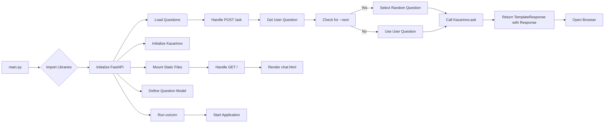

# Code Explanation for hypotez/src/ai/gemini/html_chat/app.py

## <input code>

```python
## \file hypotez/src/ai/gemini/html_chat/app.py
# -*- coding: utf-8 -*-\

#! venv/bin/python/python3.12

"""
.. module: src.ai.gemini.html_chat 
	:platform: Windows, Unix
	:synopsis:

"""


"""
	:platform: Windows, Unix
	:synopsis:

"""


"""
	:platform: Windows, Unix
	:synopsis:

"""


"""
  :platform: Windows, Unix

"""
"""
  :platform: Windows, Unix
  :platform: Windows, Unix
  :synopsis:
"""
  
""" module: src.ai.gemini.html_chat """


""" HERE SHOULD BE A DESCRIPTION OF THE MODULE OPERATION ! """

import header
import webbrowser  # Для автоматического открытия браузера
import threading  # Для запуска браузера в отдельном потоке

from fastapi import FastAPI, Request
from fastapi.templating import Jinja2Templates
from fastapi.staticfiles import StaticFiles
from pydantic import BaseModel
from src.ai.gooogle_generativeai.kazarinov import Kazarinov
import random
from pathlib import Path
from src import gs

# Инициализация FastAPI
app = FastAPI()

# Папка с HTML шаблонами
templates = Jinja2Templates(directory=gs.path.src / 'ai' / 'gooogle_generativeai' / 'chat' / 'templates')

# Подключение статики (CSS Bootstrap)
app.mount("/static", StaticFiles(directory=gs.path.src / 'ai' / 'gooogle_generativeai' / 'chat' / 'static'), name="static")


# Инициализация модели Kazarinov
k = Kazarinov(system_instruction=None, generation_config={'response_mime_type': 'text/plain'})

# Вопросы для чата
questions_list = [
    q_file.read_text() for q_file in (Path(gs.path.google_drive / 'kazarinov' / 'prompts' / 'q').rglob('*.*'))
]

# Модель для данных из формы (вопрос пользователя)
class Question(BaseModel):
    question: str

# Главная страница чата
@app.get("/")
async def get_chat(request: Request):
    return templates.TemplateResponse("chat.html", {"request": request, "response": ""})

# Эндпоинт для отправки вопросов
@app.post("/ask")
async def ask_question(question: Question, request: Request):
    user_question = question.question

    # Если вопрос не задан, загрузить случайный
    if user_question.lower() == "--next":
        q_list = questions_list[random.randint(0, len(questions_list) - 1)].split('\n')
        user_question = q_list[random.randint(0, len(q_list) - 1)]

    # Отправляем вопрос модели Kazarinov
    response = k.ask(user_question, no_log=False, with_pretrain=False)
    
    return templates.TemplateResponse("chat.html", {"request": request, "response": response})

# Функция для открытия браузера
def open_browser():
    webbrowser.open("http://127.0.0.1:8000")

# Запуск приложения FastAPI и браузера
if __name__ == "__main__":
    # Запуск браузера в отдельном потоке
    threading.Timer(1.5, open_browser).start()
    
    # Запуск приложения с uvicorn
    import uvicorn
    uvicorn.run(app, host="127.0.0.1", port=8000)
```

## <algorithm>

**Step 1:** Import necessary libraries: `header`, `webbrowser`, `threading`, `fastapi`, `Jinja2Templates`, `StaticFiles`, `BaseModel`, `Kazarinov`, `random`, `Path`, `gs`.


**Step 2:** Initialize `FastAPI` application and create `templates` object.  
Example: `app = FastAPI()`, `templates = Jinja2Templates(...)`


**Step 3:** Mount static files for Bootstrap CSS.
Example: `app.mount("/static", StaticFiles(...))`


**Step 4:** Initialize `Kazarinov` model with configuration.
Example: `k = Kazarinov(...)`


**Step 5:** Load questions from a file, splitting into a list.
Example: `questions_list = [q_file.read_text() for q_file in ... ]`

**Step 6:** Define `Question` model for user input.
Example: `class Question(BaseModel): question: str`


**Step 7:**  Handle GET request (`/`): Render the initial chat page ("chat.html").
Example:  Return a `TemplateResponse` containing the template and context.


**Step 8:** Handle POST request (`/ask`):
   * Get user question.
   * If user enters "--next", select a random question from `questions_list`.
   * Call `k.ask` method to get response.
   * Return updated `TemplateResponse` with response.

**Step 9:** Open web browser (`open_browser`).
Example: `webbrowser.open("http://127.0.0.1:8000")`


**Step 10:** Run FastAPI application with Uvicorn server. Start timer to open browser.
Example: `uvicorn.run(app, host="127.0.0.1", port=8000)` and `threading.Timer(...)`


## <mermaid>



**Dependencies Analysis:**

- `fastapi`, `Jinja2Templates`, `StaticFiles`, `BaseModel`, `random`, `Path` are from the `fastapi`, `fastapi.templating`, `fastapi.staticfiles`, `pydantic`, `random`, `pathlib` Python libraries, respectively.  These are external libraries required for building web applications and handling data structures.
- `Kazarinov` is from `src.ai.gooogle_generativeai.kazarinov`.  It's custom code/class related to a generative AI model.
- `header` is likely another custom module within the project.  Its function is unclear without seeing its content.
- `gs` imports likely from the `src` directory and provides access to file paths.


## <explanation>

**Imports:**

- `header`:  Purpose unknown without its source code. Likely provides utility functions or constants.
- `webbrowser`, `threading`:  Standard Python libraries for opening web browsers and running tasks concurrently.
- `fastapi`, `Jinja2Templates`, `StaticFiles`, `pydantic.BaseModel`:  Parts of the FastAPI framework for building a web API and handling data structures.
- `Kazarinov`: Custom class/module likely for interacting with the generative AI model. Located within `src.ai.gooogle_generativeai.kazarinov`.
- `random`: Python's built-in module for random number generation.
- `Path`: From `pathlib`, handles file paths in a platform-independent way.
- `gs`: Likely a custom module providing access to project-specific paths and resources (`gs.path.src`, `gs.path.google_drive`).


**Classes:**

- `Question(BaseModel)`: Defines a data structure for user questions, using Pydantic to validate incoming data. Has one attribute: `question`.


**Functions:**

- `open_browser()`: Opens the default web browser to the specified URL.
- `get_chat()`: Handles GET requests to the root path (`/`). It renders the initial chat page (`chat.html`) with an empty response.
- `ask_question()`: Handles POST requests to the `/ask` endpoint. It takes a `Question` object and extracts the user's question. If the input is "--next," it selects a random question from the pre-loaded list. It then sends the question to the `Kazarinov` model (`k.ask`) and returns a `TemplateResponse` with the response.


**Variables:**

- `MODE`: A string variable likely used for configuration.
- `questions_list`: A list containing user questions.
- `k`: An instance of the `Kazarinov` class used to interact with the AI model.
- `templates`: An object managing HTML templates for the application.

**Potential Errors/Improvements:**

- **Error Handling:** The code lacks error handling for cases where `Kazarinov.ask` might return an error (e.g., if the model is unavailable).  Consider adding `try...except` blocks to catch these exceptions and handle them appropriately (e.g., display an error message to the user).
- **Security:** User input (`user_question`) should be properly sanitized to prevent potential vulnerabilities.
- **Code Clarity:** The purpose of `header` import needs clarification; the multiple comment blocks with the same content should be reduced and clarified.


**Chain of Relationships:**

The application depends on the `Kazarinov` model from the `gooogle_generativeai` subpackage. This model likely interacts with the `src` project, potentially using resources and data stored there.  There is also a dependency on FastAPI's components for web application functionality, and the `gs` module for handling paths.
```