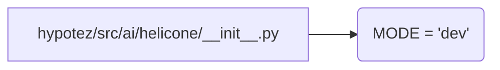

# Code Explanation for hypotez/src/ai/helicone/__init__.py

## <input code>

```python
## \file hypotez/src/ai/helicone/__init__.py
# -*- coding: utf-8 -*-\n#! venv/Scripts/python.exe\n#! venv/bin/python/python3.12\n\n"""
.. module: src.ai.helicone 
	:platform: Windows, Unix
	:synopsis:

"""
MODE = 'dev'
```

## <algorithm>

This file appears to be an initialization file for a module named `helicone` within the `ai` package.  The code doesn't contain any complex logic; it simply defines a variable.

**Step 1: Module Initialization**

```
+-----------------+
| Module `helicone`|
+-----------------+
       |
       V
+-----------------------+
|   Global Variable Definition   |
+-----------------------+
```


**Example Data Flow:**

This module is likely loaded as part of the overall Hypotez application.  When a component of the application needs to use a global mode value (e.g., whether the application is in development or production mode), it will access the `MODE` variable in this module.


## <mermaid>



**Dependency Analysis and Explanation:**

This file contains no direct imports. The mermaid diagram reflects the simple initialization of the global variable.


## <explanation>

**Imports:**

There are no imports in this file. This is a common practice in Python's module initialization files, as the primary focus is on defining constants or configuring the module.  If other modules were used within this package, they would be imported.

**Classes:**

There are no classes in this file.

**Functions:**

There are no functions in this file.

**Variables:**

* `MODE = 'dev'`: This is a global variable that sets the operating mode to `dev`.  It's likely a constant value used throughout the codebase to distinguish development from production environments.   This variable would be used (or at least could be used) to determine different configurations of the code during runtime or for selective logging.


**Potential Errors or Areas for Improvement:**

* **Lack of Documentation:** While the docstrings are present and correctly formatted, they are minimal. More specific details about the variable `MODE` and its purpose in the application would benefit the maintainers in the long term.

* **No Validation:** There's no validation or type checking performed for the `MODE` value. The value might be checked later in the application.

**Relationship with Other Parts of the Project:**

This module is part of a larger project (likely Hypotez). The `MODE` variable defined here is potentially used by other modules, classes, and functions to influence the behavior and configuration of the Hypotez application.  For example, different settings files might be loaded or different logging configurations activated based on the value of `MODE`.


```