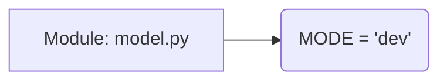

# Code Explanation for hypotez/src/ai/llama/model.py

## <input code>

```python
## \file hypotez/src/ai/llama/model.py
# -*- coding: utf-8 -*-\
#! venv/Scripts/python.exe
#! venv/bin/python/python3.12

"""
.. module: src.ai.llama 
	:platform: Windows, Unix
	:synopsis:

"""
MODE = 'dev'

"""
	:platform: Windows, Unix
	:synopsis:

"""


"""
	:platform: Windows, Unix
	:synopsis:

"""


"""
  :platform: Windows, Unix

"""
"""
  :platform: Windows, Unix
  :platform: Windows, Unix
  :synopsis:
"""MODE = 'dev'
  
""" module: src.ai.llama """
```

## <algorithm>

The provided code snippet is a Python module file (`hypotez/src/ai/llama/model.py`).  It doesn't contain any meaningful executable code.  It's primarily documentation and configuration. There's no clear workflow or algorithm to describe.  The content appears to be intended for documentation generation (e.g., Sphinx, mkdocs).


## <mermaid>



This mermaid code represents the module's simple structure: a single variable declaration.  It demonstrates a simple data flow where the constant 'MODE' is defined in the `model.py` file.


## <explanation>

* **Imports**:  There are no imports. This implies that the file likely relies on other modules and classes defined within other files in the `hypotez` package.

* **Classes**: There are no classes.

* **Functions**: There are no functions.

* **Variables**:
    * `MODE`: A string variable. Its value is set to 'dev'.  Its purpose is to likely indicate the execution mode (e.g., development, production) for the system. This variable is being repeatedly defined, but with no substantial differences.

* **Potential Errors or Areas for Improvement**:
    * **Redundancy:** The variable `MODE` is defined multiple times with the same value, which is redundant and could potentially cause confusion.  Maintaining consistency in the definition is crucial for readability and maintainability.
    * **Documentation:** While there's documentation, it seems to be malformed and incomplete.  It would benefit from consistent formatting and more details to make it more understandable.
    * **Structure:** No actual code is present, which suggests it might be part of a larger project where this variable might be used elsewhere.


**Relationship with Other Project Components**:

The variable `MODE` likely plays a role in configuration and potentially conditional logic within other parts of the `hypotez` package.  It's an example of how configuration parameters can be centralized for use in various modules or programs throughout a larger application.  Additional analysis would be needed to determine how `MODE` is used and which files/modules use this variable.


**Conclusion**:

The provided code snippet does not represent a functioning algorithm or specific behavior. It appears to be mostly intended for documentation and configuration purposes for another part of the project.