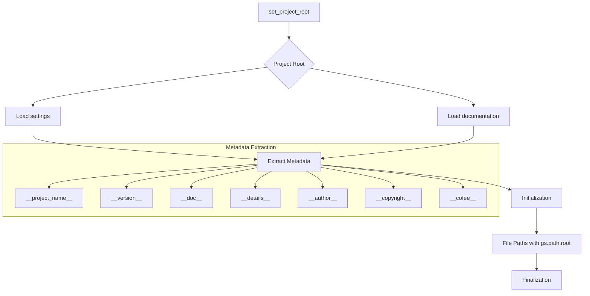

# Code Explanation for hypotez/src/ai/myai/header.py

## <input code>

```python
## \file hypotez/src/ai/myai/header.py
# -*- coding: utf-8 -*-\
#! venv/Scripts/python.exe
#! venv/bin/python/python3.12

"""
.. module: src.ai.myai 
	:platform: Windows, Unix
	:synopsis:

"""
MODE = 'dev'

"""
	:platform: Windows, Unix
	:synopsis:

"""


"""
	:platform: Windows, Unix
	:synopsis:

"""


"""
  :platform: Windows, Unix

"""
"""
  :platform: Windows, Unix
  :platform: Windows, Unix
  :synopsis:
"""MODE = 'dev'
  
""" module: src.ai.myai """

import sys
import json
from packaging.version import Version

from pathlib import Path
def set_project_root(marker_files=('__root__')) -> Path:
    """
    Finds the root directory of the project starting from the current file's directory,
    searching upwards and stopping at the first directory containing any of the marker files.

    Args:
        marker_files (tuple): Filenames or directory names to identify the project root.
    
    Returns:
        Path: Path to the root directory if found, otherwise the directory where the script is located.
    """
    __root__:Path
    current_path:Path = Path(__file__).resolve().parent
    __root__ = current_path
    for parent in [current_path] + list(current_path.parents):
        if any((parent / marker).exists() for marker in marker_files):
            __root__ = parent
            break
    if __root__ not in sys.path:
        sys.path.insert(0, str(__root__))
    return __root__


# Get the root directory of the project
__root__ = set_project_root()
"""__root__ (Path): Path to the root directory of the project"""

from src import gs

settings:dict = None
try:
    with open(gs.path.root / 'src' /  'settings.json', 'r') as settings_file:
        settings = json.load(settings_file)
except (FileNotFoundError, json.JSONDecodeError):
    ...

doc_str:str = None
try:
    with open(gs.path.root / 'src' /  'README.MD', 'r') as settings_file:
        doc_str = settings_file.read()
except (FileNotFoundError, json.JSONDecodeError):
    ...


__project_name__ = settings.get("project_name", 'hypotez') if settings  else 'hypotez'
__version__: str = settings.get("version", '')  if settings  else ''
__doc__: str = doc_str if doc_str else ''
__details__: str = ''
__author__: str = settings.get("author", '')  if settings  else ''
__copyright__: str = settings.get("copyrihgnt", '')  if settings  else ''
__cofee__: str = settings.get("cofee", "Treat the developer to a cup of coffee for boosting enthusiasm in development: https://boosty.to/hypo69")  if settings  else "Treat the developer to a cup of coffee for boosting enthusiasm in development: https://boosty.to/hypo69"
```

## <algorithm>

1. **Initialization:** Sets `MODE` to 'dev'.
2. **Project Root Determination:** Calls `set_project_root` to locate the project root directory using marker files.
3. **Settings Loading:** Attempts to load settings from `src/settings.json`.
4. **Documentation Loading:** Attempts to load documentation from `src/README.MD`.
5. **Metadata Extraction:** Extracts project metadata like name, version, author, etc. from the loaded settings.
6. **Path Manipulation:** Uses the `gs.path.root` to navigate and construct file paths within the project.


## <mermaid>



**Dependencies Analysis:**
- `sys`: Provides access to system-specific parameters and functions.
- `json`: Used for handling JSON data.
- `packaging.version`: Needed for version handling, crucial for dependency management.
- `pathlib`: Facilitates interacting with file paths in a platform-independent manner.
- `src.gs`: A custom module likely containing path manipulation functions (`gs.path.root`). This dependency highlights the modular design of the project.


## <explanation>

- **Imports:**
    - `sys`: Used for interacting with the Python interpreter, such as inserting paths into the module search path, critical for accessing files from the project's root directory.
    - `json`: Used for parsing the `settings.json` file to extract project settings.
    - `packaging.version`: Used for handling and comparing software versions.
    - `pathlib`: Used for working with file paths in a platform-independent way.  Importantly, `pathlib` allows constructing absolute paths from the current file, making the code more robust.
    - `src.gs`: This import is crucial for interacting with the project's file structure.  `gs` likely contains utility functions specifically designed for interacting with file systems, such as functions for finding the project root (`gs.path.root`). This modular design promotes code organization and maintainability.


- **Classes:** There are no classes defined in this file.

- **Functions:**
    - `set_project_root()`: This function dynamically determines the root directory of the project. It takes a tuple of marker files as input, which are used to traverse upwards from the current file's directory to find the directory containing those files. It ensures the project root directory is added to `sys.path`, which is crucial for importing modules from subdirectories correctly.


- **Variables:**
    - `MODE`: A string variable likely used to indicate the current application mode (e.g., 'dev', 'prod').
    - `__root__`: A `Path` object representing the root directory of the project.
    - `settings`: A dictionary containing project settings loaded from `settings.json`.
    - `doc_str`: A string containing the documentation loaded from `README.MD`.
    - `__project_name__`, `__version__`, `__doc__`, `__details__`, `__author__`, `__copyright__`, `__cofee__`: String variables containing various metadata extracted from settings.

- **Potential Errors/Improvements:**
    - **Robustness:** The `try...except` blocks for loading settings and documentation are good practice.  Consider adding more informative error messages within the `except` blocks to aid debugging.
    - **Error Handling**: Adding specific error handling for situations where `gs.path` isn't defined (e.g., a `gs` module doesn't exist).

- **Relationships with Other Parts of the Project:**
    - This file heavily relies on the `gs` module (likely `src.gs`) for path manipulation.  It interacts with `src/settings.json` and `src/README.MD` to load project settings and documentation. The variables used (e.g., `__project_name__`, `__version__`) are likely used in other parts of the project, indicating a consistent use of metadata.  The use of `from src import gs` indicates that the `gs` module (or other related modules in `src`) is in a separate, structured component of the project.


This file acts as a central configuration point for the project, enabling the import of critical modules/settings and handling the identification of the project root directory, facilitating easy access to the project's resources.