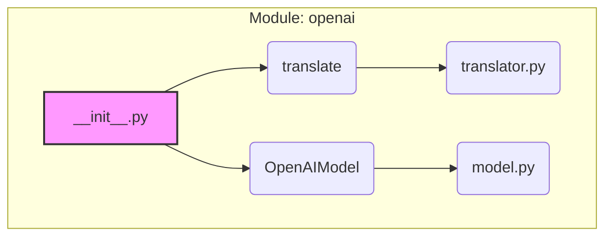

# <input code>

```python
## \file hypotez/src/ai/openai/__init__.py
# -*- coding: utf-8 -*-\n#! venv/Scripts/python.exe\n#! venv/bin/python/python3.12\n\n"""
# .. module: src.ai.openai 
# 	:platform: Windows, Unix
# 	:synopsis: Модуль модели `openai`
#
"""
MODE = 'dev'

from .translator import translate
from .model import OpenAIModel
```

# <algorithm>

```
+-----------------+
|   __init__.py   |
+-----------------+
      |
      V
+-----------+     +-----------+
| translate |---->| OpenAIModel|
+-----------+     +-----------+
      |
      |
      |
      | (Initialization)
```

**Example Data Flow:**

1. The `__init__.py` file imports functions and classes from submodules (`translator` and `model`).
2. It defines a global variable `MODE` with the value 'dev'.
3.  Later code in other modules can access the `translate` function and `OpenAIModel` class defined in `translator.py` and `model.py` respectively.


# <mermaid>



**Dependency Analysis:**

The diagram shows a simple import structure.  `__init__.py` imports `translate` from `translator.py` and `OpenAIModel` from `model.py`. These are presumed to be contained within the same directory structure (`hypotez/src/ai/openai`). This implies a relationship where the functionality of `translator` and `OpenAIModel` are used by the `__init__.py` module.  The `translator.py` and `model.py` modules would likely contain the detailed implementation of the `translate` function and the `OpenAIModel` class.

# <explanation>

* **Imports:**
    * `from .translator import translate`: This line imports the `translate` function from the `translator.py` module, which is located in the same directory as `__init__.py`.  This is a relative import.
    * `from .model import OpenAIModel`: Similarly, this imports the `OpenAIModel` class from the `model.py` module in the same directory.

* **Variables:**
    * `MODE = 'dev'`: This defines a global variable named `MODE` and sets its value to 'dev'. This likely indicates a development mode, which might influence the behavior of the code (e.g., using different API keys or logging levels).

* **Classes and Functions (Implied):**
    * `OpenAIModel`:  The `OpenAIModel` class, likely responsible for interacting with the OpenAI API.  Details are not visible from this file alone. It will likely have methods to make API requests, process responses, and manage OpenAI model instances.
    * `translate`: The `translate` function, implied to handle translation tasks (likely using `OpenAIModel`). It could also represent a wrapper function for handling different language pairs, input types, or configurations.

* **Potential Errors and Improvements:**
    * The code lacks any error handling.  Crucially, if an imported module (`translator` or `model`) is not found or cannot be imported, the Python interpreter will raise a `ModuleNotFoundError`.  It's vital to include `try...except` blocks to gracefully handle such situations and prevent the entire application from crashing.
    * Adding detailed docstrings to the `translate` function and the `OpenAIModel` class will improve the maintainability and readability of the code, allowing others to understand the expected inputs, outputs, and behavior.
    * If there are specific settings or configurations needed for the OpenAI API, consider using a configuration file (e.g., `.env`) for storing them to avoid hardcoding sensitive information directly within the script.


**Chain of Relationships:**

This `__init__.py` file establishes a foundational connection in the `hypotez` project.  It will likely be used by other parts of the application that need to interact with the OpenAI API via the `translate` and `OpenAIModel` implementations from `translator.py` and `model.py`.  Without seeing `translator.py` and `model.py`, the exact relationships are unknown, but it's safe to assume that calls to the OpenAI API or the `translate` functionality are made from other parts of the application.