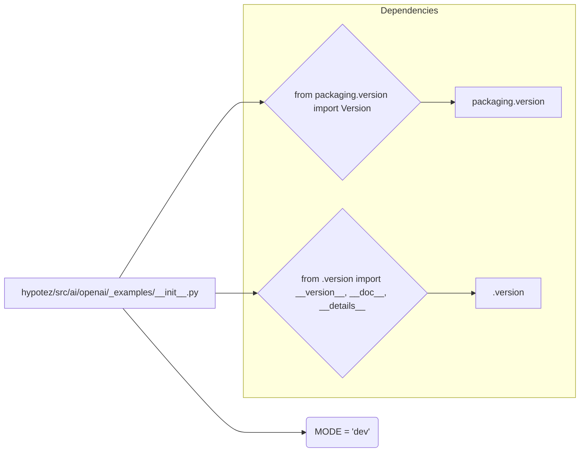

# Code Explanation for `hypotez/src/ai/openai/_examples/__init__.py`

## <input code>

```python
## \file hypotez/src/ai/openai/_examples/__init__.py
# -*- coding: utf-8 -*-\n#! venv/Scripts/python.exe\n#! venv/bin/python/python3.12\n\n"""
.. module: src.ai.openai._examples 
	:platform: Windows, Unix
	:synopsis:

"""
MODE = 'dev'

"""
	:platform: Windows, Unix
	:synopsis:

"""


"""
	:platform: Windows, Unix
	:synopsis:

"""


"""
  :platform: Windows, Unix

"""
"""
  :platform: Windows, Unix
  :platform: Windows, Unix
  :synopsis:
"""MODE = 'dev'
  
""" module: src.ai.openai._examples """


from packaging.version import Version
from .version import __version__, __doc__, __details__
```

## <algorithm>

This Python file appears to be an initialization module for a package related to OpenAI within the `hypotez` project.  It mainly defines a constant, and imports from a submodule named `version`.

```
+-----------------+
| Initialization  |
+-----------------+
|      MODE      |--->  'dev' (Constant)
+-----------------+
|Import Statements|
+-----------------+
|     from .version      |
| import __version__, ...|
+-----------------+
```

No significant processing or logic is evident in this file.  The algorithm consists mostly of defining constants and importing necessary components from other modules.


## <mermaid>




## <explanation>

### Imports

*   `from packaging.version import Version`: Imports the `Version` class from the `packaging.version` module. This module is likely used for managing and comparing software versions, a common practice in Python projects.  This import suggests version checking or handling related to the OpenAI API or dependencies. This import is a dependency on an external library.
*   `from .version import __version__, __doc__, __details__`: Imports `__version__`, `__doc__`, and `__details__` from a file named `version.py` (likely located in the same directory as `__init__.py`). These are likely version information, documentation strings, and other metadata fields typically defined for Python packages. This import demonstrates a relationship to a submodule within the same package responsible for versioning.


### Variables

*   `MODE = 'dev'`: Defines a string variable `MODE` with the value 'dev'. This likely indicates a development mode, but without further context, its exact purpose is unclear.  It could control configuration options for the project.

### Classes

There are no classes defined in this file.

### Functions

No functions are defined.

### Potential Errors/Improvements

*   **Missing Documentation:** While there are docstrings, they are quite rudimentary. More descriptive documentation explaining the purpose of `MODE` and the role of this module within the `hypotez` project would greatly enhance readability and understanding.
*   **Redundant `MODE` Definitions:**  There are multiple `MODE = 'dev'` lines.  It would be more efficient to have a single definition. This is a simple error in style, not a bug.

### Relationships with Other Parts of the Project

This `__init__.py` file serves as an entry point to the `_examples` subpackage in the `openai` package within `hypotez`.  The `version.py` file referenced in the `from` statement is essential for defining metadata associated with this module and for its package, showing an internal relationship. The `packaging.version` is a dependency required for version handling, and is not internal to `hypotez`.