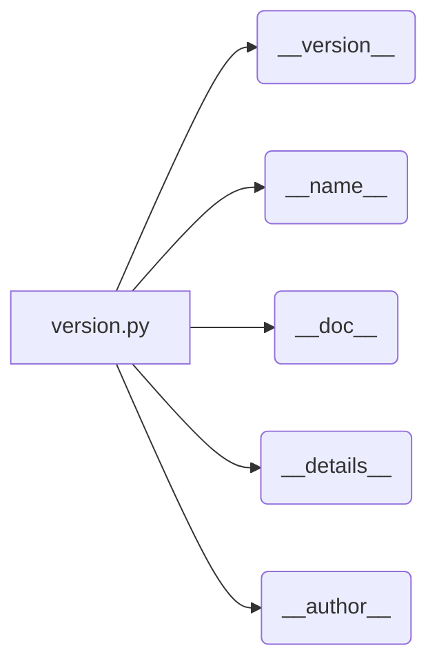

# Code Explanation for `hypotez/src/ai/openai/_examples/version.py`

## <input code>

```python
## \file hypotez/src/ai/openai/_examples/version.py
# -*- coding: utf-8 -*-\n#! venv/Scripts/python.exe\n#! venv/bin/python/python3.12\n\n"""
.. module: src.ai.openai._examples 
	:platform: Windows, Unix
	:synopsis:

"""


"""
	:platform: Windows, Unix
	:synopsis:

"""


"""
	:platform: Windows, Unix
	:synopsis:

"""


"""
  :platform: Windows, Unix

"""
"""
  :platform: Windows, Unix
  :platform: Windows, Unix
  :synopsis:
"""
  
""" module: src.ai.openai._examples """


""" @namespace src.ai._examples """


"""
- `__version__`: This variable holds the version of the module or package.
- `__name__`: Contains the name of the module. If the script is being run directly, the value will be `"__main__"`.
- `__doc__`: The module's documentation string.
- `__details__`: This variable likely contains additional details about the module, but the exact purpose depends on the specific module or package.
- `__annotations__`: Contains type annotations for variables and functions in the module.
- `__author__`: The name(s) of the author(s) of the module.
"""
__name__:str
__version__="3.12.0.0.0.4"
__doc__:str
__details__:str="Details about version for module or class"
__annotations__

__author__='hypotez '
```

## <algorithm>

This script defines module-level metadata, mainly versioning and author information. There's no procedural algorithm or data flow in the traditional sense. The workflow consists of defining variables.

```
+-----------------+
| Define Metadata |
+-----------------+
     |
     v
+------------------+
| __version__ = ...|
| __name__  = ... |
| __doc__ = ...   |
| __details__ = ...|
| __author__ = ...|
+------------------+
```

## <mermaid>



This mermaid diagram simply shows the relationships between the file and its exported variables. The variables hold metadata values, and they are defined directly inside the Python script.


## <explanation>

### Imports:

There are no imports in this file.  This is a module definition script, not a program that calls other functions or libraries.

### Classes:

There are no classes defined in this file.

### Functions:

There are no functions defined in this file.

### Variables:

* `__version__`: Holds the version string "3.12.0.0.0.4".  This is crucial for managing different versions of the module.
* `__name__`:  A built-in variable that holds the name of the module.
* `__doc__`: The docstring, providing documentation about the module.
* `__details__`:  A variable to store more detailed information about the module, which isn't used in the example, and likely should be further detailed.
* `__annotations__`:  A built-in variable that's a dictionary that can contain type annotations and other metadata.
* `__author__`: Contains the author's name.  Consider using a consistent format (e.g., a list of authors for multiple contributors).
* `MODE`: This variable `` is a somewhat unusual example in a module defining metadata. It's important to document what the `MODE` variable is intended for.

### Potential Errors or Areas for Improvement:

* **Redundant Documentation:** The multiple `"""Docstrings"""` are redundant and should be consolidated into a single, clear docstring.
* **Variable `MODE`:** Its purpose is unclear without additional context. Is this meant to be a global configuration option? If so, consider using a configuration file or better variable naming to avoid confusion.
* **PEP 8 Compliance:** While the code is syntactically correct, consider applying PEP 8 style guidelines for better readability and maintainability. For example,  using a consistent naming convention for variables.


### Relationships with other parts of the project:

This file is likely a part of a larger project. The versioning information here would be used by the project's build and packaging system (e.g., `setup.py`, `poetry.toml`) to track and manage different versions of the `src.ai.openai._examples` module.  The `__version__` variable, when combined with a proper `setup.py` or similar, will be used to record the version in installation packages.