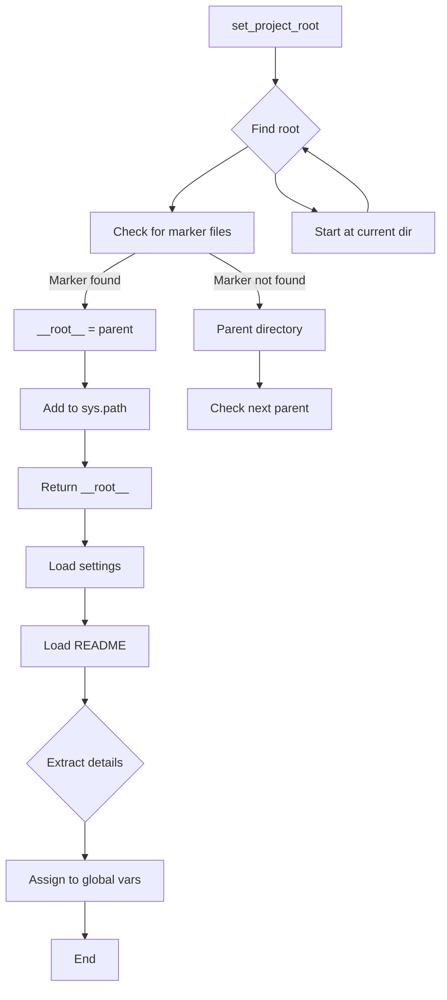

# Code Analysis of hypotez/src/ai/openai/header.py

## <input code>

```python
## \file hypotez/src/logger/header.py
# -*- coding: utf-8 -*-\n
#! venv/Scripts/python.exe\n
#! venv/bin/python/python3.12\n

"""
module: src.logger 
	:platform: Windows, Unix
	:synopsis: Модуль определяющий корневой путь к проекту. Все импорты строятся относительно этого пути.
    :TODO: В дальнейшем перенести в системную переменную"""


import sys
import json
from packaging.version import Version

from pathlib import Path
def set_project_root(marker_files=('__root__','.git')) -> Path:
    """
    Finds the root directory of the project starting from the current file's directory,
    searching upwards and stopping at the first directory containing any of the marker files.

    Args:
        marker_files (tuple): Filenames or directory names to identify the project root.
    
    Returns:
        Path: Path to the root directory if found, otherwise the directory where the script is located.
    """
    __root__:Path
    current_path:Path = Path(__file__).resolve().parent
    __root__ = current_path
    for parent in [current_path] + list(current_path.parents):
        if any((parent / marker).exists() for marker in marker_files):
            __root__ = parent
            break
    if __root__ not in sys.path:
        sys.path.insert(0, str(__root__))
    return __root__


# Get the root directory of the project
__root__ = set_project_root()
"""__root__ (Path): Path to the root directory of the project"""

from src import gs

settings:dict = None
try:
    with open(gs.path.root / 'src' / 'settings.json', 'r') as settings_file:
        settings = json.load(settings_file)
except (FileNotFoundError, json.JSONDecodeError):
    ...

doc_str:str = None
try:
    with open(gs.path.root / 'src' / 'README.MD', 'r') as settings_file:
        doc_str = settings_file.read()
except (FileNotFoundError, json.JSONDecodeError):
    ...


__project_name__ = settings.get("project_name", 'hypotez') if settings  else 'hypotez'
__version__: str = settings.get("version", '')  if settings  else ''
__doc__: str = doc_str if doc_str else ''
__details__: str = ''
__author__: str = settings.get("author", '')  if settings  else ''
__copyright__: str = settings.get("copyrihgnt", '')  if settings  else ''
__cofee__: str = settings.get("cofee", "Treat the developer to a cup of coffee for boosting enthusiasm in development: https://boosty.to/hypo69")  if settings else "Treat the developer to a cup of coffee for boosting enthusiasm in development: https://boosty.to/hypo69"
```

## <algorithm>

**Step 1**: Define `set_project_root` function.  This function takes a tuple of marker files as input to locate the project root.

**Step 2**: `set_project_root` starts at the current file's directory.

**Step 3**: `set_project_root` recursively traverses up the directory tree.

**Step 4**: For each parent directory, it checks if any of the marker files exist within.

**Step 5**: If a marker file is found, the function sets the `__root__` variable to the current parent directory and breaks the loop.

**Step 6**: If no marker file is found, the `__root__` variable remains the current directory.

**Step 7**: Add the project root directory to the `sys.path`.

**Step 8**: The `__root__` variable now holds the determined project root.

**Step 9**: Load project settings from `src/settings.json` using a `try...except` block.

**Step 10**: Load documentation from `src/README.MD`.


**Step 11**: Extract project settings (project name, version, author, etc.) from the settings file. Default values are provided in case of file missing or error reading.


## <mermaid>



**Dependencies**:

* `sys`: Provides access to system-specific parameters and functions.
* `json`: Used for handling JSON data.
* `packaging.version`: Used for version handling (likely for checking Python package versions).
* `pathlib`:  Facilitates working with file paths in a platform-independent way, a crucial dependency for project-root finding.
* `src.gs`:  This likely imports a helper module (`gs`) that defines functions to interact with resources (`gs.path.root`) related to the project.

## <explanation>

* **Imports:**
    * `sys`: Used to modify the Python path, ensuring that the project's modules are importable.
    * `json`: Used to load configuration settings from `settings.json`.
    * `packaging.version`:  Importantly, it's used to handle and compare Python package versions; a crucial role within the context of project or library dependencies.
    * `pathlib`:  Essential for working with filesystem paths in a system-independent manner, very important for portability. This is essential for finding the project root and referencing resources relative to that root.
    * `src.gs`: This is a custom module within the project, crucial for the `gs.path.root` function to access project resources.


* **Classes (none):** No classes are defined in this file.

* **Functions:**
    * `set_project_root(marker_files)`: This function is crucial for finding the root directory of the project. It takes a tuple of marker file names (e.g., `pyproject.toml`, `requirements.txt`, `.git`) as input and recursively searches up the directory tree until one of these marker files is found. It then adds the project root to the `sys.path` list to make modules in subdirectories importable.

* **Variables:**
    * `__root__`: Stores the determined root directory of the project. This variable is crucial for referencing project resources.
    * `settings`: Stores the configuration data loaded from `settings.json`.
    * `doc_str`: Stores the content read from the `README.MD` file.
    * `__project_name__`, `__version__`, `__author__`, etc.: These global variables store project metadata (project name, version, author). These are accessed later in the project.

* **Potential Errors/Improvements:**
    * The use of `...` in the `try...except` blocks is a bit crude. Consider raising more descriptive exceptions or logging the error.
    * Using try-except blocks to handle potential errors is generally a good practice.  This avoids crashing the program if a file is not found or is invalid.
    * The use of magic variable names (`__root__`, `__version__`, `settings`, `doc_str`) should be kept consistent in a project and clearly documented.

**Chain of Relationships**:

This code snippet is a crucial part of the project initialization process. It identifies the root directory and loads important configuration information.  It relies on the existence of `settings.json` and `README.MD` files, and it depends on the existence and correct functionality of the `src.gs` module. Subsequent code in the project depends on the variables containing metadata from the project directory (name, version, author).