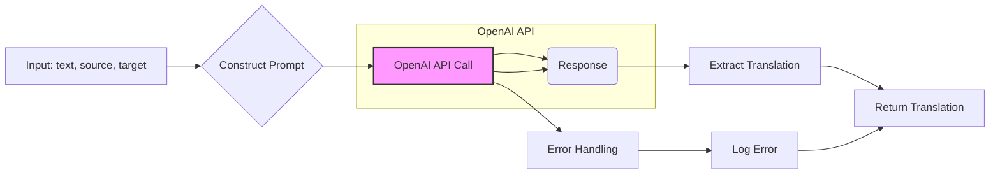

# <input code>

```python
## \file hypotez/src/ai/openai/translator.py
# -*- coding: utf-8 -*-\
#! venv/Scripts/python.exe
#! venv/bin/python/python3.12

"""
.. module:: src.ai.openai
    :platform: Windows, Unix
    :synopsis: Модуль для перевода текста с использованием OpenAI API.
"""


import openai
from src import gs
from src.logger import logger

openai.api_key = gs.credentials.openai

def translate(text, source_language, target_language):
    """
    Перевод текста с использованием OpenAI API.

    Этот метод отправляет текст для перевода на указанный язык с помощью модели OpenAI и возвращает переведённый текст.

    Аргументы:
        text (str): Текст для перевода.
        source_language (str): Язык исходного текста.
        target_language (str): Язык для перевода.

    Возвращает:
        str: Переведённый текст.

    Пример использования:
        >>> source_text = "Привет, как дела?"
        >>> source_language = "Russian"
        >>> target_language = "English"
        >>> translation = translate_text(source_text, source_language, target_language)
        >>> print(f"Translated text: {translation}")
    """
    
    # Формируем запрос к OpenAI API
    prompt = (
        f"Translate the following text from {source_language} to {target_language}:\\n\\n"
        f"{text}\\n\\n"
        f"Translation:"
    )

    try:
        # Отправляем запрос к OpenAI API
        response = openai.Completion.create(
            engine="text-davinci-003",  # Укажите нужную модель
            prompt=prompt,
            max_tokens=1000,
            n=1,
            stop=None,
            temperature=0.3
        )

        # Извлекаем перевод из ответа API
        translation = response.choices[0].text.strip()
        return translation
    except Exception as ex:
        # Логируем ошибку
        logger.error("Error during translation", ex)
        return
```

# <algorithm>

1. **Initialization:** Import necessary modules (`openai`, `gs`, `logger`). Set the OpenAI API key using `gs.credentials.openai`.
2. **Translation Request:** Constructs a prompt string that includes the input `text`, `source_language`, and `target_language`.
3. **API Call:** Sends a completion request to the OpenAI API using the `openai.Completion.create` method. The request includes the constructed prompt, engine, `max_tokens`, `n`, `stop`, and `temperature` parameters.
4. **Response Handling:** Captures the response from the OpenAI API. Extracts the translated text from the `response.choices[0].text`.
5. **Error Handling:** Includes a `try...except` block to handle potential errors during the API call and logs the error using `logger.error`.
6. **Return Value:** Returns the translated `text` if successful, or `None` if an error occurs.

**Example Data Flow:**

```
+-----------------+     +-----------------+
|     Input        | --> |  Translation  |
+-----------------+     +-----------------+
| text, source,    |     | Request       |
| target language  |  --->| to OpenAI    |
+-----------------+     +-----------------+
|                     |     |Response        |
+-----------------+     +-----------------+
|  prompt           |     | translated    |
|                     | <---|  text        |
+-----------------+     +-----------------+
        |                      |
        V                      V
+-----------------+     +-----------------+
|  API Request     | --> |  Return value  |
+-----------------+     +-----------------+
```


# <mermaid>



**Dependencies Analysis:**

- `openai`:  Handles interactions with the OpenAI API.  It's a separate package.
- `gs`: Likely a package containing global settings or configurations, potentially holding credentials like the OpenAI API key. The code shows a dependency on `gs.credentials.openai`.
- `logger`: A custom logging module that would be defined elsewhere in the project (`src.logger`).  It's responsible for logging errors during the translation process.


# <explanation>

**Imports:**

- `openai`: Used for interacting with the OpenAI API to perform the translation.  It's expected to be a separate package installed.
- `gs`:  Implements a way to access the global settings and configuration, most likely including credentials such as the OpenAI API key.
- `logger`:  This is likely a custom logging module from the `src` package.  It's used to record errors during the translation process.

**Classes:**

No classes are defined in the code snippet.

**Functions:**

- `translate(text, source_language, target_language)`:
    - Takes the text to translate, source language, and target language as input.
    - Constructs a prompt string to send to the OpenAI API for translation.
    - Uses `openai.Completion.create` to make the API call.
    - Handles potential exceptions during the API call.
    - Returns the translated text if successful or `None` if an error occurs.

**Variables:**

- `MODE`:  A global variable likely used for setting the mode of operation (e.g., 'dev', 'prod').
- `openai.api_key`: Holds the OpenAI API key retrieved from `gs.credentials.openai`.

**Potential Errors and Improvements:**

- **Error Handling:** The `try...except` block is good for catching exceptions, but it could be improved by providing more specific error handling (e.g., checking for specific OpenAI API errors) and logging detailed error information.  It should also consider `requests`-related exceptions.
- **Input Validation:**  The code doesn't validate the inputs.  Checking for valid `text`, `source_language`, and `target_language` would be beneficial.  For example, `source_language` and `target_language` should be valid language codes understood by the OpenAI API.
- **Rate Limiting:**  OpenAI API has rate limits. The code does not account for this.  Implement mechanisms to handle API rate limits and avoid exceeding them.
- **Prompt Engineering:**  The prompt structure could be improved to provide more context or instructions to the OpenAI model to get better quality translations.


**Relationship with other project parts:**

The code depends on `gs` for the OpenAI API key and `logger` for error handling, indicating a relationship with other components in the `src` package.  The `gs` package likely handles other global configuration data, and the `logger` package ensures consistent error reporting throughout the application.