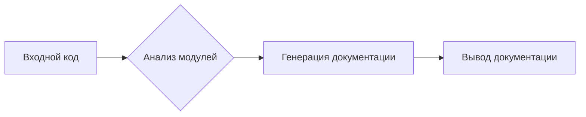

# Документация для кода (пример)

Этот документ содержит примеры документации для кода в формате RST, соответствующем указанным инструкциям.

**1. Модуль: `code_documenter`**

- Этот модуль отвечает за генерацию документации для кода в формате Markdown.
- Он использует шаблон для создания описаний модулей, классов, функций и методов.

## Примеры использования

```python
# Пример генерации документации для модуля
from code_documenter import generate_docstring

module_doc = generate_docstring('my_module')
print(module_doc)
```

```python
# Пример генерации документации для класса
from code_documenter import generate_docstring

class MyClass:
  def my_method(self):
      pass

class_doc = generate_docstring(MyClass)
print(class_doc)
```

```python
# Пример генерации документации для функции
from code_documenter import generate_docstring

def my_function(arg1, arg2):
  """Функция для демонстрации."""
  pass


function_doc = generate_docstring(my_function)
print(function_doc)
```


**2. Класс: `CodeDocumenter` (пример)**

- Класс `CodeDocumenter` отвечает за создание документации для кода.

## Атрибуты

- `code_source`: Исходный код для анализа.
- `output_format`: Формат вывода документации (Markdown).


## Методы

### `generate_module_docstring`

- Генерирует документацию для модуля.
- Принимает имя модуля.
- Возвращает строку документации в формате Markdown.

### `generate_class_docstring`

- Генерирует документацию для класса.
- Принимает объект класса.
- Возвращает строку документации в формате Markdown.

### `generate_function_docstring`

- Генерирует документацию для функции.
- Принимает объект функции.
- Возвращает строку документации в формате Markdown.


**3. Функции и методы (пример)**

### `generate_docstring(obj)`

- Функция принимает объект (модуль, класс, функцию) и генерирует его документацию в формате RST.
- Использует `inspect` для получения информации о параметрах и возвращаемых значениях.


**4. Комментарии в коде (пример)**

```python
# Этот код демонстрирует пример документации для функции
def my_function(arg1, arg2):
    """
    Функция для сложения двух чисел.
    :param arg1: Первое число.
    :param arg2: Второе число.
    :return: Сумма двух чисел.
    """
    return arg1 + arg2
```

**5. Исключение (пример)**

```python
# Обработка исключения FileNotFoundError
try:
    open("my_file.txt")  # Пример использования
except FileNotFoundError as e:
    print(f"Ошибка: {e}")
```

**mermaid**



**Explanation**

- **Imports:** В примере нет импортов. Примеры показывают, как можно было бы импортировать библиотеку `inspect`.
- **Classes:**  `CodeDocumenter` (пример) – отвечает за генерацию документации из кода.
- **Functions:**  `generate_docstring` (пример) – основной метод для генерации документации для различных объектов (модулей, классов, функций).
- **Variables:**  В примерах используются переменные для хранения исходного кода, результатов анализа и выходных данных.
- **Potential errors:**  Возможно, для реального проекта потребуется обработка исключений (например, ошибки в синтаксисе кода) и валидация входных данных.

**Chain of relationships:**

- Модуль `code_documenter` использует библиотеку `inspect` для анализа кода.


**Примечание:**  Данный пример не является полным, но демонстрирует структуру документации.  Для реального проекта требуется разработка более сложных механизмов анализа кода и генерации документации, а также интеграция с другими частями проекта `hypotez`.