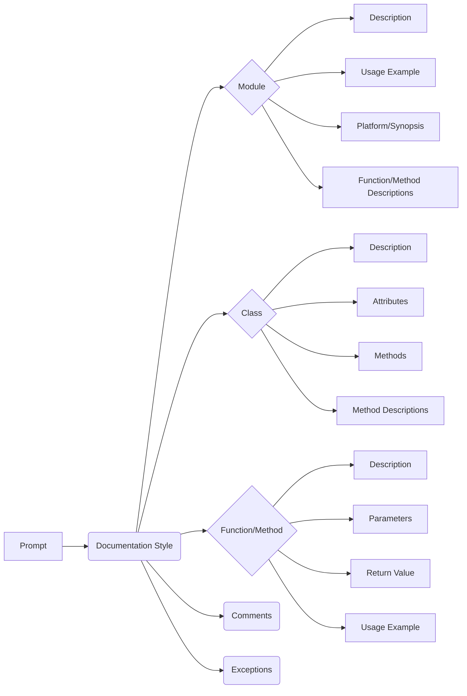

# <input code>

```
"prompt": "Ты должен оформлять документацию по коду в следующем стиле. Все комментарии к коду, включая описание модуля, классов и функций, должны быть написаны в формате reStructuredText (RST). Для каждого модуля, класса и функции следуй следующему шаблону:\n\n1. **Модуль**:\n    - Описание модуля должно быть оформлено в заголовке, с указанием его назначения.\n    - Укажи примеры использования модуля, если это возможно. Пример кода должен быть оформлен в блоке `.. code-block:: python`.\n    - Укажи платформы и синопсис модуля.\n    - Для описания функций и методов модуля используй заголовки для атрибутов и методов, если это необходимо.\n\nПример оформления для модуля:\n```\nМодуль для работы ассистента программиста\n=========================================================================================\n\nЭтот модуль содержит класс :class:`CodeAssistant`, который используется для работы с различными моделями ИИ, \nтакими как Google Gemini и OpenAI, для выполнения задач по обработке кода.\n\nПример использования\n--------------------\n\nПример использования класса `CodeAssistant`:\n\n.. code-block:: python\n\n    assistant = CodeAssistant(role=\'code_checker\', lang=\'ru\', model=[\'gemini\'])\n    assistant.process_files()\n```\n\n2. **Классы**:\n    - Каждый класс должен быть оформлен в соответствии с его назначением. Указывай описание класса, его атрибуты и методы.\n    - В разделе классов укажи все методы и их назначение, а также примеры использования.\n    - Для каждого метода используйте описание его параметров и возвращаемых значений, а также примеры использования.\n\nПример оформления для класса:\n```\nКласс для работы с ассистентом программиста\n=========================================================================================\n\nКласс :class:`CodeAssistant` используется для взаимодействия с различными моделями ИИ, такими как Google Gemini, \nи предоставляет методы для анализа и создания документации для кода.\n\nАтрибуты:\n----------\n- `role`: Роль ассистента (например, \'code_checker\').\n- `lang`: Язык, на котором будет работать ассистент (например, \'ru\').\n- `model`: Список используемых моделей ИИ (например, [\'gemini\']).\n\nМетоды:\n--------\n- `process_files`: Метод для обработки файлов с кодом.\n\nПример использования:\n---------------------\n\n.. code-block:: python\n\n    assistant = CodeAssistant(role=\'code_checker\', lang=\'ru\', model=[\'gemini\'])\n    assistant.process_files()\n```\n\n3. **Функции и методы**:\n    - Оформи описание каждой функции или метода, указывая параметры и возвращаемые значения.\n    - Для каждой функции добавь описание её назначения и примеры использования в формате `.. code-block:: python`.\n\nПример оформления для метода:\n```\nМетод для обработки файлов\n=========================================================================================\n\nЭтот метод используется для анализа и обработки файлов с кодом.\n\nПараметры:\n-----------\n- `files`: Список файлов для обработки.\n- `options`: Дополнительные параметры, которые могут быть использованы для настройки обработки.\n\nВозвращаемое значение:\n----------------------\n- Возвращает результат обработки в виде списка анализируемых данных.\n\nПример использования:\n---------------------\n\n.. code-block:: python\n\n    assistant = CodeAssistant(role=\'code_checker\', lang=\'ru\', model=[\'gemini\'])\n    result = assistant.process_files(files=[\'file1.py\', \'file2.py\'], options={})\n```\n\n4. **Комментарии в коде**:\n    - Все комментарии в коде должны быть оформлены в формате RST, и они должны объяснять, что делает конкретная часть кода.\n    - Оставляй комментарии в блоках, а не в строках. Используй комментарии для описания логики, а также для объяснения решений или временных решений в коде.\n    - Пример:\n    ```\n    # Здесь происходит обработка исключений, чтобы продолжить выполнение, если файл не найден\n    try:\n        process_file(file)\n    except FileNotFoundError as ex:\n        handle_exception(ex)\n    ```\n\n5. **Исключения**:\n    - Оформляй описание исключений для классов, методов и функций.\n    - Указывай, какие исключения могут быть подняты, и при каких обстоятельствах.\n\nПример описания исключений:\n```\nИсключение при отсутствии файла\n=========================================================================================\n\nЭто исключение возникает, когда файл не найден в процессе обработки.\n\nПараметры:\n-----------\n- `file`: Путь к файлу, который не был найден.\n\nПример использования:\n---------------------\n\n.. code-block:: python\n\n    try:\n        open(file)\n    except FileNotFoundError as ex:\n        raise FileNotFoundError("Файл не найден") from ex\n```\n\nПридерживайся этих инструкций для создания документации по коду. Все комментарии должны быть четкими, информативными и соответствовать стандарту RST."\n
```

# <algorithm>

N/A.  The input is a prompt, not executable code.  No algorithm can be diagrammed.


# <mermaid>



**Dependencies Analysis:**

The mermaid diagram depicts a high-level structure for RST-style documentation generation. There are no external dependencies (imports) directly present in the prompt.  It's a description of a *process* or *requirement*, not code.


# <explanation>

The input is a *prompt*, not executable code.  It describes a set of instructions for generating RST-style documentation for Python code.

* **Imports:**  There are no imports; this is a specification for a documentation style.
* **Classes:** The prompt describes how classes should be documented, including attributes, methods, and usage examples.
* **Functions:**  The prompt describes how to document functions, including parameters, return values, descriptions, and examples.
* **Variables:** The prompt doesn't directly deal with variables, as it's concerned with structuring documentation for code elements.
* **Potential Errors/Improvements:**  The prompt itself has no errors. However, the prompt is incomplete without the Python code it should be used to document.


**Relationships with other parts of the project:**

The prompt defines a *process* for creating documentation.  It doesn't reference any particular project components. The next step would be to apply this prompt to actual Python code to generate the documentation.