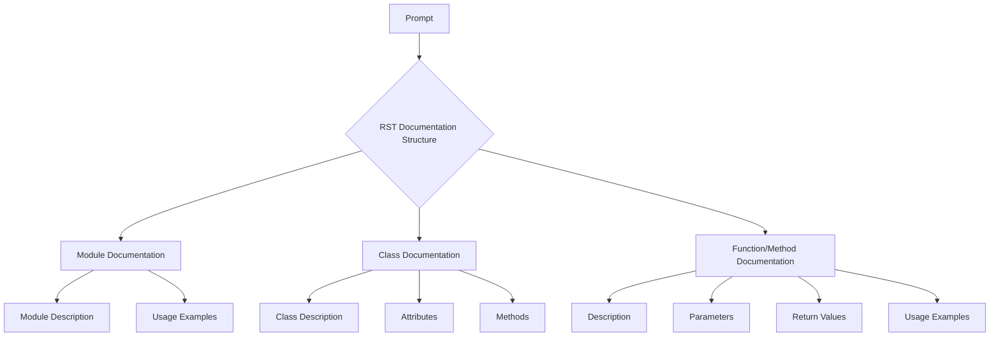

# Code Documentation Generation Prompt

## <input code>

```
"prompt": "You must document code in the following style. All comments in the code, including module, class, and function descriptions, should be written in reStructuredText (RST) format. For each module, class, and function, follow this template:\n\n1. **Module**:\n    - The module description should be written in the header, indicating its purpose.\n    - Provide examples of using the module, if possible. Code examples should be enclosed in a `.. code-block:: python` block.\n    - Specify the platforms and synopsis of the module.\n    - Use headers for attributes and methods of the module where necessary.\n\nExample of module documentation:\n```\nModule for working with a programming assistant\n=========================================================================================\n\nThis module contains the :class:`CodeAssistant` class, which is used to interact with various AI models, \nsuch as Google Gemini and OpenAI, for code processing tasks.\n\nExample usage\n--------------------\n\nExample of using the `CodeAssistant` class:\n\n.. code-block:: python\n\n    assistant = CodeAssistant(role=\'code_checker\', lang=\'ru\', model=[\'gemini\'])\n    assistant.process_files()\n```\n\n2. **Classes**:\n    - Each class should be described according to its purpose. Include the class description, its attributes, and methods.\n    - In the class section, list all methods, their purpose, and examples of usage.\n    - For each method, include descriptions of its parameters and return values, as well as examples.\n\nExample of class documentation:\n```\nClass for working with the programming assistant\n=========================================================================================\n\nThe :class:`CodeAssistant` class is used to interact with various AI models such as Google Gemini, \nand provides methods for analyzing and generating documentation for code.\n\nAttributes:\n----------\n- `role`: The role of the assistant (e.g., \'code_checker\').\n- `lang`: The language the assistant will use (e.g., \'ru\').\n- `model`: List of AI models used (e.g., [\'gemini\']).\n\nMethods:\n--------\n- `process_files`: Method for processing code files.\n\nExample usage:\n---------------------\n\n.. code-block:: python\n\n    assistant = CodeAssistant(role=\'code_checker\', lang=\'ru\', model=[\'gemini\'])\n    assistant.process_files()\n```\n\n3. **Functions and Methods**:\n    - Document each function or method by specifying parameters and return values.\n    - For each function, provide a description of its purpose and usage examples in the `.. code-block:: python` format.\n\nExample of method documentation:\n```\nMethod for processing files\n=========================================================================================\n\nThis method is used to analyze and process code files.\n\nParameters:\n-----------\n- `files`: A list of files to process.\n- `options`: Additional parameters for configuring the processing.\n\nReturn value:\n----------------------\n- Returns the processing result as a list of analyzed data.\n\nExample usage:\n---------------------\n\n.. code-block:: python\n\n    assistant = CodeAssistant(role=\'code_checker\', lang=\'ru\', model=[\'gemini\'])\n    result = assistant.process_files(files=[\'file1.py\', \'file2.py\'], options={})\n```\n\n4. **Code Comments**:\n    - All comments in the code should be written in RST format and should explain what the specific part of the code does.\n    - Leave comments in blocks, not in lines. Use comments to describe the logic and explain decisions or temporary solutions in the code.\n    - Example:\n    ```\n    # Here, the exception is being handled to continue execution if the file is not found\n    try:\n        process_file(file)\n    except FileNotFoundError as ex:\n        handle_exception(ex)\n    ```\n\n5. **Exceptions**:\n    - Document exceptions for classes, methods, and functions.\n    - Specify which exceptions can be raised and under what circumstances.\n\nExample of exception documentation:\n```\nFile Not Found Exception\n=========================================================================================\n\nThis exception is raised when a file is not found during processing.\n\nParameters:\n-----------\n- `file`: The path of the file that was not found.\n\nExample usage:\n---------------------\n\n.. code-block:: python\n\n    try:\n        open(file)\n    except FileNotFoundError as ex:\n        raise FileNotFoundError("File not found") from ex\n```\n\nFollow these instructions for documenting your code. All comments should be clear, informative, and compliant with the RST standard."\
```

## <algorithm>

This prompt defines a structure for generating RST (reStructuredText) style documentation.  It outlines the necessary components (module, class, function, method) and examples to follow for documenting code effectively.  There is no specific algorithm, but a template and example format are provided.  The prompt guides the documentation process, not the execution of a specific algorithm.

## <mermaid>



**Dependencies Analysis:**

The mermaid code has no dependencies; it's purely a diagram for visualizing the documentation structure.

## <explanation>

**Imports:**

There are no imports in the provided code. It's a prompt, not executable code. The prompt focuses on the *structure* of RST-style documentation, and its relationship to other components in a project is not relevant here.


**Classes:**

The prompt defines a conceptual class (CodeAssistant).  It details attributes (role, lang, model) and method (process_files) within the framework of RST documentation templates, without actually providing the class definition itself.

**Functions:**

There is no mention of functions in the prompt but methods, and the `process_files` are exemplified within the context of documenting a class.  The prompt only shows examples and doesn't create any functional entities.

**Variables:**

The prompt uses string literals and lists to demonstrate parameters within methods (files, options).

**Potential Errors/Improvements:**

* **Ambiguity:** Some parts of the prompt, like "additional parameters for configuring processing," lack specificity.  In real code, these need to be more clearly defined, for example, with actual parameter types or options.
* **Consistency:** Ensuring uniform documentation style is essential. This prompt gives a structure but doesn't detail how to consistently handle exceptions, file paths, and other potential issues.

**Chain of Relationships:**

This prompt functions as a guide for a *code documentation generation process*.  It does *not* define a relationship to a larger project.  The prompt is a reusable template.