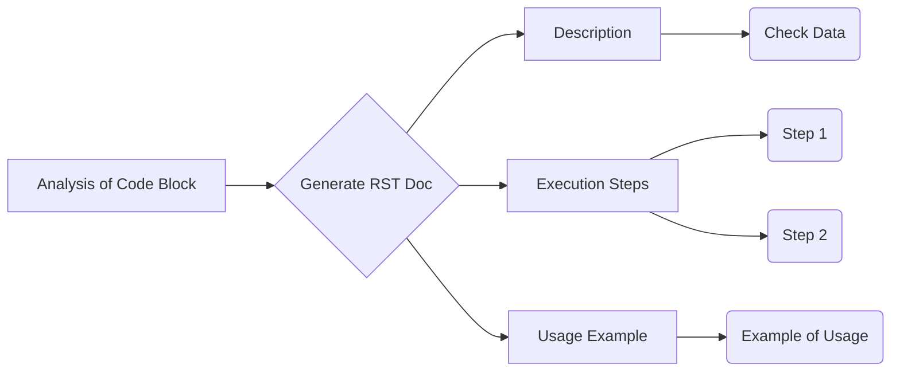

```MD
# Code Explanation

## <input code>

```
Here's the translated prompt in English:


---


**Prompt for generating `how to` documentation for code blocks**


1. You need to analyze the current block of code and all previously loaded code blocks in the project. Based on this analysis, you will create a step-by-step instruction that describes what actions need to be taken to execute the given code block.


2. For each code block, you should create a detailed instruction in reStructuredText (RST) format, following these steps:


    - **Description**: Explain what this code block does, for example, what task it solves or what validation it performs.
    - **Execution steps**: Describe the sequence of actions that need to be performed for the code to execute. For each step, explain in detail what happens during the process.
    - **Usage example**: Provide an example of how this code can be used in the project, including possible function or method calls.


3. The structure of the documentation for each code block should be as follows:


```rst
How to use this code block
=========================================================================================


Description
-------------------------
This code block performs [describe the actions of the code block, for example, "a validation check on input data"].


Execution steps
-------------------------
1. [First step, for example, "Retrieve data by calling the `get_data()` function."]
2. [Second step, for example, "Validate the data using the `validate_data()` method."]
3. [Third step, for example, "If the data is valid, further processing is performed."]
4. [Continue as needed...]


Usage example
-------------------------
An example of how to use this code block in a project:


.. code-block:: python

    <example_code_usage>
```


4. When writing documentation, be sure to:


    - If the code block performs a check, describe how it works and what data is being validated.
    - If the code block calls other functions or methods, be sure to specify which functions are called and with what parameters.
    - Use precise wording, avoiding vague terms like "getting" or "doing." Instead, describe what the code specifically does: "the code checks," "the code sends a request," and so on.


5. Example for a code block that performs a variable check:


```rst
How to use this code block
=========================================================================================


Description
-------------------------
This code block performs a validation check on the `value` variable before further processing.


Execution steps
-------------------------
1. Retrieve the value of the `value` variable by calling the `get_value()` method.
2. Check if the value is empty or invalid. If so, log an error message and halt execution.
3. If the value is valid, pass it to the next function for further processing.


Usage example
-------------------------
An example of how to use this code block:


.. code-block:: python

    value = get_value()
    if value:
        process_value(value)
    else:
        logger.error('Invalid value')
```


6. Each code block should be documented in this format, with clear and understandable steps explaining what the code does and with an example of how it can be used.


---


This prompt gives you the instructions to create detailed documentation for each code block based on its analysis. You will generate documentation that explains the sequence of actions for executing the code, as well as provide usage examples.
```

## <algorithm>

This code describes the structure and logic of a prompt for generating how-to documentation for code blocks.  There is no specific code to execute.  The algorithm focuses on the *process* of creating the documentation.

1. **Analysis**: The prompt analyzes the current code block and any previous blocks within the project.
2. **Documentation Generation**:  Generates reStructuredText (RST) documentation.
3. **Documentation Structure**: Defines the structure of the RST documentation (description, execution steps, usage example).
4. **Detailed Steps**:  Presents detailed steps for each part of the documentation, including examples for checks, function calls, and handling of specific variables.
5. **Example-Driven**: The prompt includes detailed examples showing how to create how-to documentation for different scenarios, like validating variable values.


## <mermaid>



**Dependencies**:

There are no external dependencies or imports in the provided code.  The code block describes a *process*, not a code snippet that would directly run.

## <explanation>

The prompt details a *method* for generating documentation. It doesn't contain code to be executed or analyzed. Instead, it defines the specifications for creating comprehensive documentation about how to use Python code blocks.

- **Imports**: There are no imports. This is a documentation prompt, not executable code.
- **Classes**: There are no classes.
- **Functions**: The prompt outlines the steps involved in creating RST documentation, like the function to generate reStructuredText. The steps, while not concrete code, act like functions in a workflow.
- **Variables**: No variables are defined; the text defines procedures.
- **Potential errors/improvements**: The prompt is well-defined and gives clear examples.  Further improvements could involve providing specific validation rules and details about the input data format.


**Relationship to other parts of the project**:

The prompt guides the creation of documentation.  It implicitly assumes the existence of code blocks to be documented within the project.  The documentation would likely be used by developers to understand how to use specific functions and methods.