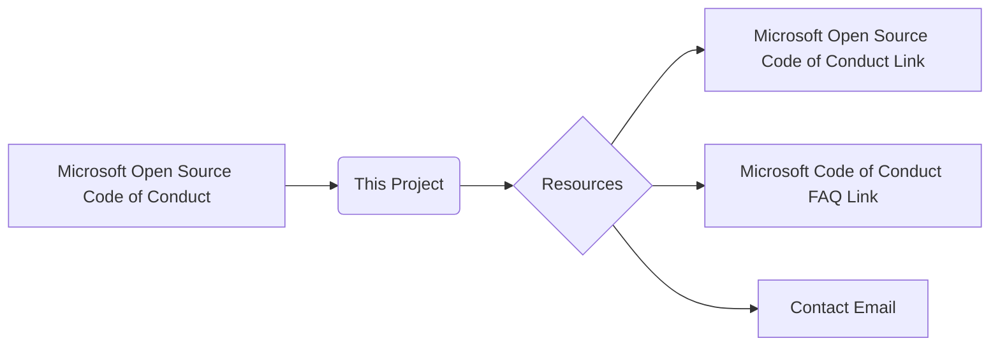

# Code Explanation

```
# Microsoft Open Source Code of Conduct

This project has adopted the [Microsoft Open Source Code of Conduct](https://opensource.microsoft.com/codeofconduct/).

Resources:

- [Microsoft Open Source Code of Conduct](https://opensource.microsoft.com/codeofconduct/)
- [Microsoft Code of Conduct FAQ](https://opensource.microsoft.com/codeofconduct/faq/)
- Contact [opencode@microsoft.com](mailto:opencode@microsoft.com) with questions or concerns
```

**<algorithm>**

This code snippet is not a program; it's a plain text file containing information about the project's code of conduct.  It does not have a step-by-step workflow.  It's simply a declaration and a set of links to relevant resources.

**<mermaid>**



**Dependencies:**

There are no external dependencies or imports. The code itself is just a static declaration, and it relies on hyperlinks to external resources.

**<explanation>**

* **Imports:** There are no imports.  The code consists solely of text, links, and formatting (Markdown).
* **Classes:** There are no classes.
* **Functions:** There are no functions.
* **Variables:** There are no variables.
* **Potential Errors/Improvements:** This code has no executable logic, so there are no potential errors in the traditional sense. The markdown format is suitable for the purpose of outlining the code of conduct, but it could be improved by including contact information or a way to link to a more structured document, or integrate with the repository's issue tracker for reports.

**Relationships with other parts of the project (if applicable):**

The relationship is entirely *declarative*.  The code's purpose is to establish a code of conduct *for* the project.  It's a crucial but non-executable component of the project's overall structure.  This file is likely found in a repository's root directory or a dedicated `CODE_OF_CONDUCT.md` file and serves as a guide for contributors.


**Summary:**

This is a simple Markdown file, not a program.  Its purpose is to clearly state the code of conduct for the project and provide access to resources for more information.  No execution flow or complex logic exists.