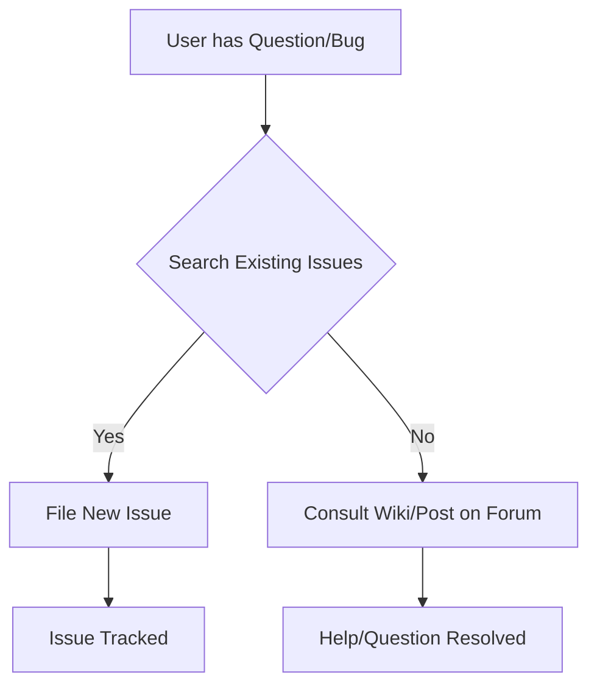
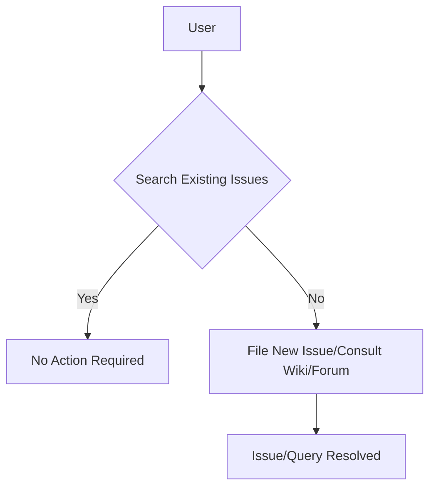

# Support

## How to file issues and get help

This project uses GitHub Issues to track bugs and feature requests. Please search the existing issues before filing new issues to avoid duplicates.  For new issues, file your bug or feature request as a new Issue.

For help and questions about using this project, please consult our Wiki or post on our Discussion forum, both right here on GitHub.

## Microsoft Support Policy

Support for TinyTroupe is limited to the resources listed above.
```



### <algorithm>

1. **User has Question/Bug:** A user encounters a problem or has a question related to the TinyTroupe project.
2. **Search Existing Issues:** The user checks if a similar issue or question has already been reported on the GitHub issue tracker.
3. **File New Issue (or) Consult Wiki/Forum:**
    * If a matching issue is found, the user proceeds no further, or if no matching issue is found the user creates a new issue on the GitHub Issue tracker, or if the problem doesn't merit a formal issue, they consult the project's Wiki or Discussion forum.
4. **Issue Tracked (or) Help/Question Resolved:**  The issue is documented for the development team to address or the user receives assistance and resolves the issue on their own.

### <mermaid>



This mermaid code represents a flow chart illustrating how a user can obtain support for the TinyTroupe project.  There are no dependencies between files/packages involved as this is a README.

### <explanation>

This file (`SUPPORT.md`) is a support document for the TinyTroupe project, likely a part of a larger project structure. It provides guidelines for users on how to report issues, get help, and understand the support policy.

* **Imports:** There are no imports in this markdown file, as it is purely text-based documentation.


* **Classes:** No classes are present.


* **Functions:** No functions are present.


* **Variables:** No variables are present.


* **Potential Errors/Areas for Improvement:** The documentation could benefit from providing more specific details, such as linking to relevant parts of the project's codebase for easier navigation. Providing clear, concise guidance on the issue reporting process will reduce the time taken for troubleshooting for users. An example could include a section outlining the expected format for bug reports.


* **Relationships with other parts of the project:** The `SUPPORT.md` document is a component of the overall TinyTroupe project. It provides a way for users to get assistance, report bugs, or ask questions. It's important to note that its functionality depends on the actual project structure and existence of GitHub Issues, Wiki, and Forum components.  This documentation is likely intended to complement other project files, like source code and configuration documents.