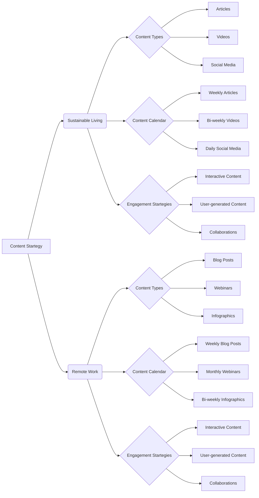

# Content Startegy Ideas

## 1. <input code>

```
# Content Startegy Ideas

## 1. Sustainable Living Tips

### Introduction
In today's world, sustainability has become a crucial aspect of our daily lives. With increasing awareness about environmental issues, more and more people are looking for ways to live sustainably. This content Startegy aims to provide valuable tips and advice for sustainable living, helping individuals make eco-friendly choices and reduce their environmental footprint. By focusing on topics such as reducing waste, eco-friendly products, and sustainable lifestyle choices, we can engage an audience that is passionate about environmental issues and promote our brand's commitment to sustainability.

### Content Types
To effectively reach our audience, we will utilize a variety of content types, including:

1. **Articles**: In-depth articles that explore various aspects of sustainable living, such as the benefits of reducing waste, how to choose eco-friendly products, and tips for living a more sustainable lifestyle.
2. **Videos**: Engaging video content that demonStartes practical tips for sustainable living, such as DIY projects, eco-friendly product reviews, and interviews with sustainability experts.
3. **Social Media Posts**: Short, shareable posts on social media platforms that highlight key tips and advice for sustainable living, as well as promote our longer-form content.

### Content Calendar
To ensure a consistent flow of content, we will develop a content calendar that outlines our publishing schedule. This will include:

- **Weekly Articles**: Publish one in-depth article each week on a specific aspect of sustainable living.
- **Bi-weekly Videos**: Release a new video every two weeks that provides practical tips and advice for sustainable living.
- **Daily Social Media Posts**: Share daily tips and advice on social media platforms to keep our audience engaged and informed.

### Example Topics
Here are some example topics that we can cover in our content:

1. **Reducing Waste**:
   - How to reduce plastic waste in your daily life
   - Tips for composting at home
   - The benefits of using reusable products

2. **Eco-friendly Products**:
   - Reviews of eco-friendly household products
   - How to choose sustainable clothing
   - The benefits of using natural cleaning products

3. **Sustainable Lifestyle Choices**:
   - Tips for reducing your carbon footprint
   - How to create a sustainable home
   - The benefits of eating a plant-based diet

### Engagement Startegies
To maximize engagement with our content, we will implement the following Startegies:

1. **Interactive Content**: Create interactive content, such as quizzes and polls, to encourage audience participation and engagement.
2. **User-generated Content**: Encourage our audience to share their own tips and advice for sustainable living, and feature their contributions in our content.
3. **Collaborations**: Partner with sustainability influencers and experts to create co-branded content and reach a wider audience.

### Metrics and Goals
To measure the success of our content Startegy, we will track the following metrics:

1. **Website Traffic**: Monitor the number of visitors to our website and the engagement with our articles and videos.
2. **Social Media Engagement**: Track the number of likes, shares, and comments on our social media posts.
3. **Audience Growth**: Measure the growth of our audience on social media platforms and our email subscriber list.

Our goals for this content Startegy are to:

1. Increase website traffic by 25% within the first six months.
2. Grow our social media following by 50% within the first year.
3. Establish our brand as a thought leader in the sustainability space.

## 2. Remote Work Best Practices
...
```

## 2. <algorithm>

This document outlines content Startegies for sustainable living and remote work.  It doesn't have a direct algorithm, but rather describes a content plan with several components:


* **Content Planning:**  Defining topics, content types (articles, videos, social media), and a schedule (content calendar).
* **Content Creation:**  Producing the planned articles, videos, and social media posts.
* **Engagement Startegies:** Promoting content through interactions, user-generated content, and collaborations.
* **Metrics and Goals:**  Tracking key metrics (traffic, engagement, audience growth) against predefined targets.

The flow is iterative; content performance is measured, and adjustments are made to the plan as needed.


## 3. <mermaid>



**Dependencies:**

The mermaid code uses a standard graph definition language. There are no explicit dependencies on external libraries or modules within this document.


## 4. <explanation>

* **Imports:**
There are no imports in the provided text. It's a content Startegy document, not a code file.

* **Classes:**
No classes are defined. This is a document outlining content Startegy, not a program.

* **Functions:**
No functions are defined.

* **Variables:**
No variables are defined.

* **Potential Errors/Improvements:**
The document is well-structured, but further details about target audience, specific keywords, and promotion channels would significantly strengthen the Startegy.  Without concrete data on user needs, the document might not be actionable.


* **Relationships with other parts of the project:**
The document outlines Startegies but doesn't inherently link to other parts of a specific software project. This is a document about defining a content Startegy and not a technical piece of code.


**Summary:**

The document describes content Startegies for sustainable living and remote work. It does not include code; it's a plan detailing content types, schedules, engagement, and goals.  This analysis emphasizes that the document focuses on a content Startegy for marketing, not on programming or software implementation.