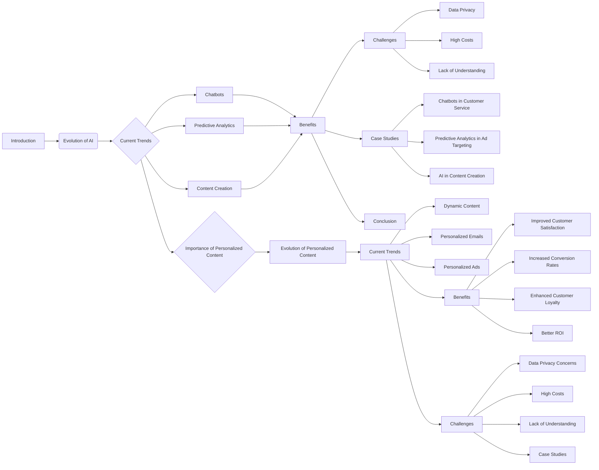

# Code Explanation: Impact of AI on Digital Marketing Startegies

## <input code>

```
# Impact of AI on Digital Marketing Startegies
# ... (rest of the code as provided)
```

## <algorithm>

This code describes the impact of AI on digital marketing Startegies. It doesn't contain executable code, but rather presents a structured analysis of the topic.  There's no step-by-step algorithm in the traditional programming sense. Instead, the document outlines:

1. **Introduction**: Briefly introduces the role of AI in the context of digital marketing.
2. **Evolution of AI in Digital Marketing**: Explains the historical progression of AI adoption, from early basic applications to current trends.
3. **Current Trends**: Lists and describes key current trends (e.g., chatbots, predictive analytics, content creation).
4. **Benefits**: Details the advantages of AI in digital marketing (efficiency, personalization, insights, cost savings).
5. **Challenges**: Highlights potential problems (data privacy, high costs, lack of understanding).
6. **Case Studies**: IlluStartes real-world examples of AI application.
7. **Conclusion**: Summarizes the overall impact and future prospects.
8. **Importance of Personalized Content**: Discusses the significance of personalized content, its evolution, benefits, challenges, and case studies.

Data flow in this context is the flow of information and ideas from one section to another within the document, highlighting the different aspects of AI's role.  There isn't a specific data processing flow in the traditional algorithmic sense.


## <mermaid>



**Dependencies (Analysis):**

The mermaid code defines a flow chart representing the relationships within the document.  It does not import any external libraries or depend on any specific code structures. It uses mermaid syntax to visually represent the flow of concepts from one section to the next.

## <explanation>

**Imports:**

There are no imports as this is plain text. The document uses natural language to describe concepts.

**Classes:**

There are no classes. The document is not a program.

**Functions:**

There are no functions.  The text describes different topics/sections within the larger topic of AI in digital marketing.

**Variables:**

There are no variables.

**Potential Errors/Improvements:**

* **Lack of Specificity:** The document provides a high-level overview.  More concrete examples, specific metrics, and detailed descriptions could enhance the analysis.

* **Bias:** The document could benefit from acknowledging potential biases in the analysis or discussing conflicting viewpoints.


**Relationship with Other Parts of the Project:**

The document is not code and would not have relationships with other code components. The document's main purpose is to explore different digital marketing topics; it serves as an analysis piece, not as a piece of code. It could potentially be used for documentation or a foundational step in a research project.