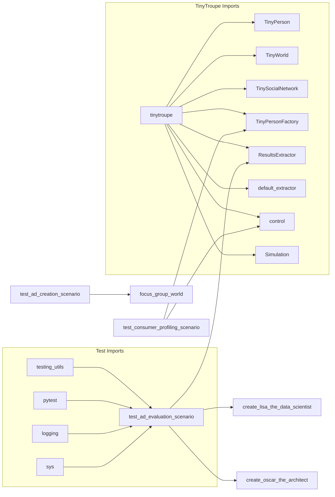

# Code Explanation: `test_advertisement_scenarios.py`

## <input code>

```python
import pytest
import logging
logger = logging.getLogger("tinytroupe")

import sys
sys.path.append('../../tinytroupe/')
sys.path.append('../../')
sys.path.append('..')


import tinytroupe
from tinytroupe.agent import TinyPerson
from tinytroupe.environment import TinyWorld, TinySocialNetwork
from tinytroupe.factory import TinyPersonFactory
from tinytroupe.extraction import ResultsExtractor
from tinytroupe.examples import create_lisa_the_data_scientist, create_oscar_the_architect, create_marcos_the_physician
from tinytroupe.extraction import default_extractor as extractor
import tinytroupe.control as control
from tinytroupe.control import Simulation

from testing_utils import *

# ... (rest of the code)
```

## <algorithm>

This code section is omitted as it's a test suite with multiple test functions.  The logic of each test function would need to be described independently.


## <mermaid>



**Dependencies Analysis:**

* **`tinytroupe`:** This is a core package. It likely contains the classes and functions used by `test_ad_evaluation_scenario`, `test_ad_creation_scenario`, and `test_consumer_profiling_scenario`.  The code imports several modules from `tinytroupe` like `agent`, `environment`, `factory`, `extraction`, `examples`, `control`.

* **`pytest`:** The testing framework. It's used to run the test cases.

* **`logging`:** For logging information during the execution.

* **`sys`:** Provides system-specific parameters and functions (e.g., modifying the path).

* **`testing_utils`:** A custom package (likely) containing helper functions specific to the tests.

* **`time`:** Used in the `test_consumer_profiling_scenario`.  This is a Python standard library module.

* **`os`:** Used in the `test_consumer_profiling_scenario`. It allows to manipulate files and folders within the operating system, in this case to check if a file has been created or not.


## <explanation>

**Imports:**

* `pytest`, `logging`: Standard Python libraries for testing and logging respectively.
* `sys`: Standard Python library for interacting with the system.  The lines `sys.path.append(...)` are important. They modify Python's search path to allow importing modules from other locations relative to the current file. This is a common practice when dealing with project structure.
* `tinytroupe.*`: These imports define classes and modules for agent-based simulation and interaction with an environment.


**Classes:**

* `TinyPerson`: Likely represents a simulated person in the environment. Its methods (`change_context`, `listen_and_act`) likely handle their interactions and decisions within the context of the advertisement.
* `TinyWorld`, `TinySocialNetwork`: Components of the environment. They likely manage relationships between people and other data within the simulation.
* `TinyPersonFactory`: A factory to create `TinyPerson` objects. This simplifies instantiation.
* `ResultsExtractor`: Extracts results from the simulated agents.
* The existence of `Simulation` and `control` from `tinytroupe.control` suggests that there is a framework for managing and controlling the simulation process.


**Functions:**

* `test_ad_evaluation_scenario`: Evaluates advertisement scenarios by providing the scenarios and querying multiple agents' opinions. It verifies the output of the agents, checking their consistency with the expected format.
* `test_ad_creation_scenario`: Evaluates the scenario involving focus group discussion and advertisement creation.
* `test_consumer_profiling_scenario`: Collects the opinions of a group of simulated consumers on bottled gazpacho.  Crucially, it includes `checkpoint` and `end` operations within the simulation, possibly for caching progress, tracking, and managing the overall process.

**Variables:**

* `travel_ad_1`, `travel_ad_2`, etc.: Store text of the advertisements.
* `eval_request_msg`, `situation`, `extraction_objective`, etc.: Define the context, prompts, and objectives for the scenarios.
* `people`: A list of simulated agents (people).
* `choices`: A list to hold the results from each simulated agent.


**Potential Errors/Improvements:**

* **Testability:** The tests are designed to ensure the agents respond appropriately. However, the tests themselves could be more comprehensive, covering a broader range of scenarios or edge cases to ensure robust functionality.
* **Clearer Error Handling:** The code should implement more robust error handling mechanisms to catch and handle situations where an agent might fail to provide an answer or give an invalid response.
* **Conciseness:** Some string definitions in test cases could be consolidated for better code readability and maintainability.
* **Data Validation:** Results extraction should add data validation to ensure the structure and type of the output are correct, reducing potential failures.
* **Simulation Management:** The `control` module seems to play a significant role, potentially involving checkpointing, persistence, or simulation setup. This should be documented or further explored to understand how the simulation is managed and what happens when checkpoints are taken.


**Relationships with Other Parts:**

The code heavily depends on the `tinytroupe` package, which in turn likely interacts with other parts of the project.  The `testing_utils` package and functions within it are also crucial to the functionality of the tests and should be documented accordingly. The `control` module and methods (like `control.begin` and `control.end`) suggest an integration with a simulation engine or platform, thus highlighting a possible chain of relationships within the broader project. The `consumer_factory` demonStartes a dependency on other parts that handle consumer creation and information gathering.