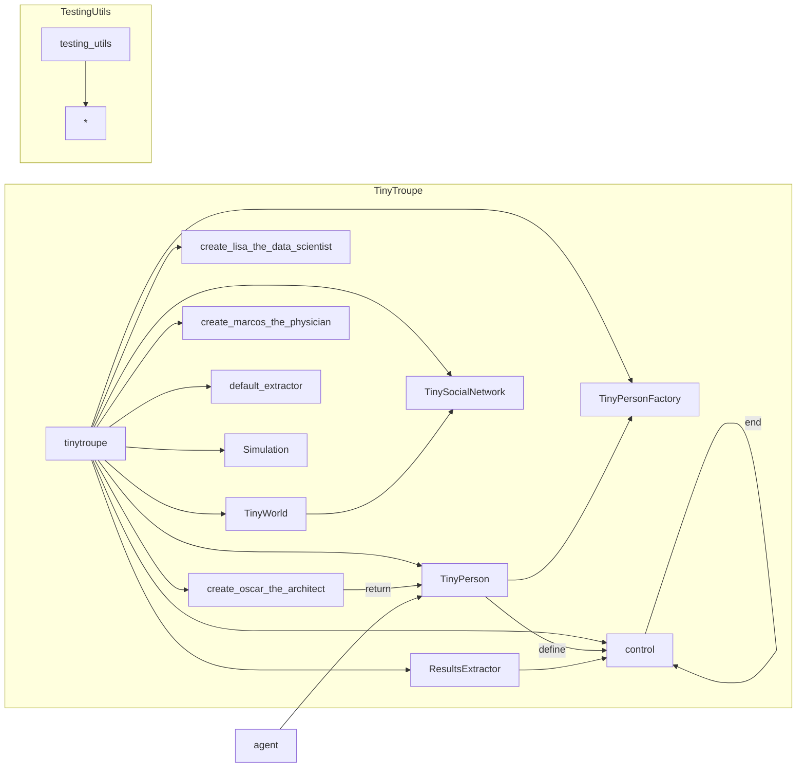

# Code Analysis of test_basic_scenarios.py

## <input code>

```python
import pytest
import logging
logger = logging.getLogger("tinytroupe")

import sys
sys.path.append('../../tinytroupe/')
sys.path.append('../../')
sys.path.append('..')


import tinytroupe
from tinytroupe.agent import TinyPerson
from tinytroupe.environment import TinyWorld, TinySocialNetwork
from tinytroupe.factory import TinyPersonFactory
from tinytroupe.extraction import ResultsExtractor
from tinytroupe.examples import create_lisa_the_data_scientist, create_oscar_the_architect, create_marcos_the_physician
from tinytroupe.extraction import default_extractor as extractor
import tinytroupe.control as control
from tinytroupe.control import Simulation

from testing_utils import *

def test_scenario_1():
    control.reset()

    assert control._current_simulations["default"] is None, "There should be no simulation running at this point."

    control.begin()
    assert control._current_simulations["default"].status == Simulation.STATUS_STARTED, "The simulation should be started at this point."

    agent = create_oscar_the_architect()

    agent.define("age", 19)
    agent.define("nationality", "Brazilian")

    assert control._current_simulations["default"].cached_trace is not None, "There should be a cached trace at this point."
    assert control._current_simulations["default"].execution_trace is not None, "There should be an execution trace at this point."

    control.checkpoint()
    # TODO check file creation

    agent.listen_and_act("How are you doing?")
    agent.define("occupation", "Engineer")

    control.checkpoint()
    # TODO check file creation

    control.end()
```

## <algorithm>

```mermaid
graph TD
    A[test_scenario_1()] --> B{control.reset()};
    B --> C[assert control._current_simulations["default"] is None];
    C --True--> D[control.begin()];
    D --> E[assert control._current_simulations["default"].status == Simulation.STATUS_STARTED];
    D --> F[agent = create_oscar_the_architect()];
    F --> G[agent.define("age", 19)];
    G --> H[agent.define("nationality", "Brazilian")];
    H --> I[assert control._current_simulations["default"].cached_trace is not None];
    I --> J[assert control._current_simulations["default"].execution_trace is not None];
    J --> K[control.checkpoint()];
    K --> L[agent.listen_and_act("How are you doing?")];
    L --> M[agent.define("occupation", "Engineer")];
    M --> N[control.checkpoint()];
    N --> O[control.end()];
```

## <mermaid>


**Dependencies Analysis:**

The mermaid diagram shows the dependencies between the modules and classes within the `tinytroupe` package. `pytest`, `logging`, `sys`, and `testing_utils` are also imported, but these are not part of the `tinytroupe` package.  They're likely supporting libraries for testing and general Python functionality.


## <explanation>

**Imports:**

- `pytest`: A testing framework used for writing and running tests.
- `logging`:  For logging messages, useful for debugging and tracing the program's execution. The `logger = logging.getLogger("tinytroupe")` line creates a logger for the `tinytroupe` module.
- `sys`:  Provides access to system-specific parameters and functions. The `sys.path.append(...)` lines modify the Python path to include necessary modules.
- `tinytroupe`: This import likely imports the core TinyTroupe package, acting as a namespace for all other imported classes and modules.
- `tinytroupe.*`: Imports specific modules and classes from the `tinytroupe` package, such as the agent (`TinyPerson`), environment (`TinyWorld`, `TinySocialNetwork`), factory (`TinyPersonFactory`), extraction modules, example creation functions, control components, and the `Simulation` class.  This indicates that `tinytroupe` is a larger project.
- `testing_utils`: A custom module likely containing utility functions or fixtures for testing. The relationship here is not directly within TinyTroupe, but outside the core package, used for support.


**Classes:**

- `TinyPerson`:  Represents a person agent within the TinyTroupe simulation. This class appears to handle attributes and methods associated with the simulated person's characteristics, interactions, and actions within the environment.
- `TinyWorld`:  Represents the environment in which agents operate.
- `TinySocialNetwork`:  Part of the environment, representing the social interactions between agents.
- `TinyPersonFactory`:  Likely handles the creation and initialization of `TinyPerson` objects (probably including things like `create_oscar_the_architect`).
- `ResultsExtractor`: Provides functionality for extracting and analyzing results from the simulation.

**Functions:**

- `test_scenario_1()`: A test function designed to verify the `control` module's behaviour by instantiating a simulation, adding an agent, and executing actions.
- `create_oscar_the_architect()`:  Creates a specific agent object (`TinyPerson`) named Oscar (likely an example).
- `control.reset()`, `control.begin()`, `control.checkpoint()`, `control.end()`:  These functions are part of the TinyTroupe's control logic, used for managing simulation states, checkpoints, and overall execution flow. They interact directly with `control._current_simulations["default"]` which implies a central simulation manager.

**Variables:**

- `control._current_simulations["default"]`:  A variable likely storing the current simulation instance within a dictionary, indexed by the string "default."
- `agent`: Stores a `TinyPerson` object, typically used for interaction with the simulation.

**Potential Errors/Improvements:**

- The `# TODO check file creation` comments indicate that there might be missing validation or assertions to verify that the simulation or associated files were properly created during checkpoints.
- The use of `sys.path.append(...)` is not ideal for large projects; a more structured method of module importation would improve maintainability.  Using a `requirements.txt` file and virtual environments would be a recommended practice for larger projects.
- The test is incomplete and depends on various aspects within the `tinytroupe` package. Without full understanding of those internal components, some parts of the test's purpose may not be clear.


**Relationships:**

The `test_basic_scenarios.py` file tests the functionality of the TinyTroupe simulation framework, which depends on classes (`TinyPerson`, `TinyWorld`) and functions within the `tinytroupe` package. `testing_utils` module provides support for these tests.  A clear dependency chain exists that needs full documentation for complete analysis.