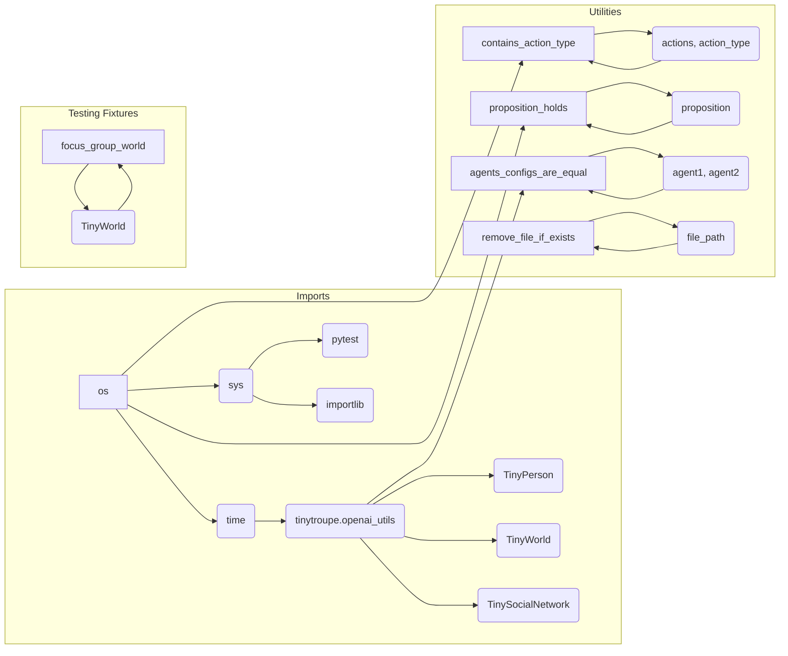

# Code Explanation: testing_utils.py

## <input code>

```python
"""
Testing utilities.
"""
import os
import sys
from time import sleep
sys.path.append('../../tinytroupe/')
sys.path.append('../../')
sys.path.append('..')

import tinytroupe.openai_utils as openai_utils
from tinytroupe.agent import TinyPerson
from tinytroupe.environment import TinyWorld, TinySocialNetwork
import pytest
import importlib

# force caching, in order to save on API usage
openai_utils.force_api_cache(True, "tests_cache.pickle")

# ... (rest of the code)
```

## <algorithm>

This code defines various utility functions used for testing within the `tinytroupe` project.  The workflow involves checking actions and stimuli for specific types and content, interacting with a large language model (LLM) to validate propositions, and managing file paths.

**Step 1:**  Import necessary modules.
*   Import `os`, `sys`, `time`, `pytest`, `importlib`, and custom modules (`openai_utils`, `TinyPerson`, `TinyWorld`, `TinySocialNetwork`).
*   Append paths to `sys.path` to find necessary modules within the project's directory structure.
*   Initialize OpenAI API caching.

**Step 2:** Define utility functions.
*   Functions like `contains_action_type`, `contains_stimulus_type`, `terminates_with_action_type` verify if a list of actions or stimuli has a particular type.
*   Functions `contains_action_content`, `contains_stimulus_content` search for specific text content within the action or stimulus.
*   `proposition_holds` verifies propositions using an LLM call.
*   `only_alphanumeric` filters a string to keep only alphanumeric characters.
*   `create_test_system_user_message` constructs message formats for LLM calls.
*   `agents_configs_are_equal` compares configurations of agents.
*   `remove_file_if_exists` handles cleanup of temporary files, likely to avoid file conflicts.
*   `get_relative_to_test_path` builds file paths, adjusting for the test directory.
*   `focus_group_world` fixture creates a `TinyWorld` for testing a focus group scenario.
*   `setup` fixture clears agents and environments before each test.

**Step 3:** LLM interaction (in `proposition_holds`).
*   Formulates system and user prompts.
*   Sends messages to the LLM client (`openai_utils.client().send_message`).
*   Processes the LLM response for a "true" or "false" result.

**Data Flow Examples:**

*   `contains_action_type(actions, "hello")`: The function iterates through `actions`, checks if an `action["action"]["type"]` equals "hello".
*   `proposition_holds("The text contains product ideas")`: The function sends a proposition to the LLM and returns `True` if the LLM replies "true", otherwise `False`.

## <mermaid>



**Dependencies Analysis:**

The mermaid diagram shows dependencies between the modules.  `os`, `sys`, and `time` are standard Python libraries. `pytest` is a testing framework. `tinytroupe.*` modules are components of a larger project. The diagram implies that functions within `testing_utils` depend on the functionality provided by modules in the `tinytroupe` package (which are, in turn, dependent on other modules and potentially external libraries like OpenAI).

## <explanation>

**Imports:**

-   `os`, `sys`: Standard Python modules for interacting with the operating system and system-level operations, such as file paths and process management.
-   `time`: Used for potential time-related operations (e.g., delays).
-   `pytest`: A testing framework that allows writing and running tests.
-   `importlib`: Allows dynamic loading of modules.
-   `tinytroupe.openai_utils`: A custom module containing utility functions for interacting with the OpenAI API, likely handling requests, responses, and caching.
-   `tinytroupe.agent`: Contains classes related to agents, possibly representing different characters or roles in a conversational or simulation context.
-   `tinytroupe.environment`: Likely contains classes to define and manage environments for agents to interact within, like a chat environment or a world simulation.
-   The `sys.path.append` lines modify Python's module search path, allowing the code to import modules from the `tinytroupe` package which may not be in the current directory, reflecting a hierarchical project structure.


**Classes:**

-   `TinyPerson`: Likely represents an agent within the `tinytroupe` project, probably possessing attributes like configuration and behavior.  `clear_agents()` would likely clear any stored instances of `TinyPerson` objects.
-   `TinyWorld`, `TinySocialNetwork`: These likely represent different environments within the simulation or conversation system, providing contextual data and interaction mechanisms. `clear_environments()` clears any stored instances of `TinyWorld` objects.

**Functions:**

-   `contains_action_type`, `contains_stimulus_type`, `contains_action_content`, `contains_stimulus_content`, `terminates_with_action_type`: These are helper functions to check if specific elements (actions or stimuli) exist within a dataset.
-   `proposition_holds`: A crucial function that interacts with an LLM to validate a proposition. It defines system and user prompts, sends them to the LLM, processes the response, and returns `True` or `False` based on the LLM's output.
-   `only_alphanumeric`:  A simple function to filter out non-alphanumeric characters from a string. Useful for cleaning up output from the LLM.
-   `create_test_system_user_message`: Creates a standardized format for LLM interactions.
-   `agents_configs_are_equal`: Compares the configurations of two agents, used to check for equality.
-   `remove_file_if_exists`: Removes a file if it exists, a common operation in testing to avoid conflicts or leftover data.
-   `get_relative_to_test_path`: constructs a file path relative to the test directory, a good practice for managing file locations in tests.


**Variables:**

-   `openai_utils.force_api_cache`: A boolean flag controlling caching of LLM API calls.


**Potential Errors/Improvements:**

-   Error Handling: While `proposition_holds` includes error handling for unexpected LLM responses,  consider handling edge cases, such as connection timeouts or missing data from the API.
-   `sys.path.append` order: The order of appending directories to `sys.path` is important and could cause issues if the wrong order results in a wrong module being found or imported.


**Relationship Chain:**

The `testing_utils` file is part of the `tinytroupe` project's testing suite. It relies on the `tinytroupe` package for its classes and functions.  The utility functions used in `testing_utils` likely support tests defined within other test modules or files (`tests/*.py`), which further depend on the implementation details of the `tinytroupe` package itself.


```
tinytroupe/tests/testing_utils.py  <--+
                                     |
                                     +--> tinytroupe/tests/*.py  (tests)
                                     |
                                     +--> tinytroupe/tinytroupe.*  (implementation)