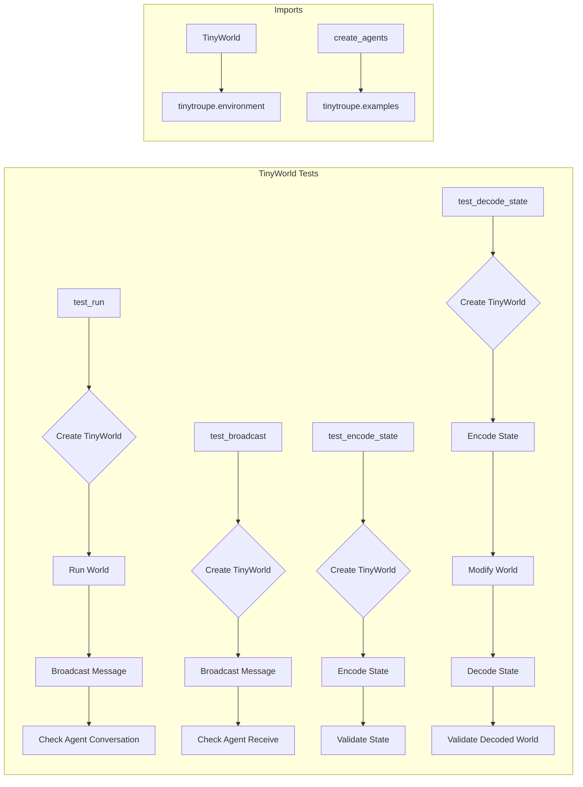

# Code Explanation for test_tinyworld.py

## <input code>

```python
import pytest
import logging
logger = logging.getLogger("tinytroupe")

import sys
sys.path.append('../../tinytroupe/')
sys.path.append('../../')
sys.path.append('..')

from tinytroupe.examples import create_lisa_the_data_scientist, create_oscar_the_architect, create_marcos_the_physician
from tinytroupe.environment import TinyWorld
from testing_utils import *

def test_run(setup, focus_group_world):

    # empty world
    world_1 = TinyWorld("Empty land", [])   
    world_1.run(2)

    # world with agents
    world_2 = focus_group_world
    world_2.broadcast("Discuss ideas for a new AI product you'd love to have.")
    world_2.run(2)

    # check integrity of conversation
    for agent in world_2.agents:
        for msg in agent.episodic_memory.retrieve_all():
            if 'action' in msg['content'] and 'target' in msg['content']['action']:
                assert msg['content']['action']['target'] != agent.name, f"{agent.name} should not have any messages with itself as the target."
            
            # TODO stimulus integrity check?


def test_broadcast(setup, focus_group_world):

    world = focus_group_world
    world.broadcast("""
                Folks, we need to brainstorm ideas for a new baby product. Something moms have been asking for centuries and never got.

                Please start the discussion now.
                """)
    
    for agent in focus_group_world.agents:
        # did the agents receive the message?
        assert "Folks, we need to brainstorm" in agent.episodic_memory.retrieve_first(1)[0]['content']['stimuli'][0]['content'], f"{agent.name} should have received the message."


def test_encode_complete_state(setup, focus_group_world):
    world = focus_group_world

    # encode the state
    state = world.encode_complete_state()
    
    assert state is not None, "The state should not be None."
    assert state['name'] == world.name, "The state should have the world name."
    assert state['agents'] is not None, "The state should have the agents."


def test_decode_complete_state(setup, focus_group_world):
    world = focus_group_world

    name_1 = world.name
    n_agents_1 = len(world.agents)

    # encode the state
    state = world.encode_complete_state()
    
    # screw up the world
    world.name = "New name"
    world.agents = []

    # decode the state back into the world
    world_2 = world.decode_complete_state(state)

    assert world_2 is not None, "The world should not be None."
    assert world_2.name == name_1, "The world should have the same name."
    assert len(world_2.agents) == n_agents_1, "The world should have the same number of agents."


```

## <algorithm>

**Algorithm for `test_tinyworld.py`**

The tests in `test_tinyworld.py` verify the functionality of the `TinyWorld` class.  The core logic revolves around creating `TinyWorld` instances, interacting with them, and asserting the outcomes match the expected behavior.

* **Test `test_run`**:
    1. Creates an empty `TinyWorld` (`world_1`).
    2. Runs the world for a specified duration (`2`).
    3. Creates a `TinyWorld` (`world_2`) populated with agents.
    4. Broadcasts a message to all agents.
    5. Runs the world for another duration (`2`).
    6. Verifies that agent-to-agent messages do not target themselves.

* **Test `test_broadcast`**:
    1. Creates a `TinyWorld` (`world`).
    2. Broadcasts a message to all agents.
    3. Verifies that each agent received the message.

* **Test `test_encode_complete_state`**:
    1. Creates a `TinyWorld` (`world`).
    2. Encodes the state of the world.
    3. Validates that the encoded state is not None, contains the world's name, and agents information.

* **Test `test_decode_complete_state`**:
    1. Creates a `TinyWorld` (`world`).
    2. Encodes the state of the world.
    3. Modifies the original world (critical).
    4. Decodes the encoded state into a new `TinyWorld` (`world_2`).
    5. Verifies that the decoded `world_2` correctly reflects the original state (name and number of agents).

## <mermaid>



**Dependency Analysis (Mermaid Diagram):**

The imports in the code establish dependencies between modules and packages in the `tinytroupe` project. The Mermaid diagram represents this:

* **`tinytroupe.environment`**: The `TinyWorld` class is part of this package, indicating the core implementation for managing the environment and agents in the simulation.
* **`tinytroupe.examples`**: The `create_lisa_the_data_scientist`, `create_oscar_the_architect`, `create_marcos_the_physician` functions are likely responsible for creating agent instances, suggesting that this package provides sample agent definitions.

The diagram uses `subgraph` to group elements visually.


## <explanation>

**Imports:**

* **`pytest`**: Used for writing and running unit tests within the project.  Crucial for testing `tinytroupe` components.
* **`logging`**: Enables logging information for debugging purposes.  The `logger` is initialized, but not extensively used in this specific file.
* **`sys`**: Manipulates the Python path, allowing the code to import modules from other relative locations within the project directory tree.   Crucial for project structure and dependencies.
* **`tinytroupe.examples`**: Contains factory functions for creating sample agents (Lisa, Oscar, Marcos).
* **`tinytroupe.environment`**: Contains the `TinyWorld` class, the central class that defines the simulation's world and agents.
* **`testing_utils`**: Contains utility functions potentially related to setting up testing environments (e.g., `setup`, `focus_group_world`, and potentially other functions).


**Classes:**

* **`TinyWorld`**:  This class manages the simulation environment. The tests create instances, run them, interact with them (e.g., `broadcast`), and validate results, illuStarting its primary functions.  Crucial attributes for a `TinyWorld` might include `name`, `agents`, and methods for running the simulation and handling messages between agents.

**Functions:**

* **`test_run`**: Tests the `TinyWorld` functionality with and without agents.  This is a critical test of the base simulation lifecycle and the communication aspects.
* **`test_broadcast`**: Verifies that agents receive broadcasts in the world, essential for testing communication protocols.
* **`test_encode_complete_state`**: Validates that the `encode_complete_state` method returns a valid state representation of the world and agents.
* **`test_decode_complete_state`**: Ensures that the `decode_complete_state` function restores a `TinyWorld` instance to a consistent prior state, testing the integrity of the state encoding/decoding mechanism.

**Variables:**

* `world_1`, `world_2`, `world`: Variables of type `TinyWorld` used for creating and manipulating simulation instances within different tests.
* `setup`: Used to provide test setup or initial conditions (likely from `testing_utils`).
* `focus_group_world`: Provides a pre-configured `TinyWorld` populated with agents (likely from `testing_utils`).

**Potential Errors/Improvements:**

* The `# TODO stimulus integrity check?` comment in `test_run` indicates a missing test or functionality to verify the completeness or accuracy of received stimuli in the environment.
* More comprehensive tests covering a broader range of `TinyWorld` scenarios (different agent types, message types, varied interaction sequences) would improve the test suite.  This includes thorough edge cases.
* Clarity on the `setup` and `focus_group_world` variables' origins and contents is essential for full understanding.  The code would benefit from further documentation.
* Assertions should ideally check more nuanced aspects of the encoded/decoded state, not just the presence of attributes, but also the specific data contained within them.

**Chain of Relationships:**

The code interacts directly with the `tinytroupe` project, specifically with the `TinyWorld` class and likely related agent classes through the import. It leverages `testing_utils` for setup and possibly agent creation.  These parts of the project are tightly interconnected.