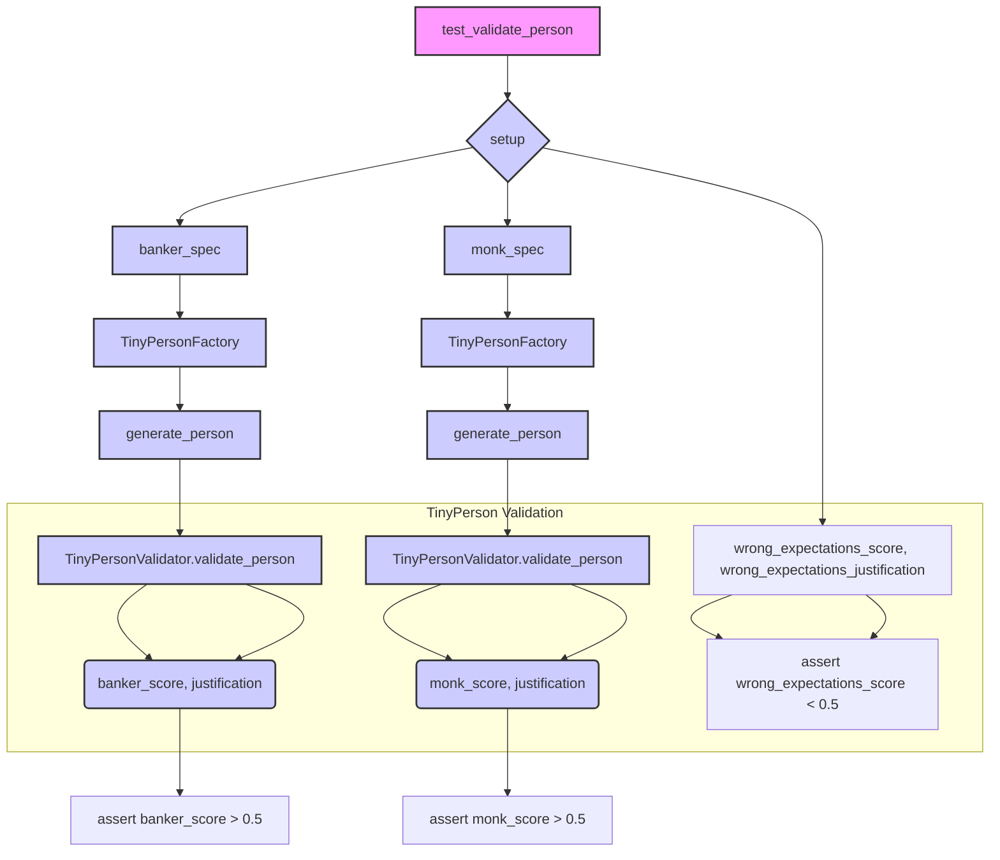

# Code Explanation for test_validation.py

## <input code>

```python
import pytest
import os
import sys
sys.path.append('../../tinytroupe/')
sys.path.append('../../')
sys.path.append('..')


from tinytroupe.examples import create_oscar_the_architect
from tinytroupe.control import Simulation
import tinytroupe.control as control
from tinytroupe.factory import TinyPersonFactory
from tinytroupe.validation import TinyPersonValidator

from testing_utils import *

def test_validate_person(setup):

    ##########################
    # Banker
    ##########################
    banker_spec ="""
    A vice-president of one of the largest brazillian banks. Has a degree in engineering and an MBA in finance. 
    Is facing a lot of pressure from the board of directors to fight off the competition from the fintechs.    
    """
    banker_factory = TinyPersonFactory(banker_spec)
    banker = banker_factory.generate_person()
    banker_expectations ="""
    He/she is:
    - Wealthy
    - Very intelligent and ambitious
    - Has a lot of connections
    - Is in his 40s or 50s

    Tastes:
    - Likes to travel to other countries
    - Either read books, collect art or play golf
    - Enjoy only the best, most expensive, wines and food
    - Dislikes communists, unions and the like

    Other notable traits:
    - Has some stress issues, and might be a bit of a workaholic
    - Deep knowledge of finance, economics and financial technology
    - Is a bit of a snob
    - Might pretend to be a hard-core woke, but in reality that's just a facade to climb the corporate ladder  
    """
    banker_score, banker_justification = TinyPersonValidator.validate_person(banker, expectations=banker_expectations, include_agent_spec=False, max_content_length=None)
    print("Banker score: ", banker_score)
    print("Banker justification: ", banker_justification)

    assert banker_score > 0.5, f"Validation score is too low: {banker_score:.2f}"


    ##########################
    # Busy Knowledge Worker   
    ########################## 
    monk_spec ="""
    A poor buddhist monk living alone and isolated in a remote montain.
    """
    monk_spec_factory = TinyPersonFactory(monk_spec)
    monk = monk_spec_factory.generate_person()
    monk_expectations ="""
    Some characteristics of this person:
    - Is very poor, and in fact do not seek money
    - Has no formal education, but is very wise
    - Is very calm and patient
    - Is very humble and does not seek attention
    - Honesty is a core value    
    """

    monk_score, monk_justification = TinyPersonValidator.validate_person(monk, expectations=monk_expectations, include_agent_spec=False, max_content_length=None)
    print("Monk score: ", monk_score)
    print("Monk justification: ", monk_justification)

    assert monk_score > 0.5, f"Validation score is too low: {monk_score:.2f}"

    # Now, let's check the score for the busy knowledge worker with the wrong expectations! It has to be low!
    wrong_expectations_score, wrong_expectations_justification = TinyPersonValidator.validate_person(monk, expectations=banker_expectations, include_agent_spec=False, max_content_length=None)

    assert wrong_expectations_score < 0.5, f"Validation score is too high: {wrong_expectations_score:.2f}"
    print("Wrong expectations score: ", wrong_expectations_score)
    print("Wrong expectations justification: ", wrong_expectations_justification)
```

## <algorithm>

The code performs a validation process on generated `TinyPerson` objects.

**Step 1:** Defines `banker_spec` and `monk_spec` strings describing characteristics of two different person types.

**Step 2:** Creates `TinyPersonFactory` objects using these specifications.

**Step 3:** `generate_person()` method of the factory creates a person object.

**Step 4:** Defines `banker_expectations` and `monk_expectations` strings specifying expected characteristics of the generated person types.

**Step 5:** Calls `TinyPersonValidator.validate_person()` to assess the match between the generated person and the expected characteristics. This function returns a score (0.0 to 1.0) and justification.

**Step 6:** Prints the score and justification of the generated person.

**Step 7:** Asserts that the score is above 0.5 for the correct expectations and below 0.5 for incorrect expectations, ensuring that the validation function works correctly.


## <mermaid>



**Dependencies Analysis:**

- `pytest`: Used for unit testing.
- `os`: Used for interacting with the operating system (unlikely crucial in this context).
- `sys`: Used for manipulating the Python path.  This is crucial for importing modules from other parts of the project.
- `tinytroupe.examples`:  Likely contains example data or functions for creating objects.
- `tinytroupe.control`:  Contains the core simulation logic.
- `tinytroupe.control as control`: Imports this for easier referencing.
- `tinytroupe.factory`: Contains functions for creating `TinyPerson` objects.
- `tinytroupe.validation`: Contains validation logic for `TinyPerson` objects.
- `testing_utils`:  Likely contains utility functions for testing.


## <explanation>

- **Imports:**  Crucial for importing necessary modules from the `tinytroupe` project, including classes and functions to create, validate, and potentially simulate tiny people. The `sys.path` modifications add parent directories to Python's module search path, enabling the import of modules from the `tinytroupe` package.  The `testing_utils` import likely contains utility functions or fixtures relevant to the test cases.

- **Classes:**
    - `TinyPersonFactory`:  Creates instances of `TinyPerson` objects based on specifications. It likely takes a specification string and parses it to create attributes and characteristics of the person.
    - `TinyPersonValidator`: Validates whether a `TinyPerson` matches predefined expectations. This class's crucial `validate_person` function calculates a validation score and justification based on the person's attributes and the provided expectations.

- **Functions:**
    - `test_validate_person`:  A test function checking the validation logic for generated people objects. It creates specific example persons (banker, monk) and asserts that the validation score matches the expected behaviour (correct and incorrect expectations).
    - `TinyPersonFactory.generate_person()`: Takes a spec string and creates a person object with properties based on that string.
    - `TinyPersonValidator.validate_person()`: Validates a `TinyPerson` object against the given `expectations`. It is critical for determining if a person matches the predefined characteristics.


- **Variables:**  `banker_spec`, `monk_spec`, `banker_expectations`, `monk_expectations`, `banker`, `monk`, `banker_score`, `banker_justification`, `monk_score`, `monk_justification`:  Contain details about the person types, expected characteristics, validation results, etc.

- **Potential Errors/Improvements:**

    - The assertions could be more informative in case of failure. Providing details on the expected score could help understand why the validation isn't working as intended.

    - The use of `max_content_length` could be improved. If there's a specific character length for expectations, this parameter would improve the validation accuracy.


- **Relationships:** The `tinytroupe` project has clear dependency relationships: the testing suite relies on the validation and factory modules. The validation and the factory modules may depend on the `control` module for simulation or other core data functions. The chain of relationships suggests that `tinytroupe` is a package containing components to manage and validate `TinyPerson` objects.