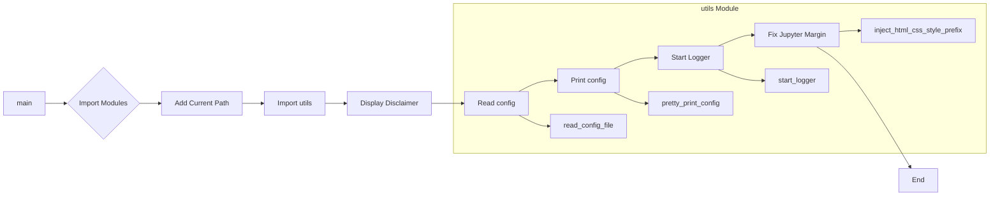

# TinyTroupe Initialization Code Analysis

## <input code>

```python
import os
import logging
import configparser
import rich # for rich console output
import rich.jupyter

# add current path to sys.path
import sys
sys.path.append('.')
from tinytroupe import utils # now we can import our utils

# AI disclaimers
print(
"""
!!!!
DISCLAIMER: TinyTroupe relies on Artificial Intelligence (AI) models to generate content. 
The AI models are not perfect and may produce inappropriate or inacurate results. 
For any serious or consequential use, please review the generated content before using it.
!!!!
""")

config = utils.read_config_file()
utils.pretty_print_config(config)
utils.start_logger(config)

# fix an issue in the rich library: we don't want margins in Jupyter!
rich.jupyter.JUPYTER_HTML_FORMAT = \
    utils.inject_html_css_style_prefix(rich.jupyter.JUPYTER_HTML_FORMAT, "margin:0px;")
```

## <algorithm>

1. **Import Modules:** Import necessary Python modules for various tasks: operating system interaction (`os`), logging (`logging`), configuration parsing (`configparser`), rich library for console output (`rich`, `rich.jupyter`), and custom utility functions (`utils`).

   * **Example:** `import os`, `import logging`, ...

2. **Add Current Path:** Append the current directory to the Python path (`sys.path`) to allow importing modules from the `tinytroupe` package.

   * **Example:** `sys.path.append('.')`

3. **Import `utils`:** Import the `utils` module from the `tinytroupe` package.

   * **Example:** `from tinytroupe import utils`


4. **Display Disclaimer:** Print a disclaimer explaining the limitations of AI models used by TinyTroupe.

   * **Example:** Prints the disclaimer string to the console.

5. **Read Configuration:** Call `utils.read_config_file()` to load configuration settings from a file (likely `config.ini`).

   * **Example:** Reads the `config.ini` file and parses its content.

6. **Print Configuration:** Calls `utils.pretty_print_config(config)` to display the loaded configuration in a formatted manner.

   * **Example:** Prints the `config` dictionary in a user-friendly format, potentially with keys and values.

7. **Start Logger:** Call `utils.start_logger(config)` to initialize logging based on configuration settings.

   * **Example:** Configures logging level, format, and output file.

8. **Fix Jupyter Margin:** Modify the `JUPYTER_HTML_FORMAT` variable in the `rich.jupyter` module to remove margins in Jupyter notebooks. This is done by calling the utility function.

   * **Example:** `rich.jupyter.JUPYTER_HTML_FORMAT` is updated.

## <mermaid>



**Dependencies Analysis:**

*   `os`: Used for potentially interacting with the operating system.
*   `logging`: Used for logging messages and managing log levels.
*   `configparser`: Used to parse configuration files.
*   `rich`: Used to provide rich text output, especially important for a console-based application.
*   `rich.jupyter`: Used for providing rich output in Jupyter notebooks.
*   `tinytroupe.utils`: Contains custom utility functions like reading the config, pretty printing, and setting up logging.  This indicates a modular design, where `tinytroupe` contains utility functions to handle tasks related to configuration, logging, and output formatting.


## <explanation>

**Imports:**

*   `os`: Used for interacting with the operating system, like potentially getting the current path or manipulating files.
*   `logging`: Handles logging to the console or a file.  It's vital for debugging and monitoring application behavior.
*   `configparser`: Reads configuration files in a structured format (INI files, etc.), making it easy to load settings.
*   `rich`: Provides rich text output, allowing the display of formatted text and other elements to the console (useful for making the output more informative and visually appealing).
*   `rich.jupyter`: Specific to Jupyter notebooks, handling output formatting for that environment.
*   `sys`: Used to modify the Python path, which is crucial for importing modules from other parts of your project.
*   `tinytroupe.utils`: The `utils` module likely contains functions for reading configuration files, printing formatted data, and setting up logging mechanisms, potentially using the `logging` module.


**Classes (None explicitly present):**

*   There are no explicit classes defined in the code snippet.


**Functions (None explicitly present):**

*   The code primarily consists of function calls from the `utils` module. The provided code doesn't define its own functions but calls functions in the `utils` module.


**Variables:**

*   `config`: Stores the configuration data loaded from the config file.


**Potential Errors/Improvements:**

*   **Error Handling:** The `read_config_file` function in `utils` should include error handling (e.g., `try...except` blocks) to catch potential issues like the config file not existing or having invalid format.
*   **Configuration Validation:** Validate the content of the `config.ini` file to ensure its correctness.  This prevents unexpected behavior caused by incorrect or missing configuration options.
*   **Logging Levels:** Choose appropriate logging levels (DEBUG, INFO, WARNING, ERROR, CRITICAL) for logging statements based on their importance.


**Relationship Chain:**

This code snippet is part of the `tinytroupe` package. It relies on the `tinytroupe.utils` module for various utility functions, likely including functions related to configuration reading, logging, and output formatting.  This suggests a structure where `tinytroupe` has a well-defined set of tools for performing common operations, which are then used by other parts of the application or codebase.
```