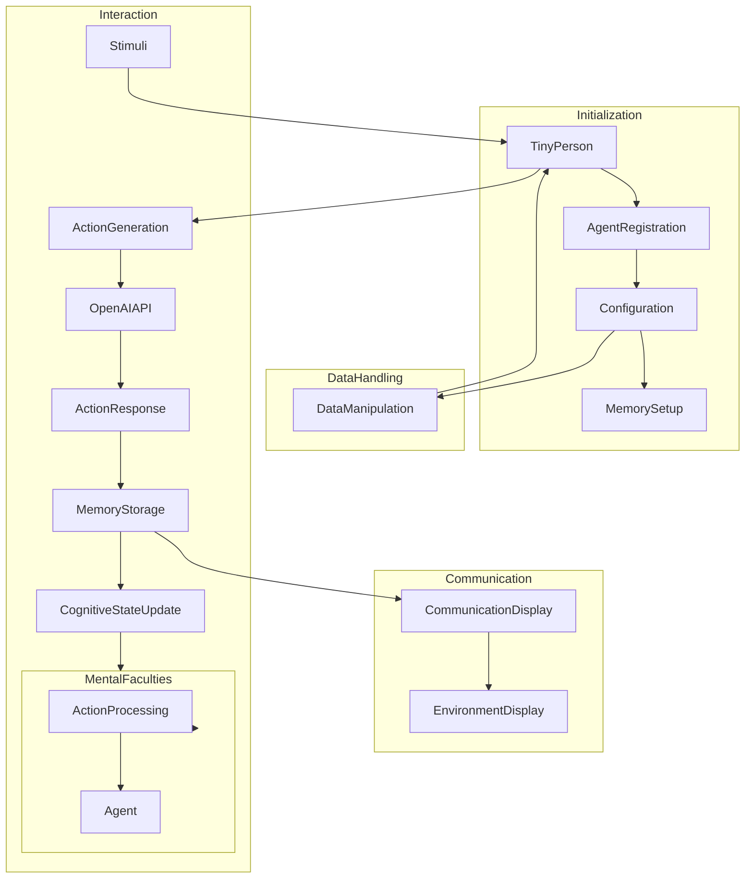

# TinyTroupe Agent Module

## <input code>

```python
"""
This module provides the main classes and functions for TinyTroupe's  agents.

Agents are the key abstraction used in TinyTroupe. An agent is a simulated person or entity that can interact with other agents and the environment, by
receiving stimuli and producing actions. Agents have cognitive states, which are updated as they interact with the environment and other agents. 
Agents can also store and retrieve information from memory, and can perform actions in the environment. Different from agents whose objective is to
provide support for AI-based assistants or other such productivity tools, **TinyTroupe agents are aim at representing human-like behavior**, which includes
idiossincracies, emotions, and other human-like traits, that one would not expect from a productivity tool.

The overall underlying design is inspired mainly by cognitive psychology, which is why agents have various internal cognitive states, such as attention, emotions, and goals.
It is also why agent memory, differently from other LLM-based agent platforms, has subtle internal divisions, notably between episodic and semantic memory. 
Some behaviorist concepts are also present, such as the idea of a "stimulus" and "response" in the `listen` and `act` methods, which are key abstractions
to understand how agents interact with the environment and other agents.
"""

import os
import csv
import json
import ast
import textwrap  # to dedent strings
import datetime  # to get current datetime
import chevron  # to parse Mustache templates
import logging
logger = logging.getLogger("tinytroupe")
import tinytroupe.utils as utils
from tinytroupe.utils import post_init
from tinytroupe.control import transactional
from tinytroupe.control import current_simulation
from rich import print
import copy
from tinytroupe.utils import JsonSerializableRegistry

from typing import Any, TypeVar, Union

Self = TypeVar("Self", bound="TinyPerson")
AgentOrWorld = Union[Self, "TinyWorld"]

# ... (rest of the code)
```

## <algorithm>

The `TinyPerson` class is the core of the agent logic.  It manages interactions, memory, and cognitive state updates.  The algorithm can be broken down into the following stages:

1. **Initialization (`__init__`, `_post_init`):**
    * Sets up agent's name, memory, mental faculties.
    * Initializes default configuration attributes (e.g., emotions, goals).
    * Reads prompt templates.
    * Registers agent in a global agent list.
    * Resets the initial prompt.
2. **Prompt Generation (`generate_agent_prompt`):**
    * Loads the agent prompt template from a file.
    * Creates a dictionary of configuration variables for the template.
    * Includes any custom actions and constraints from mental faculties.
    * Renders the template using `chevron`.
    * Handles RAI template variables if enabled.
3. **Reset Prompt (`reset_prompt`):**
    * Generates the agent prompt and assigns it to `_init_system_message`.
    * Clears the current messages.
    * Adds initial system message and recent messages from episodic memory to `current_messages`.
4. **Interaction (`listen`, `act`, `see`, `think`, `socialize`, `listen_and_act`, `see_and_act`, `think_and_act`):**
    * Receives stimuli (e.g., speech, visual descriptions, thoughts).
    * Stores the stimuli in episodic memory.
    * Generates actions via the OpenAI API using `_produce_message`.
    * Stores action results in episodic memory.
    * Updates cognitive state (goals, attention, emotions).
    * Processes actions using mental faculties.
5. **Action Processing (`act`):**
    * Optionally acts until `DONE` or a fixed number of times.
    * Includes error handling and checks for action loops to prevent infinite loops.
    * Passes actions to mental faculties for processing.
6. **Communication Display (`_display_communication`, `pop_and_display_latest_communications`):**
    * Formats communication (stimuli/actions) with Rich library.
    * Displays formatted communication if the agent has no parent environment.  Otherwise, the environment handles display.
7. **Data Handling (`_observe`, `define`, `define_relationships`, `clear_relationships`, `_update_cognitive_state`)**: Stores and retrieves information, updates relationships, clears memory sections, updates cognitive states, etc.


## <mermaid>



**Explanation of Imports and Dependencies:**

The diagram shows the basic flow.  The `tinytroupe.utils`, `tinytroupe.control`, `rich`, `copy`, and `chevron` libraries have dependencies on external libraries that are implicitly used through the `TinyPerson` class.  The code utilizes these libraries for various functionalities like configuration management, transaction handling, formatting display using Rich, deep copying, and template rendering.

## <explanation>

* **Imports:** The code imports necessary libraries for file handling (`os`, `csv`, `json`, `ast`), text processing (`textwrap`, `datetime`), templating (`chevron`), logging (`logging`), Rich display library (`rich`), and utilities from the TinyTroupe project (`tinytroupe.utils`, `tinytroupe.control`, `JsonSerializableRegistry`).
* **Classes:**
    * `TinyPerson`: This class represents a simulated person/agent with methods for interacting with the environment, storing information in episodic and semantic memory, and updating cognitive states.  It defines interactions with other agents, handling actions and stimuli, and internal state changes.
    * `TinyMentalFaculty`: A base class for mental faculties, defining methods for action processing.
    * `RecallFaculty`, `FilesAndWebGroundingFaculty`, and `TinyToolUse`: Specific mental faculties for recalling information, accessing files/web pages, and using tools.
    * `TinyMemory`, `EpisodicMemory`, and `SemanticMemory`: These classes encapsulate different memory types. `SemanticMemory` uses `llama_index` for semantic searching and document loading.
* **Functions:** The `TinyPerson` class includes various methods like `act`, `listen`, `see`, `think`, `define`, `define_relationships`, `related_to`, and others. These provide functions to control agent behavior. `act` method is crucial for controlling the sequence and type of actions an agent takes before stopping.
* **Variables:** `config`, `default` (stores default configuration values), `communication_style`, and `communication_display` are used to control agent behavior. The critical concept here is the `current_messages` buffer and the `_actions_buffer`, which hold internal state information.
* **Potential Errors/Improvements:**
    * Error handling for the `_produce_message` function could be enhanced by adding a fallback mechanism if the model response is not valid JSON or misses a key.
    * The code utilizes `llama_index`. More information is needed on how llama_index is initialized, the `Settings.embed_model` assignment, and how documents are loaded and indexed for efficient semantic search.
    * Error handling around `define_relationships` could be better to handle invalid input types.
    * The `retrieve_relevant` method of `SemanticMemory` does not implement a retrieval mechanism. This needs to be fleshed out.
    * The code lacks clear documentation for the specific arguments and return values of the mental faculties, especially `process_action`, which should clearly indicate the interaction with the agent's state and external data.

**Project Relationships:**

The `tinytroupe.agent` module depends on `tinytroupe.utils` (for utility functions like configuration reading and JSON serialization) and `tinytroupe.control` (for transactional operations and simulation management).  `TinyPerson` interacts heavily with other agents (if any) via `listen` and `act` methods.  The `TinyPerson` class depends on mental faculties (e.g., `RecallFaculty`, `FilesAndWebGroundingFaculty`) and memory mechanisms.  The `SemanticMemory` class, in particular, relies on the `llama-index` library for vector store indexing and retrieval, making it an external dependency of the `TinyTroupe` project.