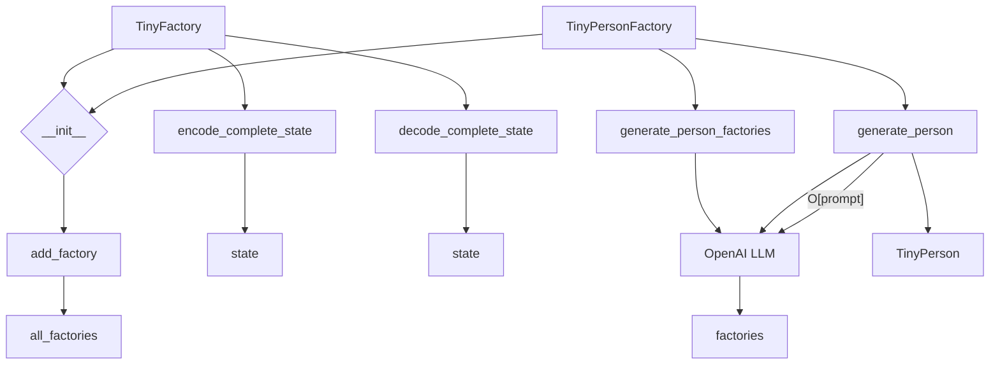
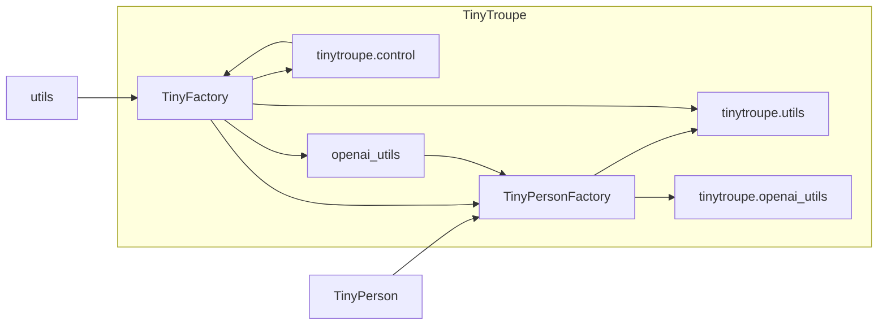

# TinyTroupe Factory Code Explanation

## <input code>

```python
import os
import json
import chevron
import logging
import copy
logger = logging.getLogger("tinytroupe")

from tinytroupe import openai_utils
from tinytroupe.agent import TinyPerson
import tinytroupe.utils as utils
from tinytroupe.control import transactional

class TinyFactory:
    """
    A base class for various types of factories. This is important because it makes it easier to extend the system, particularly 
    regarding transaction caching.
    """

    # A dict of all factories created so far.
    all_factories = {} # name -> factories
    
    def __init__(self, simulation_id:str=None) -> None:
        """
        Initialize a TinyFactory instance.

        Args:
            simulation_id (str, optional): The ID of the simulation. Defaults to None.
        """
        self.name = f"Factory {utils.fresh_id()}" # we need a name, but no point in making it customizable
        self.simulation_id = simulation_id

        TinyFactory.add_factory(self)
    
    def __repr__(self):
        return f"TinyFactory(name=\'{self.name}\')"\n    
    @staticmethod
    def set_simulation_for_free_factories(simulation):
        """
        Sets the simulation if it is None. This allows free environments to be captured by specific simulation scopes
        if desired.
        """
        for factory in TinyFactory.all_factories.values():
            if factory.simulation_id is None:
                simulation.add_factory(factory)

    @staticmethod
    def add_factory(factory):
        """
        Adds a factory to the list of all factories. Factory names must be unique,
        so if an factory with the same name already exists, an error is raised.
        """
        if factory.name in TinyFactory.all_factories:
            raise ValueError(f"Factory names must be unique, but \'{factory.name}\' is already defined.")
        else:
            TinyFactory.all_factories[factory.name] = factory
    
    @staticmethod
    def clear_factories():
        """
        Clears the global list of all factories.
        """
        TinyFactory.all_factories = {}

    ################################################################################################
    # Caching mechanisms
    #
    # Factories can also be cached in a transactional way. This is necessary because the agents they
    # generate can be cached, and we need to ensure that the factory itself is also cached in a 
    # consistent way.
    ################################################################################################

    def encode_complete_state(self) -> dict:
        """
        Encodes the complete state of the factory. If subclasses have elmements that are not serializable, they should override this method.
        """
        state = copy.deepcopy(self.__dict__)
        return state

    def decode_complete_state(self, state:dict):
        """
        Decodes the complete state of the factory. If subclasses have elmements that are not serializable, they should override this method.
        """
        state = copy.deepcopy(state)

        self.__dict__.update(state)
        return self
```
## <algorithm>



## <mermaid>



**Dependencies Analysis**:

*   **`os`**: Provides functions for interacting with the operating system, e.g., file paths.
*   **`json`**: Used for encoding and decoding JSON data.
*   **`chevron`**: A templating engine, likely for generating dynamic strings, including user prompts for OpenAI.
*   **`logging`**: For logging events and messages within the code.
*   **`copy`**: For creating deep copies of objects, crucial for safely handling factory states during caching.
*   **`tinytroupe.openai_utils`**: A module likely providing functions for interacting with OpenAI's API.  Crucial dependency for AI-related functionalities.
*   **`tinytroupe.agent`**: Contains definitions for the `TinyPerson` class.
*   **`tinytroupe.utils`**: A module providing utility functions, e.g., for generating IDs and parsing JSON from OpenAI responses.
*   **`tinytroupe.control`**: Probably for control flow related mechanisms, including transactional decorators.


## <explanation>

*   **Imports**: The code imports necessary libraries for file system interactions (`os`), data serialization (`json`), templating (`chevron`), logging (`logging`), object copying (`copy`), OpenAI API interactions (`tinytroupe.openai_utils`), the `TinyPerson` class from the `tinytroupe.agent` module, utility functions from `tinytroupe.utils`, and the transactional decorator from `tinytroupe.control`. This demonStartes a modular design within the `tinytroupe` package.
*   **Classes**:
    *   **`TinyFactory`**: A base class for creating factories. It manages all created factories using a class variable `all_factories`. Crucial methods for state management (`encode_complete_state`, `decode_complete_state`) enable transaction caching. This structure likely facilitates creating specialized factories (like `TinyPersonFactory`) by inheritance.
    *   **`TinyPersonFactory`**: Subclass of `TinyFactory`, specialized for creating `TinyPerson` agents. Stores context text, generated agents, and names to avoid duplicates.  `generate_person_factories` and `generate_person` are key methods that leverage OpenAI's LLM to create `TinyPerson` objects. Notice the use of the `@transactional` decorator for caching. This structure demonStartes inheritance and specialization for different factory types within the system.
*   **Functions**:
    *   **`__init__`**: Initializes a `TinyFactory` instance, setting a unique name and optionally a simulation ID.  Critically, it adds the factory to the `all_factories` registry.
    *   **`generate_person_factories`**: Generates a batch of `TinyPersonFactory` instances using OpenAI's LLM.  It defines a system prompt and user prompt for OpenAI, rendering the user prompt with variables (`number_of_factories` and `generic_context_text`).
    *   **`generate_person`**: Generates a single `TinyPerson` instance given specific context and particularities using OpenAI's LLM. Important error handling and attempt limiting are included.  Notice the use of a helper method (`_aux_model_call`) for a crucial transactional aspect during caching.

*   **Variables**:  Class variable `all_factories` stores all created `TinyFactory` instances.  Instance variables store data relevant to the factory, like `name`, `simulation_id`, `context_text`, and generated entities (`generated_minibios`).

*   **Potential Errors/Improvements**:
    *   **Error Handling:** The `generate_person` method has nested `try-except` blocks to catch exceptions during the OpenAI API calls.  More specific error handling (e.g., handling rate limits, timeouts) could be beneficial.
    *   **Robustness:** The code assumes that the JSON response from OpenAI is in a specific format. Error handling to account for various API responses is crucial for production code.
    *   **Context Management**: The `context_text` passed around is crucial.  Robust handling for passing potentially large or complex context information should be considered.  Consider using a mechanism to store or reference the context more effectively (e.g., a reference to a stored object).
    *   **Concurrency:** If multiple threads/processes use the `TinyFactory` class simultaneously, proper synchronization mechanisms are crucial.


**Relationship Chain**:

The code defines a chain of relationships where `TinyPersonFactory` relies on `TinyFactory`, which interacts with `openai_utils` and `tinytroupe.utils` for AI interactions and utility functions. `TinyPersonFactory` creates `TinyPerson` agents and caches their states, further enabling more complex interactions within the project.