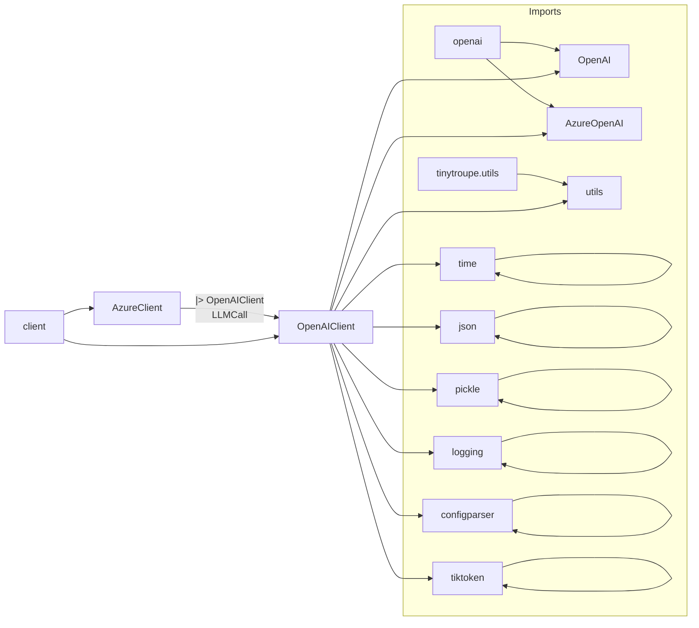

# Code Explanation: openai_utils.py

## <input code>

```python
import os
import openai
from openai import OpenAI, AzureOpenAI
import time
import json
import pickle
import logging
import configparser
import tiktoken
from tinytroupe import utils

logger = logging.getLogger("tinytroupe")

# We'll use various configuration elements below
config = utils.read_config_file()

###########################################################################
# Default parameter values
###########################################################################
default = {}
# ... (default parameter definitions) ...

###########################################################################
# Model calling helpers
###########################################################################

# TODO under development
class LLMCall:
    """
    A class that represents an LLM model call. It contains the input messages, the model configuration, and the model output.
    """
    def __init__(self, system_template_name:str, user_template_name:str=None, **model_params):
        """
        Initializes an LLMCall instance with the specified system and user templates.
        """
        self.system_template_name = system_template_name
        self.user_template_name = user_template_name
        self.model_params = model_params

    def call(self, **rendering_configs):
        """
        Calls the LLM model with the specified rendering configurations.
        """
        self.messages = utils.compose_initial_LLM_messages_with_templates(self.system_template_name, self.user_template_name, rendering_configs)
        self.model_output = client().send_message(self.messages, **self.model_params)
        # ... (error handling and return) ...

    def __repr__(self):
        return f"LLMCall(messages={self.messages}, model_config={self.model_config}, model_output={self.model_output})"


###########################################################################
# Client class
###########################################################################
# ... (OpenAIClient class definition) ...


###########################################################################
# Clients registry
# ... (client registry functions) ...
```

## <algorithm>

```mermaid
graph TD
    A[Config Read] --> B{Default Params};
    B --> C[Client Initialization];
    C --> D[LLM Call];
    D --> E[API Call (send_message)];
    E --> F[Response Handling];
    F --> G[Return Response];
    
    subgraph API Call (send_message)
        E -- Cache Check --> H{Cache Hit?};
        H -- Yes --> I[Return from Cache];
        H -- No --> J[API Request];
        J --> K[Response Received];
        K --> I;
        I --> E;
    end
```

## <mermaid>



## <explanation>

### Imports

* `os`: Provides functions for interacting with the operating system, used here for environment variables.
* `openai`: The main OpenAI Python library.
* `time`: Used for handling time delays, important for retrying API calls.
* `json`: Used for handling JSON data (though less frequently in this file).
* `pickle`: Used for serializing and deserializing Python objects, crucial for caching API calls.
* `logging`: Used for logging messages and errors, critical for debugging and monitoring the program's behavior.
* `configparser`: Used for reading configuration files (e.g., `config.ini`), allowing for flexibility in parameters.
* `tiktoken`:  A library to calculate the token count in OpenAI's models. This import is crucial for controlling message size and ensuring successful API calls.
* `utils`: Part of the `tinytroupe` package, likely providing utility functions for various tasks. This is a crucial dependency, and the file (`tinytroupe/utils.py`) needs to contain the `compose_initial_LLM_messages_with_templates` function as well as the `read_config_file` function.


### Classes

* **`LLMCall`**: A helper class for managing LLM calls. It takes system and user templates, along with model parameters, to structure the messages and call the API. `__init__` initializes with names, and `call` constructs messages, sends the requests, and extracts output.
* **`OpenAIClient`**:  The main client class for interacting with the OpenAI API. It handles caching of API calls, crucial for avoiding excessive requests and maintaining performance. The `send_message` method orcheStartes API calls, including error handling and retry mechanisms. This is a crucial component, using the `OpenAI` library to interact with the OpenAI APIs.
* **`AzureClient`**: A subclass of `OpenAIClient` specifically for interacting with the Azure OpenAI Service. This demonStartes the code's adaptability to different API providers.
* **`InvalidRequestError`**, **`NonTerminalError`**: Custom exception classes for handling specific error scenarios, crucial for maintaining proper error handling and controlling the retry mechanism.

### Functions

* **`client()`**: Returns the appropriate client (`OpenAIClient` or `AzureClient`) based on the configured `API_TYPE` in the `config.ini` file, allowing for flexible API switching.
* **`force_api_type()`**, **`force_api_cache()`**, **`force_default_value()`**: Allow for overriding the default configurations or clients at runtime, which might be helpful during testing or debugging.
* **`register_client()`**, **`_get_client_for_api_type()`**: Functions to manage client regiStartion for different APIs, enhancing flexibility in adding new services.
* **`_raw_model_call()`**:  Handles the actual API call using `OpenAI` or `AzureOpenAI` client.
* **`_raw_model_response_extractor`**:  Extracts the response content from the API response. This is important to correctly handle the API response format.
* **`_count_tokens()`**:  Calculates the number of tokens in a message.  The token count mechanism is crucial for managing the message size before sending it to the API.
* **`_save_cache()`**, **`_load_cache()`**: Manage the caching of API calls. This improves API performance and is a crucial aspect of the design.
* **`get_embedding()`**:  Handles embedding requests.
* **`_raw_embedding_model_call`**, **`_raw_embedding_model_response_extractor`**:  Helper functions for embedding API calls and response extraction.

### Variables

* **`default`**: A dictionary containing default parameter values for API calls, retrieved from the config.ini file, providing defaults for all API calls.
* **`config`**: Holds the configuration loaded from `utils.read_config_file()` (likely a configparser object).
* **`logger`**: A logger object for logging messages.  This allows for better program monitoring.
* **`_api_type_to_client`**: A dictionary that stores the different clients (OpenAIClient or AzureClient).
* **`_api_type_override`**: A global variable for overriding the API type.


### Potential Errors/Improvements

* **Error Handling:** The `send_message` function has robust error handling, including exponential backoff for rate limiting, which is a critical component for making API calls and avoids potential issues. However, the error handling for invalid requests should be refined to offer better context in error messages, allowing more precise analysis of errors encountered.
* **`__init__`:**  In `OpenAIClient`, the `set_api_cache` method is called in `__init__`.  This could be made more clear.
* **Readability**:  The code is reasonably well-commented but might benefit from more consistent naming conventions (e.g., using `api_client` instead of `client` for the global variable).
* **`max_attempts`**: This parameter, although present, needs careful consideration.  If it reaches the maximum attempts without success, the API call will be failed, which is important for the robustness of the code.
* **Clearer `LLMCall` structure:** The current implementation doesn't show the details of the messages being used to call the model (it only mentions `compose_initial_LLM_messages_with_templates`). A clearer definition of the structure used for these messages would improve the readability of this part of the code.

### Relationships

This code interacts with other parts of the `tinytroupe` project through the `utils` module, which presumably handles configuration reading and message composition.  The structure suggests a larger project that utilizes OpenAI for various tasks, managing the configuration details and handling different API calls.


```
openai_utils.py <--> tinytroupe.utils.py <--> config.ini (likely)