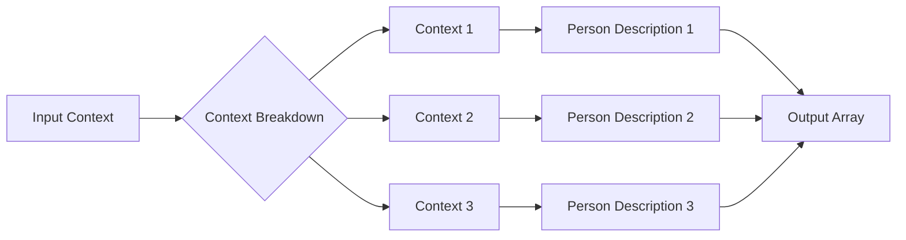

```MD
# Code Explanation: generate_person_factory.md

## <input code>

```
Your task is create many contexts that will be used as base to generate a list of persons.
The idea is receive a broad context, with some  details of persons we want to generate, like demographics parameters, physical characteristics, behaviors, believes, etc; and then create many other contexts, more specifics, but derivaded of the more generic one.
Your response must be an array in JSON format. Each element of the array must be a context that will be used to generate a person description.

Example:
  - INPUT:
    Please, generate 3 person(s) description(s) based on the following broad context: Latin American, age between 20 and 40 years old, economic status can vary between poor and rich, it can be religious or not, it can be married or not, it can be have children or not, it can be a professional or not, it can be a worker or not
  - OUTPUT:
    ["Mexican person that has formed as lawyer but now works in other are, is single, like sports and movies", "Create a Brazilian person that is a doctor, like pets and the nature and love heavy metal.", "Create a Colombian person that is a lawyer, like to read and drink coffee and is married with 2 children."]
```

## <algorithm>

This code describes a task, not a function or a program.  It outlines the desired behavior of a hypothetical function or API endpoint for generating person descriptions.  The algorithm is expressed in the example input/output format, showing the expected interaction pattern.

**Workflow:**

1. **Input:** The function receives a broad context describing the desired characteristics of a person (e.g., nationality, age range, economic status, etc.)
2. **Output Generation:** Based on the input context, it produces a list of more specific contexts, which are detailed descriptions tailored to generate a person's profile.
3. **Output Format:** The output is an array (list) of strings, where each string is a context ready to be used to create detailed person descriptions.

**Example:**

* **Input:** "Please, generate 3 person(s) description(s) based on the following broad context: Latin American, age between 20 and 40 years old, ..."
* **Output:**  ["Mexican person that has formed as lawyer but now works in other are, is single, like sports and movies", ...]


## <mermaid>



**Dependencies:**

There are no imports or external dependencies in the provided code snippet, as it is purely a description of functionality.


## <explanation>

**Imports:**

No imports are present in the provided code as it's a description of a task, not a program.

**Classes:**

No classes are defined.

**Functions:**

No functions are defined.

**Variables:**

No variables are declared.

**Potential Errors/Improvements:**

* **Ambiguity:** The prompt is unclear about the *process* of generating the specific contexts.  How are the details selected? How many details are necessary? A clear specification of the rules/logic is needed to implement a robust solution.

* **Lack of Implementation:** This is a high-level description of the functionality.  No actual code is provided for implementation.  A specific function implementation would require algorithms/code to generate variations of the provided context (e.g. using a language model or similar tools).


**Relationships with other project components:**

This description outlines a function or API that would likely be used by a program that manages or creates person descriptions or data. It could be part of a larger project involving generating fictional or real-world person profiles. The relationships would depend on the larger context within which the 'generate person factory' fits.