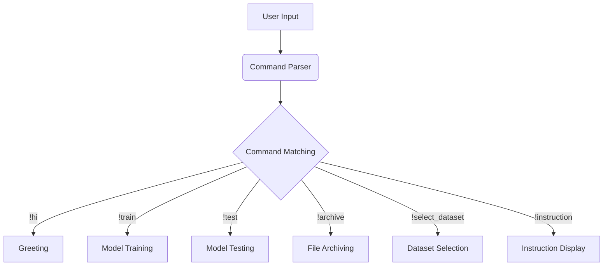

# Code Explanation

## <input code>

```
!hi: Greets the user.
!train <data> <data_dir> <positive> <attachment>: Trains the model with the provided data. Use data for a file, data_dir for a directory, or attachment for a file attachment.
!test <test_data>: Tests the model with provided JSON test data.
!archive <directory>: Archives files in the specified directory.
!select_dataset <path_to_dir_positive> <positive>: Selects a dataset for training from the specified directory.
!instruction: Displays this instruction message.
```

## <algorithm>

This code defines a set of commands (or intents) for a chatbot or similar application.  The commands are designed to be invoked via a user interface or similar system.  There is no inherent data flow in this static list; the commands themselves define actions which would initiate specific processing elsewhere in the application.

* **Command:** `!hi`
    * **Action:** Greets the user.
    * **Example:** User types `!hi` -> Chatbot replies with a greeting.
* **Command:** `!train`
    * **Action:** Trains the model with specified data.
    * **Parameters:** `data` (file), `data_dir` (directory), `positive` (flag? metadata?), `attachment` (file)
    * **Example:** User types `!train my_data.txt data/training_directory positive true` -> The application finds and processes the data, including the metadata files, and trains the model on them.
* **Command:** `!test`
    * **Action:** Tests the model.
    * **Parameters:** `test_data` (JSON data)
    * **Example:** User types `!test test_data.json` -> The application performs the test on the provided data.
* **Command:** `!archive`
    * **Action:** Archives files in a directory.
    * **Parameters:** `directory` (directory path)
    * **Example:** User types `!archive /path/to/my/files` -> The application archives the files in the specified directory.
* **Command:** `!select_dataset`
    * **Action:** Selects a dataset for training.
    * **Parameters:** `path_to_dir_positive` (directory containing training dataset), `positive` (some selection criteria)
    * **Example:** User types `!select_dataset data/dataset positive_data` -> The application selects a subset of training data based on criteria.
* **Command:** `!instruction`
    * **Action:** Displays instructions.
    * **Example:** User types `!instruction` -> The application displays the instructions.


## <mermaid>



**Dependencies:**

This code snippet doesn't directly import anything, so no dependencies are discussed.  However, to function in a real application, this command list would need to be part of a larger system with libraries for input handling, command parsing, and file/directory management. The `!` prefix likely indicates a defined format to be parsed by the bot's input handler.


## <explanation>

* **Imports**:  There are no imports in this code snippet.
* **Classes**:  No classes are defined.
* **Functions**:  No functions are defined.
* **Variables**:  No variables are defined.
* **Potential Errors/Improvements**:
    * **Ambiguity:**  "Positive" and similar terms are used for different purposes.  Clarity on these would be essential for robust parsing and action handling. The meanings of `positive` in `!train` and `!select_dataset` should be clearly defined.
    * **Input Validation:** The code doesn't check the validity of user input (e.g., if the file exists or the directory is valid).  Robust applications should validate this.
    * **Error Handling:**  The code doesn't handle potential errors (e.g., invalid commands or missing data).  Error handling and reporting would improve robustness.


**Chain of Relationships:**

This command list is likely part of a larger system. The commands `!train`, `!test`, `!select_dataset` would need to interact with data loading and storage components, possibly machine learning frameworks (if training a model) and file handling mechanisms.  `!archive` needs interactions with file system and archival utilities.  The command parser (which would parse the user input) sits between the user and the components responsible for handling the commands.