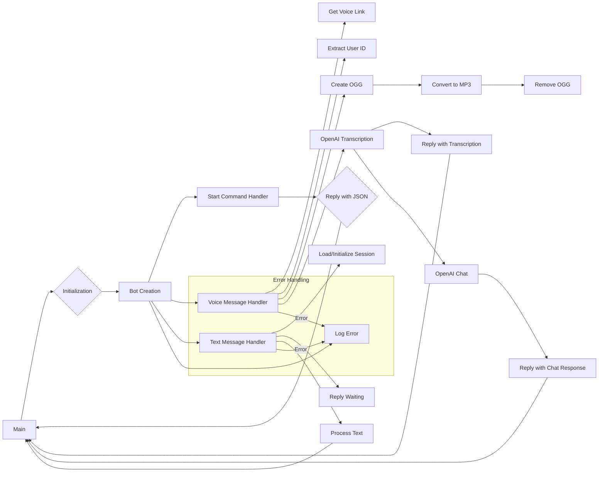

```MD
# Code Explanation: ChatGPT Telegram Bot

## <input code>

```javascript
import { Telegraf } from 'telegraf'
import { message } from 'telegraf/filters'
import { code } from 'telegraf/format'
import config from 'config'
import { ogg } from './ogg.js'
import { openai } from './openai.js'
import { removeFile } from './utils.js'

const bot = new Telegraf(config.get('TELEGRAM_TOKEN'))
bot.command('start', async(ctx) : {\n    await ctx.reply(JSON.stringify(ctx.message));\n})\n\nbot.on(message('voice'), async (ctx) : {\n    try {\n        await ctx.reply(code('Сообщение принял. Жду ответ от сервера...'))\n        const link = await ctx.telegram.getFileLink(ctx.message.voice.file_id)\n        const userId = String(ctx.message.from.id)\n        const oggPath = await ogg.create(link.href, userId)\n        const mp3Path = await ogg.toMp3(oggPath, userId)\n        removeFile(oggPath)\n        const text = await openai.transcription(mp3Path)\n        await ctx.reply(code(`запрос: ${text}`))\n        const messages = [{ role: openai.roles.USER, content: text }]\n        const response = await openai.chat(messages)\n        await ctx.reply(response.content)\n    } catch (e) {\n        console.error(`Error while proccessing voice message`, e.message)\n    } \n})\n\nbot.on(message('text'), async (ctx) : {\n    ctx.session ??= INITIAL_SESSION\n    try {\n        await ctx.reply(code('Сообщение принял. Жду ответ от сервера...'))\n        await processTextToChat(ctx, ctx.message.text)\n    } catch (e) {\n        console.log(`Error while voice message`, e.message)\n    }\n})\n\nbot.launch()\nprocess.once('SIGINT', () : bot.stop('SIGINT'))\nprocess.once('SIGTERM', () : bot.stop('SIGTERM'))
```

## <algorithm>

**Step 1**: Initialization

* Load necessary modules: `Telegraf`, filters, formatting, config, custom modules (ogg, openai, utils).
* Create a `Telegraf` bot instance using the Telegram token from the `config` file.
* Define the `INITIAL_SESSION` variable(likely for storing conversation state)

**Step 2**: Handling '/start' command

* If user sends `/start` command.
* Reply with the JSON representation of the incoming message.

**Step 3**: Handling voice messages

* **Step 3.1** Indicate receiving and waiting for a response.
* **Step 3.2** Obtain the download link for the voice message.
* **Step 3.3** Extract the user ID.
* **Step 3.4** Convert voice to OGG format and save it.
* **Step 3.5** Convert the OGG file to MP3.
* **Step 3.6** Delete the OGG file (avoiding storage issues).
* **Step 3.7** Send transcription request to OpenAI using MP3 path.
* **Step 3.8** Reply with the transcription.
* **Step 3.9** Send the processed text to OpenAI's chat API.
* **Step 3.10** Reply with the response from the OpenAI chat API.
* **Error Handling:** Catch any errors during the process and log them to the console.

**Step 4**: Handling text messages

* **Step 4.1** Load or initialize session data.
* **Step 4.2** Indicate receiving and waiting for a response.
* **Step 4.3** Process the text using `processTextToChat` function.
* **Error Handling:** Catch any errors during the process and log them to the console.


**Step 5**: Start the bot

* The bot starts listening for events and commands.
* Listen for interrupt signals (SIGINT, SIGTERM) and stop the bot gracefully.


## <mermaid>



**Dependencies Analysis**:

* `Telegraf`: A Telegram bot framework.
* `telegraf/filters`: Provides filters for handling different message types (e.g., `message`).
* `telegraf/format`: Contains the `code` function for formatting messages.
* `config`:  Likely a configuration management library used to load secrets (e.g., the Telegram bot token).
* `ogg`: A custom module for handling OGG voice file conversion.
* `openai`: A custom module interacting with the OpenAI API.
* `utils`: A custom module for file manipulation (removing the OGG file).

## <explanation>

**Imports:**

* `Telegraf`, `message`, `code`: Necessary for creating and interacting with the Telegram bot.
* `config`: Loads the Telegram token for bot authentication.  Crucial dependency for accessing secret/environment variables.
* `ogg`, `openai`, `removeFile`: Custom modules from the same project.  Indicates a modular design for handling voice processing, AI interactions and file cleanup, respectively.

**Classes:**

* `Telegraf`: A Telegram bot class, offering methods for handling commands, messages, and launching the bot.

**Functions:**

* `bot.command('start', ...)`: Handles the `/start` command, sending a response to the user.
* `bot.on(message('voice'), ...)`: Processes voice messages:
    * `ctx.telegram.getFileLink(...)`: Retrieves the voice file's download link.
    * `ogg.create(...)`, `ogg.toMp3(...)`: Calls custom functions for OGG and MP3 conversion.
    * `removeFile(...)`: Deletes the temporary OGG file.
    * `openai.transcription(...)`: Sends the MP3 file to OpenAI's transcription service.
    * `openai.chat(...)`: Sends the transcribed text to the OpenAI's chat API.
* `bot.on(message('text'), ...)`: Handles text messages:
    * `processTextToChat(ctx, text)`: A function (not defined in this snippet) likely handles processing text messages.

**Variables:**

* `bot`: A `Telegraf` instance representing the bot.
* `config.get('TELEGRAM_TOKEN')`:  The bot's Telegram API token, loaded from a configuration file.
* `INITIAL_SESSION`: A variable likely used to store the conversation state for text messages.


**Potential Errors/Improvements:**

* Error handling in `bot.on(message('voice'), ...)` and `bot.on(message('text'), ...)` is good practice.
* Consider adding more robust error handling for the `openai` calls (e.g., rate limiting, API errors, network issues).
* `processTextToChat` is not defined in this file but required for handling text messages.
* Handling possible issues with large files and timeouts (waiting for the `openai` API).
* The code assumes existence of `INITIAL_SESSION` variable, which needs definition in the scope where it's used.
* Consider using a more descriptive variable name for `INITIAL_SESSION`.
* File paths should be handled securely to avoid potential vulnerabilities.
*  The use of `await` is correct for asynchronous operations.


**Relationship with other project parts:**

The `ogg`, `openai`, and `utils` modules are clearly separated parts of the project that work together to provide the functionality of handling voice messages and responding to users. The `config` file provides essential configurations for running the bot.  The bot is dependent on these other modules for functionalities beyond Telegram API.