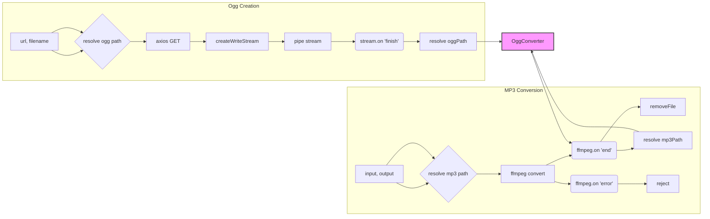

# Ogg Converter Analysis

## <input code>

```javascript
import axios from 'axios'
import { createWriteStream } from 'fs'
import { dirname, resolve } from 'path'
import { fileURLToPath } from 'url'
import ffmpeg from 'fluent-ffmpeg'
import installer from '@ffmpeg-installer/ffmpeg'
import { removeFile } from './utils.js'

const __dirname = dirname(fileURLToPath(import.meta.url))
// ====
class OggConverter {
  constructor() {
    ffmpeg.setFfmpegPath(installer.path)
  }
    toMp3(input, output) {
        try {
            const outputPath = resolve(dirname(input), `${output}.mp3`)
            return new Promise((resolve, reject) : {
                ffmpeg(input)
                    .inputOption('-t 30')
                    .output(outputPath)
                    .on('end', () : {
                        removeFile(input)
                        resolve(outputPath)
                    })
                    .on('error', (err) : reject(err.message))
                    .run()
            })
        } catch (e) {
            console.log('Error while creating mp3', e.message)
        }
    } // ====
    async create(url, filename) {
        try {
            const oggPath = resolve(__dirname, '../voices', `${filename}.ogg`)
            const response = await axios({
                method: 'get',
                url,
                responseType: 'stream',
            })
            return new Promise((resolve) : {
                const stream = createWriteStream(oggPath)
                response.data.pipe(stream)
                stream.on('finish', () : resolve(oggPath))
            })
        } catch (e) {
            console.log('Error while creating ogg', e.message)
        }
    }
}
export const ogg = new OggConverter()
```

## <algorithm>

**Ogg Creation:**

1. **Receive URL and Filename:** The `create` method receives the URL of the Ogg audio file and the desired filename.
2. **Resolve Ogg Path:** `resolve` is used to construct the absolute path to the output OGG file, placing it in a `voices` subdirectory relative to the script's directory.
3. **Fetch Ogg:** `axios` is used to fetch the audio stream from the given URL with `responseType: 'stream'`.
4. **Create Write Stream:** `createWriteStream` is created for the resolved OGG path.
5. **Pipe the Stream:** The fetched data stream from `response.data` is piped to the `stream`. This directly writes the data to the file.
6. **Resolve Path:** The `stream`'s 'finish' event triggers the promise resolution with the path to the created file.
7. **Error Handling:** A `try...catch` block handles potential errors during the fetching and writing process.


**MP3 Conversion:**

1. **Receive Input and Output Names:** The `toMp3` method receives the input OGG file path and the desired output MP3 filename.
2. **Construct Output Path:** `resolve` is used to construct the output MP3 file path.
3. **Convert to MP3:** `fluent-ffmpeg` is used to convert the input audio to MP3. The `inputOption('-t 30')` is crucial to limit the conversion to 30 seconds.
4. **Error Handling:** A `try...catch` block handles potential conversion errors.
5. **Cleanup:**  The `removeFile` function from `utils.js` deletes the original OGG file after conversion is complete.
6. **Promise Handling:** The conversion process is wrapped in a `Promise` to handle asynchronous operations and propagate results or errors.


## <mermaid>



**Dependencies Analysis:**

* `axios`: For making HTTP requests, crucial for fetching the OGG file from a URL.
* `fs`: Provides file system functionalities, necessary for creating and writing to files.
* `path`: For resolving file paths.
* `url`: For handling file URLs.
* `fluent-ffmpeg`:  For performing audio conversions.
* `@ffmpeg-installer/ffmpeg`: Contains the FFmpeg executable needed by `fluent-ffmpeg`.
* `utils.js`: Likely contains the `removeFile` function, responsible for deleting files (implied by the code).


## <explanation>

**Imports:**

* `axios`:  Used for fetching the OGG file from a remote URL (`responseType: 'stream'` is important for efficient streaming).
* `fs`: Provides the `createWriteStream` function to write the downloaded stream to a file.
* `path`:  Provides `dirname` and `resolve` functions for correctly manipulating file paths (critical for ensuring files are saved in the right place).
* `url`: Needed to resolve paths from URLs.
* `fluent-ffmpeg`:  Allows for audio/video conversion.
* `@ffmpeg-installer/ffmpeg`:  Provides the path to FFmpeg binaries so `fluent-ffmpeg` can execute it.
* `utils.js`: Contains the `removeFile` function, which is likely responsible for deleting temporary files. This is a good practice for cleanup.

**Classes:**

* `OggConverter`: This class encapsulates the logic for handling Ogg audio conversion and creation.
    * `constructor()`: Sets the FFmpeg path. This is crucial; it ensures the correct executable is found.
    * `toMp3(input, output)`: Converts an OGG file to MP3, handling errors and cleanup.
        * Uses `fluent-ffmpeg` for conversion.
        * Includes crucial error handling and cleanup (removing the input file).
    * `create(url, filename)`: Downloads an OGG file from the specified URL and saves it locally.
        * Uses `axios` to handle the download (using `responseType: 'stream'` for efficiency).
        * Includes robust error handling.

**Functions:**

* `resolve()`: Combines parts of file paths into a complete, absolute path.
* `removeFile()`: (Assumed from `utils.js`) Deletes a file.  Critical for preventing file accumulation.

**Variables:**

* `__dirname`: The directory name of the current script.
* `outputPath`: The constructed path for the output MP3 file.
* `oggPath`: The constructed path for the output OGG file.
* `response`: The Axios response object containing the stream data.
* `stream`: The `createWriteStream` object used for writing the stream to the file.


**Potential Errors/Improvements:**

* **Error Handling:** While error handling is present, more specific error messages could be added for better debugging.
* **Input Validation:**  Consider adding validation for the input `url`, `filename`, and `input` to prevent unexpected behavior.
* **Timeout:** The `-t 30` option in `ffmpeg` is a good start, but explicit timeout mechanisms in the conversion process are recommended to avoid indefinite hanging.
* **File Existence Check:** Before attempting to convert an MP3, check if the input OGG file actually exists.
* **Asynchronous Operations:** The entire process is asynchronous, but the `async/await` structure is used appropriately.


**Relationship Chain:**

1. Client request (triggering the conversion).
2. `ogg` class instance (handles conversion).
3. `create` method (downloads OGG).
4. `toMp3` method (converts to MP3).
5. `removeFile` method (from `utils.js`) cleans up the original file.

This chain demonStartes the logical flow from user interaction to file processing and cleanup.