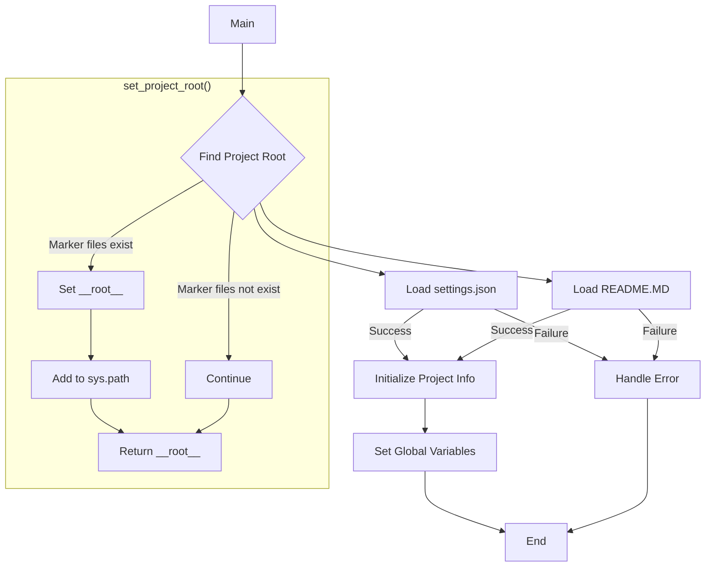

# Code Explanation for hypotez/src/bots/openai_bots/header.py

## <input code>

```python
## \file hypotez/src/bots/openai_bots/header.py
# -*- coding: utf-8 -*-\
#! venv/Scripts/python.exe
#! venv/bin/python/python3.12

"""
.. module: src.bots.openai_bots 
	:platform: Windows, Unix
	:synopsis:

"""
MODE = 'dev'

"""
	:platform: Windows, Unix
	:synopsis:

"""


"""
	:platform: Windows, Unix
	:synopsis:

"""


"""
  :platform: Windows, Unix

"""
"""
  :platform: Windows, Unix
  :platform: Windows, Unix
  :synopsis:
"""MODE = 'dev'
  
""" module: src.bots.openai_bots """

import sys
import json
from packaging.version import Version

from pathlib import Path
def set_project_root(marker_files=('__root__')) -> Path:
    """
    Finds the root directory of the project starting from the current file's directory,
    searching upwards and stopping at the first directory containing any of the marker files.

    Args:
        marker_files (tuple): Filenames or directory names to identify the project root.
    
    Returns:
        Path: Path to the root directory if found, otherwise the directory where the script is located.
    """
    __root__:Path
    current_path:Path = Path(__file__).resolve().parent
    __root__ = current_path
    for parent in [current_path] + list(current_path.parents):
        if any((parent / marker).exists() for marker in marker_files):
            __root__ = parent
            break
    if __root__ not in sys.path:
        sys.path.insert(0, str(__root__))
    return __root__


# Get the root directory of the project
__root__ = set_project_root()
"""__root__ (Path): Path to the root directory of the project"""

from src import gs

settings:dict = None
try:
    with open(gs.path.root / 'src' /  'settings.json', 'r') as settings_file:
        settings = json.load(settings_file)
except (FileNotFoundError, json.JSONDecodeError):
    ...

doc_str:str = None
try:
    with open(gs.path.root / 'src' /  'README.MD', 'r') as settings_file:
        doc_str = settings_file.read()
except (FileNotFoundError, json.JSONDecodeError):
    ...


__project_name__ = settings.get("project_name", 'hypotez') if settings  else 'hypotez'
__version__: str = settings.get("version", '')  if settings  else ''
__doc__: str = doc_str if doc_str else ''
__details__: str = ''
__author__: str = settings.get("author", '')  if settings  else ''
__copyright__: str = settings.get("copyrihgnt", '')  if settings  else ''
__cofee__: str = settings.get("cofee", "Treat the developer to a cup of coffee for boosting enthusiasm in development: https://boosty.to/hypo69")  if settings  else "Treat the developer to a cup of coffee for boosting enthusiasm in development: https://boosty.to/hypo69"
```

## <algorithm>

1. **Initialization:** Imports necessary libraries (sys, json, packaging.version, pathlib). Defines a global variable `MODE`.
2. **Project Root Detection:** Calls `set_project_root` to find the project root directory using marker files (e.g., `pyproject.toml`, `requirements.txt`, `.git`).
3. **Settings Loading:** Attempts to load settings from `src/settings.json`.  If the file doesn't exist or is not valid JSON, it handles the exception with `...`.
4. **Documentation Loading:** Attempts to load documentation from `src/README.MD`.  If the file doesn't exist, it handles the exception with `...`.
5. **Configuration Initialization:** Extracts project name, version, documentation, author, copyright, and "cofee" from the loaded settings.  Defaults are defined for cases where settings data is missing.


## <mermaid>



**Dependencies Analysis:**

*   `sys`:  For interacting with the Python runtime environment, including access to the system path.
*   `json`: For parsing and working with JSON data.
*   `packaging.version`: For handling software versioning (not directly used in this file, but important if handling versions).
*   `pathlib`: For interacting with file paths in a more object-oriented manner.
*   `gs`:  Presumably a custom module from `src` that provides a way to work with the project's filesystem paths (e.g., getting the project root).

## <explanation>

**Imports:**

*   `sys`: Used to modify the Python path, allowing the script to import modules from the project root directory.
*   `json`: For loading the project settings from the JSON file.
*   `packaging.version`: For handling versions (likely not directly used in this header but it may be necessary for other parts of the program).
*   `pathlib`: Used to manipulate file paths in a platform-independent manner.
*   `gs`:  Crucial for accessing project-specific paths and resources. This import indicates a dependency on the `gs` module, which likely manages project-related file paths within the `src` directory.


**Classes:**

*   No classes are defined.  The file contains only functions and variables.

**Functions:**

*   `set_project_root(marker_files)`: This function is a utility to find the root directory of the project.
    *   `Args`: A tuple of filenames/directories used to identify the project root.
    *   `Returns`: The `Path` object representing the project's root directory.
    *   `Example`: `set_project_root(('pyproject.toml', 'requirements.txt'))` would look for those files in the current directory or parent directories.

**Variables:**

*   `MODE`: A global variable likely for specifying development or production mode.
*   `settings`: A dictionary that stores project settings loaded from `settings.json`.
*   `doc_str`: A string containing the project documentation, loaded from `README.MD`.
*   `__root__`: A `Path` object representing the root of the project after being calculated by `set_project_root()`.  This is a crucial variable and is used to include the project in Python's import path.
*   `__project_name__`, `__version__`, `__doc__`, `__details__`, `__author__`, `__copyright__`, `__cofee__`: Variables storing the project name, version, documentation, and other details extracted from the settings.

**Potential Errors/Improvements:**

*   The `try...except` blocks for loading `settings.json` and `README.MD` are good practice to prevent the script from crashing if these files are missing or invalid.
*   The use of `gs.path.root` suggests that there may be a more robust path management system in the `gs` module to handle different operating systems.
*   The `MODE` variable is initialized but not used in this code. This can be a potential source of future confusion if it's meant to influence other parts of the project's logic.


**Relationships:**

This header file establishes a dependency on `gs`, a package likely in the `src` directory for handling project resources. It also depends on other modules in `src` for functionality needed in the code.  It likely interacts with other bot files to load settings and use information about the project's structure. The files `settings.json` and `README.MD` are essential data sources that provide configuration and documentation, respectively. The header is responsible for initializing variables to be used by modules that need this data later in the project.