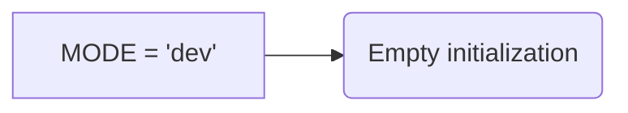

# Code Explanation for hypotez/src/bots/discord/__init__.py

## <input code>

```python
## \file hypotez/src/bots/discord/__init__.py
# -*- coding: utf-8 -*-\
#! venv/Scripts/python.exe
#! venv/bin/python/python3.12

"""
.. module: src.bots.discord 
	:platform: Windows, Unix
	:synopsis:

"""
MODE = 'dev'

"""
	:platform: Windows, Unix
	:synopsis:

"""


"""
	:platform: Windows, Unix
	:synopsis:

"""


"""
  :platform: Windows, Unix

"""
"""
  :platform: Windows, Unix
  :platform: Windows, Unix
  :synopsis:
"""MODE = 'dev'
  
""" module: src.bots.discord """
```

## <algorithm>

No algorithm is present in this file. It's an initialization file for the `discord` bot module within the `hypotez` project.  The code mainly defines a constant `MODE` with a value 'dev'.  This is a simple configuration file that does not contain any functions or complex logic to be represented in a step-by-step workflow.

## <mermaid>



## <explanation>

This Python file, `hypotez/src/bots/discord/__init__.py`, is a module initialization file for a Discord bot.  Critically, it's *not* an executable script.

### Imports:

There are no imports, indicating this file likely relies on other modules/packages for its functionality.   The `#!` lines at the top are shebang lines. These specify the interpreter that should be used to run the file.  They are primarily for specifying the python interpreter for the operating system this code will run on (windows or unix).  They will be ignored during the import/module load process.  While technically valid python they serve no practical use.


### Classes:

No classes are defined.

### Functions:

No functions are defined.

### Variables:

- `MODE`: A string variable with the value 'dev'. This is likely a configuration variable indicating the bot is in development mode.  This variable is defined repeatedly with the same value which might be an issue (potential for error or refactoring).

### Potential Errors/Improvements:

- **Redundant `MODE` definitions**: The variable `MODE` is defined multiple times, which is redundant and potentially confusing.  Removing the duplicate definitions would improve code readability and maintainability.  A single declaration is sufficient.
- **Missing import statements**: The code likely relies on other modules within the project.  There should be import statements for those external dependencies.


### Relationships with other project parts:

This file is part of the `hypotez` project, specifically the bot related to Discord.  It's likely that other files in the `hypotez/src/bots/discord` directory will import and use the `MODE` variable to determine behavior.   This could be used to activate different modes of operation for testing, development or production use.


```
```
```
```


```


```
```
```