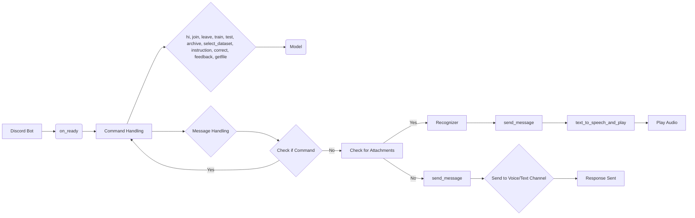

# Discord Bot Trainer Code Explanation

## <input code>

```python
# ... (code from the file)
```

## <algorithm>

The bot's workflow involves several stages:

1. **Initialization:**
    * Imports necessary libraries (e.g., `discord`, `commands`, `logger`).
    * Sets up logging, defining a mode (``).
    * Creates a `discord.Bot` instance with specified intents (message content, voice states).
    * Creates a `Model` object, likely for AI interaction.
    * Configures the command prefix.
    * Sets the path to FFmpeg for audio conversion.

2. **Bot Ready Event:**
    * `on_ready` is triggered when the bot is connected.
    * Logs a message indicating the bot is ready.

3. **Command Handling:**
    * `hi`, `join`, `leave`, `train`, `test`, `archive`, `select_dataset`, `instruction`, `correct`, `feedback`, `getfile` are defined as bot commands.
    * Each command performs a specific action (e.g., sending a message, joining/leaving a voice channel, training the model).
    * `train` command handles data input from attachments.
    * `test` command expects JSON data as input, calls model's predict method.
    * `archive` command archives files.
    * `select_dataset` allows selecting and archiving datasets.
    * `instruction` fetches instructions from a file.
    * `correct` allows correcting previous model responses.
    * `feedback` stores feedback for model improvement.
    * `getfile` sends a file.

4. **Message Handling (`on_message`):**
    * Checks if the message is from the bot itself.
    * Checks if the message is a command.
    * If the message has attachments, likely audio, it uses the `recognizer` function to transcribe it.
    * Sends the model's response (`send_message`) to the message author's voice channel if available, otherwise to the message channel.
    * Handles any errors during the process.

5. **Audio Handling:**
    * `text_to_speech_and_play` function converts text to speech, plays it in a voice channel and disconnects.


## <mermaid>



**Dependencies Analysis:**

The diagram shows the dependencies between different parts of the code. Key imports and their relationships:

* **`discord`:**  Core Discord library for bot interaction.
* **`commands`:** Extension for easier command handling.
* **`pathlib`:**  Provides object-oriented file system paths.
* **`tempfile`:** Creates temporary files.
* **`asyncio`:** Enables asynchronous operations (crucial for Discord).
* **`header`:** Likely contains configuration or other utility functions.
* **`gs`:**  Likely a package managing global settings, including credentials and paths.
* **`gs.credentials`:** Likely contains credentials (bot token).
* **`src`:**  This package likely contains other project components.
* **`src.ai`:** Likely contains AI-related modules.
* **`src.utils`:** Contains utility functions like `j_loads`, `j_loads_ns`, `j_dumps`.
* **`src.logger`:** Package for logging.
* **`speech_recognition`:** For speech recognition from audio.
* **`requests`:** For downloading audio files.
* **`pydub`:** For audio manipulation (converting formats).
* **`gtts`:** For text-to-speech conversion.
* **`.chatterbox`:** Likely contains additional bot functionality, and functions specific to chat.


## <explanation>

* **Imports:** The code imports necessary libraries for interacting with Discord, handling commands, using the AI model, managing files, and performing audio operations.  The `src` package structure indicates a modular project organization.

* **Classes:**
    * **`Model`:**  A class representing the AI model. Its `train`, `predict`, `handle_errors`, and `save_job_id`, and `select_dataset_and_archive` methods likely encapsulate the AI model training and prediction logic.

* **Functions:**
    * **`store_correction`:** Saves corrections to a file.
    * **`text_to_speech_and_play`:** Converts text to speech using `gTTS` and plays the audio in a voice channel. Important note, that this function handles disconnections and manages the player.
    * **`recognizer`:** (commented out) Function for downloading audio from a URL, converting it to WAV, and recognizing speech using `speech_recognition`. This could be used to handle voice commands.
    * **`hi`, `join`, `leave`, `train`, `test`, `archive`, `select_dataset`, `instruction`, `correct`, `feedback`, `getfile`:** These are Discord bot commands that respond to specific user inputs.


* **Variables:**
    * `MODE`, `PREFIX`, `intents`, `bot`, `model`: These variables hold configurations and objects necessary for the bot to operate.

* **Potential Errors/Improvements:**
    * The commented-out `recognizer` function is incomplete.  It's missing error handling for invalid audio URLs.  This function is crucial for voice-command functionality.
    * The code assumes `ffmpeg` is installed and available in the specified path, and it's important to ensure the FFmpeg path is correct on the system the bot is running on.
    * More robust error handling (using `try...except` blocks) could be added within the command functions to handle various potential exceptions.
    * The code would benefit from more thorough documentation, especially if used in a larger project.


**Relationships with Other Parts of the Project:**

The code depends on other parts of the `src` package, particularly `gs` for access to configuration and `src.ai.openai.model.training` for model interactions. The `header` and `.chatterbox` files are likely part of the modularized functionality within the project.  The external file for instructions (`_docs/bot_instruction.md`) and the `corrections_log.txt` file show external data dependency.