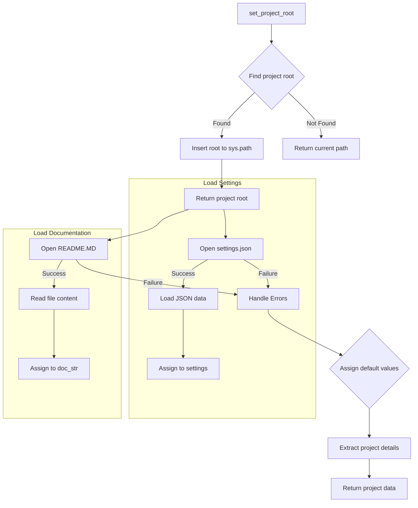

# Code Explanation for hypotez/src/bots/discord/header.py

## <input code>

```python
# -*- coding: utf-8 -*-\n
\n
#! venv/bin/python/python3.12\n

"""
.. module: src.bots.discord 
	:platform: Windows, Unix
	:synopsis:

"""


"""
	:platform: Windows, Unix
	:synopsis:

"""


"""
	:platform: Windows, Unix
	:synopsis:

"""


"""
  :platform: Windows, Unix

"""
"""
  :platform: Windows, Unix
  :platform: Windows, Unix
  :synopsis:
"""
  
""" module: src.bots.discord """

import sys
import json
from packaging.version import Version

from pathlib import Path
def set_project_root(marker_files=('__root__','.git')) -> Path:
    """
    Finds the root directory of the project starting from the current file's directory,
    searching upwards and stopping at the first directory containing any of the marker files.

    Args:
        marker_files (tuple): Filenames or directory names to identify the project root.
    
    Returns:
        Path: Path to the root directory if found, otherwise the directory where the script is located.
    """
    __root__:Path
    current_path:Path = Path(__file__).resolve().parent
    __root__ = current_path
    for parent in [current_path] + list(current_path.parents):
        if any((parent / marker).exists() for marker in marker_files):
            __root__ = parent
            break
    if __root__ not in sys.path:
        sys.path.insert(0, str(__root__))
    return __root__


# Get the root directory of the project
__root__ = set_project_root()
"""__root__ (Path): Path to the root directory of the project"""

from src import gs

settings:dict = None
try:
    with open(gs.path.root / 'src' / 'settings.json', 'r') as settings_file:
        settings = json.load(settings_file)
except (FileNotFoundError, json.JSONDecodeError):
    ...

doc_str:str = None
try:
    with open(gs.path.root / 'src' / 'README.MD', 'r') as settings_file:
        doc_str = settings_file.read()
except (FileNotFoundError, json.JSONDecodeError):
    ...


__project_name__ = settings.get("project_name", 'hypotez') if settings  else 'hypotez'
__version__: str = settings.get("version", '')  if settings  else ''
__doc__: str = doc_str if doc_str else ''
__details__: str = ''
__author__: str = settings.get("author", '')  if settings  else ''
__copyright__: str = settings.get("copyrihgnt", '')  if settings  else ''
__cofee__: str = settings.get("cofee", "Treat the developer to a cup of coffee for boosting enthusiasm in development: https://boosty.to/hypo69")  if settings  else "Treat the developer to a cup of coffee for boosting enthusiasm in development: https://boosty.to/hypo69"
```

## <algorithm>

The code finds the project root directory and loads settings from a JSON file, potentially retrieving project documentation from a README file.

1. **`set_project_root` function:**
   - Takes a tuple of marker files as input (e.g., `'pyproject.toml'`, `'requirements.txt'`).
   - Starts from the current file's directory.
   - Iterates through parent directories until it finds a directory containing any of the specified marker files.
   - If found, it inserts the root directory into `sys.path`.
   - Returns the path to the root directory.

2. **Example for `set_project_root`:**
   - If `__file__` points to `hypotez/src/bots/discord/header.py`, the function would look for `pyproject.toml`, `requirements.txt`, `.git` in `hypotez/src/bots/discord`, then `hypotez/src`, and so on, until it finds the project root.

3. **Loading project settings:**
   - Calls `set_project_root` to determine the project root.
   - Tries to open `gs.path.root / 'src' / 'settings.json'` and load JSON data.
   - Handles `FileNotFoundError` or `json.JSONDecodeError` gracefully.
   - Sets `settings` to the loaded data if successful.

4. **Loading project documentation:**
   - Tries to open `gs.path.root / 'src' / 'README.MD'` and reads the file.
   - Handles `FileNotFoundError` or `json.JSONDecodeError` gracefully.
   - Stores the content in `doc_str` if successful.

5. **Extracting project metadata:**
   - Extracts `project_name`, `version`, `author`, `copyright`, and `coffee` from the `settings` (if available).
   - Defaults to 'hypotez' if `project_name` is not found.
   - Uses default values if any of the settings are missing.

## <mermaid>



**Dependencies Analysis:**

- `import sys`: Accesses system-level variables, including the path.
- `import json`: Used for working with JSON data.
- `from packaging.version import Version`:  For proper version handling.
- `from pathlib import Path`:  For handling file paths in a platform-independent way.
- `from src import gs`:  Imports a module named `gs`, likely from the `src` package, to access the project root.  This implies `gs` contains information about the project's path structure and is central to defining the file paths for settings and documentation.

## <explanation>

### Imports

- `sys`: Provides access to system-specific parameters and functions, including the `sys.path` list, which is used to include the project root directory.
- `json`: Used for encoding and decoding JSON data to read and parse the project settings.
- `packaging.version`:  Used for version handling. The code imports the `Version` class from the `packaging.version` module, though it isn't immediately used in this part of the script, indicating a potential future use of this module for version comparison or handling (as commonly done in project setup).
- `pathlib`: Provides object-oriented support for working with paths, supporting different OS conventions, making code cleaner, more flexible and portable.
- `src.gs`:  A module (`gs`) which is likely part of the `src` package is used to access the project root directory, indicating a structured organization of project files (possibly with a centralized module `gs` providing project root information).


### Classes

- No classes are defined in this file.


### Functions

- `set_project_root(marker_files)`:  This function is crucial for locating the project root directory.
    - **Args:** A tuple of file/directory names (e.g., `pyproject.toml`, `requirements.txt`, `.git`).  These are used as markers to identify the project root.
    - **Return:** A `Path` object representing the project root directory.
    - **How it Works:** It iterates upwards through parent directories, checking if any of the provided marker files exist in each parent directory.  The first parent directory containing any of the marker files is considered the project root and returned. If no such directory is found, the directory containing the currently executing file (`__file__`) is returned.

### Variables

- `MODE`: A string variable (e.g., `'dev'`).  Likely related to the project's mode (e.g., development, production), but its use in this file is unclear without more context.
- `__root__`: A `Path` object, storing the project root directory, returned by `set_project_root()`.
- `settings`: A dictionary variable, storing the project settings parsed from the JSON file `settings.json`.
- `doc_str`: A string, storing the content read from the `README.MD` file.
- `__project_name__`, `__version__`, `__author__`, `__copyright__`, `__cofee__`: Project metadata variables which are initialized using the settings (`settings`). These variables are named with a leading underscore, which is a Python convention to indicate that they are intended for internal use (they represent metadata for the project).
- `__details__`: An empty string. Likely represents some aspect of the project details.


### Potential Errors/Improvements

- **Robustness:** The `try...except` blocks for loading `settings.json` and `README.MD` handle potential `FileNotFoundError` and `json.JSONDecodeError`. However, more specific error handling or logging (e.g., informative error messages) might improve usability.


### Relationships with Other Parts of the Project

The code heavily relies on the `gs` module within the `src` package to define the path to the project root directory. It also assumes the existence of `settings.json` and `README.MD` in the project root within the `src` directory, indicating a hierarchical project structure.  This `header.py` file is likely intended to be a module used by other files within the project, notably for setting up project-wide constants and metadata.