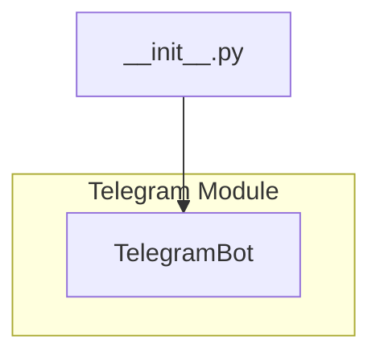

# <input code>

```python
## \file hypotez/src/bots/telegram/__init__.py
# -*- coding: utf-8 -*-

#! venv/bin/python/python3.12

"""
.. module: src.bots.telegram 
	:platform: Windows, Unix
	:synopsis:

"""


from .bot import TelegramBot
```

# <algorithm>

There is no complex algorithm. This file simply sets a variable `MODE` to 'dev', then imports the `TelegramBot` class from the `bot.py` module within the `telegram` subpackage.


# <mermaid>



**Explanation of the Mermaid Diagram:**

The diagram shows a simple dependency. The `__init__.py` file in the `telegram` subpackage imports the `TelegramBot` class from the `bot.py` file, which is also part of the `telegram` package. This import statement is the sole action within the `__init__.py` file; it prepares the `telegram` module for use by importing its components.

# <explanation>

**Imports:**

- `from .bot import TelegramBot`: This line imports the `TelegramBot` class from a module named `bot.py` that resides within the same directory (`.`) as `__init__.py`. This is a standard Python import for modules within a package.  The `.` (dot) is a relative import, which helps structure codebase.

**Classes (Implicit):**

- `TelegramBot`:  This is a class, presumably defined within `bot.py`.  Without the code from `bot.py`, we can't completely describe it. However, it's likely responsible for handling interactions with the Telegram API, managing bot logic, and responding to messages.

**Variables:**

- ``: This is a global variable that is likely used to control different modes (e.g., development, production). The value 'dev' suggests that this is used for configuring the bot for development purposes.

**Functions (Implicit):**

No functions are explicitly defined in this file.

**Potential Errors/Improvements:**

- **Missing Docstrings:** While the module docstring exists, there should also be docstrings within the `TelegramBot` class (if any). Docstrings enhance code readability and make it easier for others to understand the intended functionality.
- **Unclear purpose of MODE variable:** While the use of `MODE` for configuration is suggestive, adding a brief explanation in a docstring or comment clarifying the different modes would improve clarity.


**Relationship with other parts of the project:**

The `telegram` module is likely part of a larger application using a bot framework. The `TelegramBot` class, when instantiated, interacts with the Telegram API.  Thus, this `telegram` module depends on the `telegram` bot library and the external Telegram API, but the precise nature of these dependencies is not fully apparent without examining the other files (like `bot.py`).  This file establishes a dependency and introduces a way to initialize a bot by importing its main class definition.