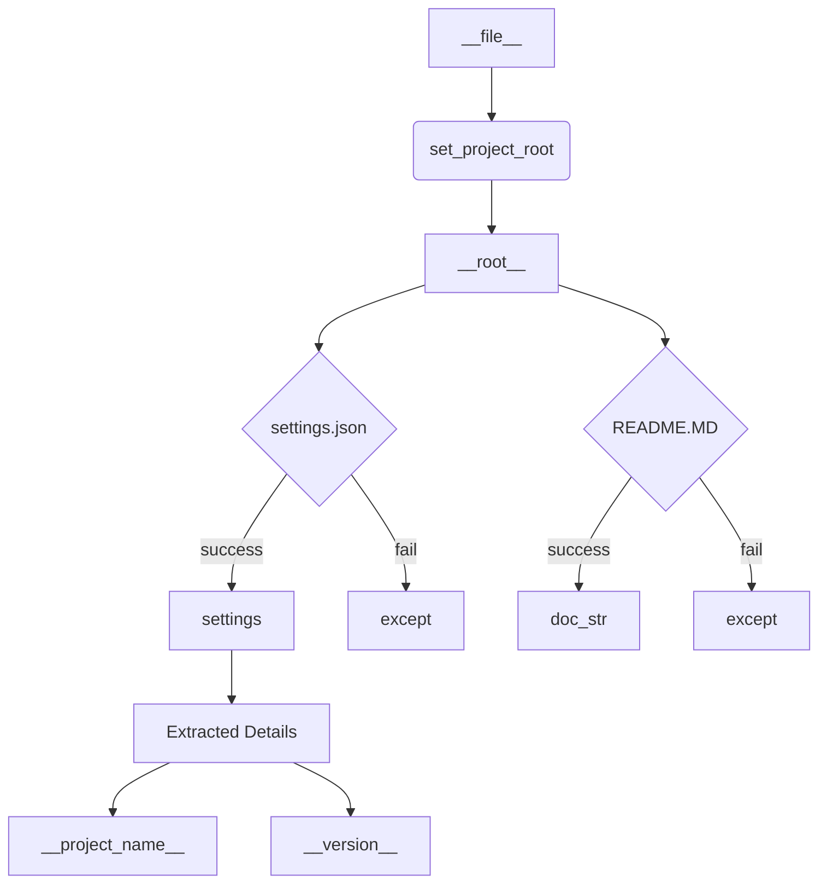

# Code Explanation for hypotez/src/logger/header.py

## <input code>

```python
## \file hypotez/src/logger/header.py
# -*- coding: utf-8 -*-\

#! venv/bin/python/python3.12

"""
module: src.logger 
	:platform: Windows, Unix
	:synopsis: Модуль определяющий корневой путь к проекту. Все импорты строятся относительно этого пути.
    :TODO: В дальнейшем перенести в системную переменную"""


import sys
import json
from packaging.version import Version

from pathlib import Path
def set_project_root(marker_files=('__root__','.git')) -> Path:
    """
    Finds the root directory of the project starting from the current file's directory,
    searching upwards and stopping at the first directory containing any of the marker files.

    Args:
        marker_files (tuple): Filenames or directory names to identify the project root.
    
    Returns:
        Path: Path to the root directory if found, otherwise the directory where the script is located.
    """
    __root__:Path
    current_path:Path = Path(__file__).resolve().parent
    __root__ = current_path
    for parent in [current_path] + list(current_path.parents):
        if any((parent / marker).exists() for marker in marker_files):
            __root__ = parent
            break
    if __root__ not in sys.path:
        sys.path.insert(0, str(__root__))
    return __root__


# Get the root directory of the project
__root__ = set_project_root()
"""__root__ (Path): Path to the root directory of the project"""

from src import gs

settings:dict = None
try:
    with open(gs.path.root / 'src' /  'settings.json', 'r') as settings_file:
        settings = json.load(settings_file)
except (FileNotFoundError, json.JSONDecodeError):
    ...

doc_str:str = None
try:
    with open(gs.path.root / 'src' /  'README.MD', 'r') as settings_file:
        doc_str = settings_file.read()
except (FileNotFoundError, json.JSONDecodeError):
    ...


__project_name__ = settings.get("project_name", 'hypotez') if settings  else 'hypotez'
__version__: str = settings.get("version", '')  if settings  else ''
__doc__: str = doc_str if doc_str else ''
__details__: str = ''
__author__: str = settings.get("author", '')  if settings  else ''
__copyright__: str = settings.get("copyrihgnt", '')  if settings  else ''
__cofee__: str = settings.get("cofee", "Treat the developer to a cup of coffee for boosting enthusiasm in development: https://boosty.to/hypo69")  if settings else "Treat the developer to a cup of coffee for boosting enthusiasm in development: https://boosty.to/hypo69"
```

## <algorithm>

**Step 1:** Define `set_project_root` function to find project root.

**Input:** Tuple of marker files (e.g., `pyproject.toml`, `requirements.txt`).

**Process:**
1. Starts from the current file's directory (`__file__`).
2. Traverses up the directory tree using `current_path.parents`.
3. Checks if any marker file exists in the current directory.
4. If found, the current directory becomes the project root (`__root__`).
5. Adds the root directory to the `sys.path` if it's not already there.
6. Returns the root directory.


**Example:**
If `__file__` is `/home/user/project/src/logger/header.py`, the function will look for `pyproject.toml`, `requirements.txt`, `.git` in the following directories:
`/home/user/project/src/logger/`, `/home/user/project/src/`, `/home/user/project/`, etc.

**Step 2:** Get project root (`__root__`).

**Input:** No explicit input.
**Process:** Calls `set_project_root()` function.

**Example:** Resulting `__root__` might be `/home/user/project`.

**Step 3:** Load settings and documentation.

**Input:** Project root path (`__root__`).
**Process:**
1. Attempts to load `settings.json` from `__root__/src/settings.json`.
2. Handles `FileNotFoundError` or `json.JSONDecodeError` if the file is missing or corrupt.
3. Attempts to load documentation from `__root__/src/README.MD`.
4. Handles `FileNotFoundError` or `json.JSONDecodeError` if the file is missing or corrupt.

**Example:**
If `settings.json` exists and is valid, it populates the `settings` dictionary.

**Step 4:** Extract project details.

**Input:** `settings` dictionary and potential `doc_str`.
**Process:** Extracts `project_name`, `version`, `author`, `copyright`, `cofee` from the `settings` dictionary. Uses default values if keys are missing or the dictionary is `None`. Stores into respective variables (`__project_name__`, etc.).

**Example:**
If `settings` contains `{"project_name": "MyProject", "version": "1.0.0"}`, then `__project_name__` becomes "MyProject" and `__version__` becomes "1.0.0".


## <mermaid>



**Dependencies Analysis:**

* `sys`: Provides access to system-specific parameters and functions, such as `sys.path`.
* `json`: Used for handling JSON data (loading `settings.json`).
* `packaging.version`: Used for handling versions (not used directly but imported).
* `pathlib`: Used for working with file paths.
* `gs`: A custom package (implied from the code).

**Explanation:**

The mermaid code depicts a sequence of steps in finding project root, loading `settings.json`, and extracting project details. It highlights how the `set_project_root` function is crucial for finding the root directory from the current file location. It also shows error handling for `settings.json` and `README.MD` files.

## <explanation>

**Imports:**

* `sys`:  Provides access to system-specific parameters and functions, crucial for modifying the Python path.
* `json`: Used for working with JSON data, allowing loading the `settings.json` file.
* `packaging.version`: A package for handling software versions. This is useful for proper version control, but not used directly in this snippet.
* `pathlib`: Provides object-oriented interface for working with filesystem paths. It replaces the old `os.path` approach.
* `gs`: This is a custom module within the Hypotez project (likely part of the src package).  It's used here to access the `gs.path.root` object, which references the project root directory. This suggests an organizational structure.

**Classes:**

There are no classes defined in this file.  The `Path` object is imported from `pathlib`, not defined here.  The `Path` object is a fundamental class for interacting with file paths.

**Functions:**

* `set_project_root(marker_files=...)`: This function is crucial for locating the project root directory. It searches upwards from the current file location until it finds a directory containing any of the specified marker files (e.g., `pyproject.toml`, `requirements.txt`, `.git`).  It's a well-designed function to handle variations in project setup.  Error handling is not explicitly handled, but it implicitly handles the `FileNotFoundError` during file checking.


**Variables:**

* `MODE`: A string variable likely used for defining the current environment mode ('dev' in this case).
* `__root__`: The path to the project root directory, calculated by `set_project_root()`.
* `settings`: A dictionary to store the project settings loaded from `settings.json`.
* `doc_str`: String variable to store project documentation retrieved from `README.MD`.
* `__project_name__`, `__version__`, `__doc__`, `__details__`, `__author__`, `__copyright__`, `__cofee__`:  Variables holding project metadata, retrieved from `settings`.  They use `settings.get()` for safe lookup and defaults.

**Potential Errors/Improvements:**

* **Error Handling:** The `try...except` blocks for loading `settings.json` and `README.MD` are good practice.  Consider adding logging statements within the `except` blocks to diagnose issues if the files aren't found.
* **`gs` module dependency:** The code relies on the `gs` module.  The exact nature and implementation of `gs` should be examined to ensure its proper usage.
* **`marker_files` default value:** Consider documenting the rationale for the marker files defaults.  What if the project doesn't have a `pyproject.toml`?  Is it crucial for the function to always find a project root?


**Relationship with other project parts:**

This file directly interacts with other parts of the project through the `gs` module, particularly the `gs.path.root` attribute, which suggests a clear organizational structure where the `gs` module provides utilities to interact with and manage paths within the project.