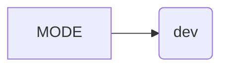

```MD
# <input code>

```python
## \file hypotez/src/bots/telegram/logger.py
# -*- coding: utf-8 -*-

#! venv/bin/python/python3.12

"""
.. module: src.bots.telegram.logger 
	:platform: Windows, Unix
	:synopsis: Модуль логгирования телеграм ботов

"""

```

# <algorithm>

This code snippet is very simple.  It's a Python file defining a single constant variable, `MODE`.  There's no function or class definition.  The algorithm is essentially assigning a value to a variable.

**Step 1:** Define a constant.

```

```


# <mermaid>



This simple mermaid diagram shows the variable `MODE` assigned the string value `'dev'`. There are no dependencies to other files/modules in this snippet.


# <explanation>

* **Imports**: There are no imports in this code. This is a simple Python module that does not depend on other modules.

* **Classes**: There are no classes defined.

* **Functions**: There are no functions defined.

* **Variables**:
    * `MODE`: A string variable which is likely a configuration setting.  Its value `'dev'` suggests this is likely for setting a development mode for the bot, which affects how logs are displayed or handled or what external services it connects to.


* **Potential Errors or Areas for Improvement**: The code is extremely basic.  There is no error handling, no checks on the value of `MODE`, and no way to dynamically change this mode.  For production code, there should be a more sophisticated way to manage configuration like using a configuration file or environment variables.  Adding comments to explain the purpose and possible values of the `MODE` constant would improve readability.


**Relationship to other parts of the project:**  The `MODE` variable likely plays a role in how logging is configured (if logging is even implemented) and may be used by other modules within the `hypotez/src/bots/telegram` package to determine which behavior to use (dev vs. production).  The lack of import statements indicates that this is likely part of the initialization stage, before other components are imported or loaded.

```